## 1 时序图

### 1.1 简单示例

你可以用 -> 来绘制参与者之间传递的消息，而不必显式地声明参与者。

你也可以使用 --> 绘制一个虚线箭头。

另外，你还能用 <- 和 <--，这不影响绘图，但可以提高可读性。注意：仅适用于时序图，对于其它示意图，规则是不同的。

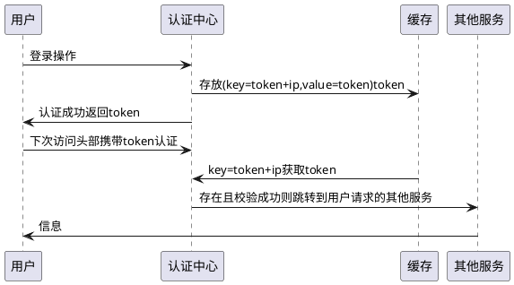

### 1.2 声明参与者

关键字 participant 用来声明参与者

Order 用于改变参与者的先后顺序。

你也可以使用其它关键字来声明参与者：

* actor
* boundary
* control
* entity
* database
* collections

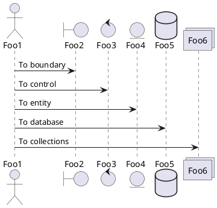

关键字 as 用于重命名参与者

你可以使用 RGB 值或者颜色名修改 actor 或参与者的背景颜色。

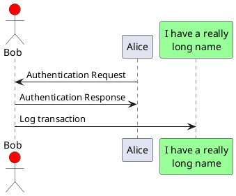

您可以使用关键字 order 自定义顺序来打印参与者。

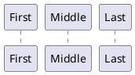

### 1.3 在参与者中使用非字母符号

你可以使用引号定义参与者，还可以用关键字 as 给参与者定义别名。

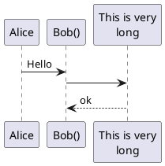

### 1.4 给自己发消息

参与者可以给自己发信息，

消息文字可以用`\n`来换行。

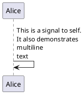

### 1.5 Text alignment

#### 1.5.1 Text of response message below the arrow

You can put the text of the response message below the arrow,with the `skinparam responseMessageBelowArrow true` command.

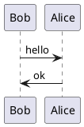

TODO: TODO Link to Text Alignment on skinparam page.

### 1.6 修改箭头样式

修改箭头样式的方式有以下几种:

* 表示一条丢失的消息：末尾加 x
* 让箭头只有上半部分或者下半部分：将 < 和 >替换成 \ 或者 /
* 细箭头：将箭头标记写两次 (如 >> 或 //)
* 虚线箭头：用 -- 替代 -
* 箭头末尾加圈：->o
* 双向箭头：<->

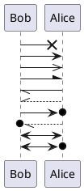
### 1.7 修改箭头颜色

你可以用以下记号修改箭头的颜色：
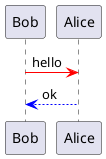
### 1.8 对消息序列编号

关键字 autonumber 用于自动对消息编号。

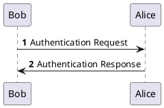

语句 autonumber //start// 用于指定编号的初始值，而 autonumber //start// //increment// 可以同时指定编号的初始值和每次增加的值。

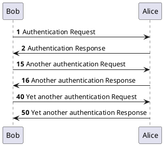

你可以在双引号内指定编号的格式。

格式是由 Java 的 DecimalFormat 类实现的：(0 表示数字；# 也表示数字，但默认为 0)。

你也可以用 HTML 标签来制定格式。

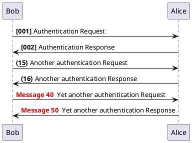

你还可以用语句 autonumber stop 和 autonumber resume //increment// //format// 来表示暂停或继续使用自动编号。

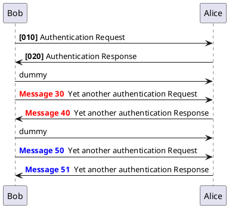
### 1.9 页面标题, 页眉, 页脚

使用 title 关键词增加标题

使用 header 关键词增加页眉

使用 footer 关键词增加页脚

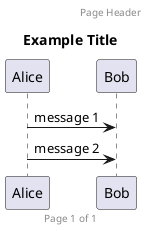

### 1.10 分割示意图

关键字 newpage 用于把一张图分割成多张。

在 newpage 之后添加文字，作为新的示意图的标题。

这样就能很方便地在 Word 中将长图分几页打印。

```plantuml {hide=false}
@startuml
Alice -> Bob : message 1
Alice -> Bob : message 2
newpage
Alice -> Bob : message 3
Alice -> Bob : message 4
newpage A title for the\nlast page
Alice -> Bob : message 5
Alice -> Bob : message 6
@enduml
```
### 1.11 组合消息

我们可以通过以下关键词将组合消息：

* alt/else
* opt
* loop
* par
* break
* critical
* group, 后面紧跟着消息内容

可以在标头 (header) 添加需要显示的文字(group 除外)。

关键词 end 用来结束分组。

注意，分组可以嵌套使用。

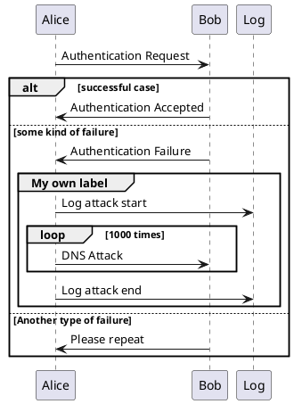
### 1.12 Secondary group label

For group, it is possible to add, between[ and ], a secondary text or label that will be displayed into the header.

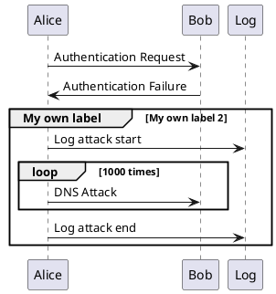
[Ref. QA-2503]

### 1.13 给消息添加注释

我们可以通过在消息后面添加 note left 或者 note right 关键词来给消息添加注释。

你也可以通过使用 end note 来添加多行注释。

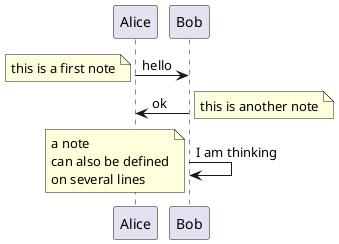

### 1.14 其他的注释

可以使用 note left of，note right of 或 note over 在节点 (participant) 的相对位置放置注释。

还可以通过修改背景色来高亮显示注释。

以及使用关键字 end note 来添加多行注释。

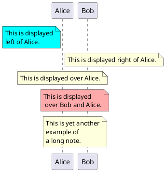

### 1.15 改变备注框的形状

你可以使用 hnote 和 rnote 这两个关键字来修改备注框的形状。

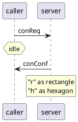

### 1.16 Creole 和 HTML

可以使用 creole 格式。

```plantuml {hide=false}
@startuml
participant Alice
participant "The **Famous** Bob" as Bob
Alice -> Bob : hello --there--
... Some ~~long delay~~ ...
Bob -> Alice : ok
note left
This is **bold**
This is //italics//
This is ""monospaced""
This is --stroked--
This is __underlined__
This is ~~waved~~
end note
Alice -> Bob : A //well formatted// message
note right of Alice
This is <back:cadetblue><size:18>displayed</size></back>
__left of__ Alice.
end note
note left of Bob
<u:red>This</u> is <color #118888>displayed</color>
**<color purple>left of</color> <s:red>Alice</strike> Bob**.
end note
note over Alice, Bob
<w:#FF33FF>This is hosted</w> by 
end note
@enduml
```

### 1.17 分隔符

你可以通过使用 == 关键词来将你的图表分割多个步骤。

```plantuml {hide=false}
@startuml
== Initialization ==
Alice -> Bob: Authentication Request
Bob --> Alice: Authentication Response
== Repetition ==
Alice -> Bob: Another authentication Request
Alice <-- Bob: another authentication Response
@enduml
```

### 1.18 引用

你可以在图中通过使用 ref over 关键词来实现引用

```plantuml {hide=false}
@startuml
participant Alice
actor Bob
ref over Alice, Bob : init
Alice -> Bob : hello
ref over Bob
This can be on
several lines
end ref
@enduml
```

### 1.19 延迟

你可以使用... 来表示延迟，并且还可以给延迟添加注释。

```plantuml {hide=false}
@startuml
Alice -> Bob: Authentication Request
...
Bob --> Alice: Authentication Response
...5 minutes latter...
Bob --> Alice: Bye !
@enduml
```

### 1.20 Text wrapping

To break long messages, you can manually add in your text.

Another option is to use maxMessageSize setting:

```plantuml {hide=false}
@startuml
skinparam maxMessageSize 50
participant a
participant b
a -> b :this\nis\nmanually\ndone
a -> b :this is a very long message on several words
@enduml
```
### 1.21 空间

你可以使用 ||| 来增加空间。

还可以使用数字指定增加的像素的数量。

```plantuml {hide=false}
@startuml
Alice -> Bob: message 1
Bob --> Alice: ok
|||
Alice -> Bob: message 2
Bob --> Alice: ok
||45||
Alice -> Bob: message 3
Bob --> Alice: ok
@enduml
```

### 1.22 生命线的激活与撤销

关键字 activate 和 deactivate 用来表示参与者的生命活动。

一旦参与者被激活，它的生命线就会显示出来。

activate 和 deactivate 适用于以上情形。

destroy 表示一个参与者的生命线的终结。

```plantuml {hide=false}
@startuml
participant User
User -> A: DoWork
activate A
A -> B: << createRequest >>
activate B
B -> C: DoWork
activate C
C --> B: WorkDone
destroy C
B --> A: RequestCreated
deactivate B
A -> User: Done
deactivate A
@enduml
```
还可以使用嵌套的生命线，并且运行给生命线添加颜色。

```plantuml {hide=false}
@startuml
participant User
User -> A: DoWork
activate A #FFBBBB
A -> A: Internal call
activate A #DarkSalmon
A -> B: << createRequest >>
activate B
B --> A: RequestCreated
deactivate B
deactivate A
A -> User: Done
deactivate A
@enduml
```

### 1.23 Return

A new command return for generating a return message with optional text label. The point returned to is the point that cause the most recently activated life-line. The syntax is simply return label where label, if provided, can be any string acceptable on conventional messages.

```plantuml {hide=false}
@startuml
Bob -> Alice : hello
activate Alice
Alice -> Alice : some action
return bye
@enduml
```

### 1.24 创建参与者

你可以把关键字 create 放在第一次接收到消息之前，以强调本次消息实际上是在创建新的对象。

```plantuml {hide=false}
@startuml
Bob -> Alice : hello
create Other
Alice -> Other : new
create control String
Alice -> String
note right : You can also put notes!
Alice --> Bob : ok
@enduml
```
### 1.25 Shortcut syntax for activation, deactivation, creation

Immediately after specifying the target participant, the following syntax can be used:

* ++ Activate the target (optionally a #color may follow this)
* -- Deactivate the source
* ** Create an instance of the target
* !! Destroy an instance of the target

```plantuml {hide=false}
@startuml
alice -> bob ++ : hello
bob -> bob ++ : self call
bob -> bib ++ #005500 : hello
bob -> george ** : create
return done
return rc
bob -> george !! : delete
return success
@enduml
```
### 1.26 进入和发出消息

如果只想关注部分图示，你可以使用进入和发出箭头。

使用方括号 [和] 表示图示的左、右两侧。

```plantuml {hide=false}
@startuml
[-> A: DoWork
activate A
A -> A: Internal call
activate A
A ->] : << createRequest >>
A<--] : RequestCreated
deactivate A
[<- A: Done
deactivate A
@enduml
```

还可以使用下面的语法:

```plantuml {hide=false}
@startuml
[-> Bob
[o-> Bob
[o->o Bob
[x-> Bob
[<- Bob
[x<- Bob
Bob ->]
Bob ->o]
Bob o->o]
Bob ->x]
Bob <-]
Bob x<-]
@enduml
```

### 1.27 Short arrows for incoming and outgoing messages

You can have short arrows with using ?.

```plantuml {hide=false}
@startuml
?-> Alice : ""?->""\n**short** to actor1
[-> Alice : ""[->""\n**from start** to actor1
[-> Bob : ""[->""\n**from start** to actor2
?-> Bob : ""?->""\n**short** to actor2
Alice ->] : ""->]""\nfrom actor1 **to end**
Alice ->? : ""->?""\n**short** from actor1
Alice -> Bob : ""->"" \nfrom actor1 to actor2
@enduml
```

[Ref. QA-310]

### 1.28 Anchors and Duration

With teoz usage it is possible to add anchors to the diagram and use the anchors to specify duration time.

```plantuml {hide=false}
@startuml
!pragma teoz true
{start} Alice -> Bob : start doing things during duration
Bob -> Max : something
Max -> Bob : something else
{end} Bob -> Alice : finish
{start} <-> {end} : some time
@enduml
```

### 1.29 构造类型和圈点

可以使用 << 和 >> 给参与者添加构造类型。

在构造类型中，你可以使用 (X,color) 格式的语法添加一个圆圈圈起来的字符。

```plantuml {hide=false}
@startuml
participant "Famous Bob" as Bob << Generated >>
participant Alice << (C,#ADD1B2) Testable >>
Bob->Alice: First message
@enduml
```

默认使用 guillemet 字符来显示构造类型。你可以使用外观参数 guillemet 来修改显示行为。

```plantuml {hide=false}
@startuml
skinparam guillemet false
participant "Famous Bob" as Bob << Generated >>
participant Alice << (C,#ADD1B2) Testable >>
Bob->Alice: First message
@enduml
```

```plantuml {hide=false}
@startuml
participant Bob << (C,#ADD1B2) >>
participant Alice << (C,#ADD1B2) >>
Bob->Alice: First message
@enduml
```

### 1.30 更多标题信息

你可以在标题中使用 creole 格式。

```plantuml {hide=false}
@startuml
title __Simple__ **communication** example
Alice -> Bob: Authentication Request
Bob -> Alice: Authentication Response
@enduml
```

在标题描述中使用表示换行。

```plantuml {hide=false}
@startuml
title __Simple__ communication example\non several lines
Alice -> Bob: Authentication Request
Bob -> Alice: Authentication Response
@enduml
```

还可以使用关键字 title 和 end title 定义多行标题。

```plantuml {hide=false}
@startuml
title
<u>Simple</u> communication example
on <i>several</i> lines and using <font color=red>html</font>
This is hosted by 
end title
Alice -> Bob: Authentication Request
Bob -> Alice: Authentication Response
@enduml
```

### 1.31 包裹参与者

可以使用 box 和 end box 画一个盒子将参与者包裹起来。

还可以在 box 关键字之后添加标题或者背景颜色。

```plantuml {hide=false}
@startuml
box "Internal Service" #LightBlue
participant Bob
participant Alice
end box
participant Other
Bob -> Alice : hello
Alice -> Other : hello
@enduml
```

### 1.32 移除脚注

使用 hide footbox 关键字移除脚注。

```plantuml {hide=false}
@startuml
hide footbox
title Footer removed
Alice -> Bob: Authentication Request
Bob --> Alice: Authentication Response
@enduml
```

### 1.33 外观参数 (skinparam)

用 skinparam 改变字体和颜色。

可以在如下场景中使用：

* 在图示的定义中，
* 在引入的文件中，
* 在命令行或者 ANT任务提供的配置文件中。

你也可以修改其他渲染元素，如以下示例：

```plantuml {hide=false}
@startuml
skinparam sequenceArrowThickness 2
skinparam roundcorner 20
skinparam maxmessagesize 60
skinparam sequenceParticipant underline
actor User
participant "First Class" as A
participant "Second Class" as B
participant "Last Class" as C
User -> A: DoWork
activate A
A -> B: Create Request
activate B
B -> C: DoWork
activate C
C --> B: WorkDone
destroy C
B --> A: Request Created
deactivate B
A --> User: Done
deactivate A
@enduml
```

```plantuml {hide=false}
@startuml
skinparam backgroundColor #EEEBDC
skinparam handwritten true
skinparam sequence {
ArrowColor DeepSkyBlue
ActorBorderColor DeepSkyBlue
LifeLineBorderColor blue
LifeLineBackgroundColor #A9DCDF
ParticipantBorderColor DeepSkyBlue
ParticipantBackgroundColor DodgerBlue
ParticipantFontName Impact
ParticipantFontSize 17
ParticipantFontColor #A9DCDF
ActorBackgroundColor aqua
ActorFontColor DeepSkyBlue
ActorFontSize 17
ActorFontName Aapex
}
actor User
participant "First Class" as A
participant "Second Class" as B
participant "Last Class" as C
User -> A: DoWork
activate A
A -> B: Create Request
activate B
B -> C: DoWork
activate C
C --> B: WorkDone
destroy C
B --> A: Request Created
deactivate B
A --> User: Done
deactivate A
@enduml
```

### 1.34 填充区设置

可以设定填充区的参数配置。

```plantuml {hide=false}
@startuml
skinparam ParticipantPadding 20
skinparam BoxPadding 10
box "Foo1"
participant Alice1
participant Alice2
end box
box "Foo2"
participant Bob1
participant Bob2
end box
Alice1 -> Bob1 : hello
Alice1 -> Out : out
@enduml
```

### 1.35 Appendice: Examples of all arrow type
#### 1.35.1 Normal arrow

```plantuml {hide=false}
@startuml
participant Alice as a
participant Bob as b
a -> b : ""-> ""
a ->> b : ""->> ""
a -\ b : ""-\ ""
a -\\ b : ""-\\\\""
a -/ b : ""-/ ""
a -// b : ""-// ""
a ->x b : ""->x ""
a x-> b : ""x-> ""
a o-> b : ""o-> ""
a ->o b : ""->o ""
a o->o b : ""o->o ""
a <-> b : ""<-> ""
a o<->o b : ""o<->o""
a x<->x b : ""x<->x""
a ->>o b : ""->>o ""
a -\o b : ""-\o ""
a -\\o b : ""-\\\\o""
a -/o b : ""-/o ""
a -//o b : ""-//o ""
a x->o b : ""x->o ""
@enduml
```

#### 1.35.2 Incoming and outgoing messages (with '[', ']')

```plantuml {hide=false}
@startuml
participant Alice as a
participant Bob as b
[-> b : ""[-> ""
[->> b : ""[->> ""
[-\ b : ""[-\ ""
[-\\ b : ""[-\\\\""
[-/ b : ""[-/ ""
[-// b : ""[-// ""
[->x b : ""[->x ""
[x-> b : ""[x-> ""
[o-> b : ""[o-> ""
[->o b : ""[->o ""
[o->o b : ""[o->o ""
[<-> b : ""[<-> ""
[o<->o b : ""[o<->o""
[x<->x b : ""[x<->x""
[->>o b : ""[->>o ""
[-\o b : ""[-\o ""
[-\\o b : ""[-\\\\o""
[-/o b : ""[-/o ""
[-//o b : ""[-//o ""
[x->o b : ""[x->o ""
...
b ->] : ""->] ""
b ->>] : ""->>] ""
b -\] : ""-\] ""
b -\\] : ""-\\\\]""
b -/] : ""-/] ""
b -//] : ""-//] ""
b ->x] : ""->x] ""
b x->] : ""x->] ""
b o->] : ""o->] ""
b ->o] : ""->o] ""
b o->o] : ""o->o] ""
b <->] : ""<->] ""
b o<->o] : ""o<->o]""
b x<->x] : ""x<->x]""
b ->>o] : ""->>o] ""
b -\o] : ""-\o] ""
b -\\o] : ""-\\\\o]""
b -/o] : ""-/o] ""
b -//o] : ""-//o] ""
b x->o] : ""x->o] ""
@enduml
```

## 1.35.3 Short incoming and outgoing messages (with '?')

```plantuml {hide=false}
@startuml
participant Alice as a
participant Bob as b
a -> b : //Long long label//
?-> b : ""?-> ""
?->> b : ""?->> ""
?-\ b : ""?-\ ""
?-\\ b : ""?-\\\\""
?-/ b : ""?-/ ""
?-// b : ""?-// ""
?->x b : ""?->x ""
?x-> b : ""?x-> ""
?o-> b : ""?o-> ""
?->o b : ""?->o ""
?o->o b : ""?o->o ""
?<-> b : ""?<-> ""
?o<->o b : ""?o<->o""
?x<->x b : ""?x<->x""
?->>o b : ""?->>o ""
?-\o b : ""?-\o ""
?-\\o b : ""?-\\\\o ""
?-/o b : ""?-/o ""
?-//o b : ""?-//o ""
?x->o b : ""?x->o ""
...
a ->? : ""->? ""
a ->>? : ""->>? ""
a -\? : ""-\? ""
a -\\? : ""-\\\\?""
a -/? : ""-/? ""
a -//? : ""-//? ""
a ->x? : ""->x? ""
a x->? : ""x->? ""
a o->? : ""o->? ""
a ->o? : ""->o? ""
a o->o? : ""o->o? ""
a <->? : ""<->? ""
a o<->o? : ""o<->o?""
a x<->x? : ""x<->x?""
a ->>o? : ""->>o? ""
a -\o? : ""-\o? ""
a -\\o? : ""-\\\\o?""
a -/o? : ""-/o? ""
a -//o? : ""-//o? ""
a x->o? : ""x->o? ""
@enduml
```

### 1.36 Specific SkinParameter
#### 1.36.1 By default

```plantuml {hide=false}
@startuml
Bob -> Alice : hello
Alice -> Bob : ok
@enduml
```

#### 1.36.2 lifelineStrategy solid

In order to have solid life line in sequence diagrams, you can use:
* skinparam lifelineStrategy solid

```plantuml {hide=false}
@startuml
skinparam lifelineStrategy solid
Bob -> Alice : hello
Alice -> Bob : ok
@enduml
```

[Ref. QA-2794]

#### 1.36.3 style strictuml

To be conform to strict UML (for arrow style: emits triangle rather than sharp arrowheads), you can use:
* skinparam style strictuml

```plantuml {hide=false}
@startuml
skinparam style strictuml
Bob -> Alice : hello
Alice -> Bob : ok
@enduml
```
[Ref. QA-1047]

### 1.37 Hide unlinked participant

By default, all participants are displayed.

```plantuml {hide=false}
@startuml
participant Alice
participant Bob
participant Carol
Alice -> Bob : hello
@enduml
```

But you can hide unlinked participant.

```plantuml {hide=false}
@startuml
hide unlinked
participant Alice
participant Bob
participant Carol
Alice -> Bob : hello
@enduml
```

[Ref. QA-4247]