## 10 定时图

这只是个提案，主题和内容可能改变.

非常欢迎您参与这个新特性的讨论。您的反馈、创意和建议可以帮助我们找寻适合的解决方案。

### 10.1 声明参与者

使用 concise or robust 关键字声明参与者, 选择哪个取决于所需的显示样式。

通过 @ 标注, 和 is 动词定义状态.

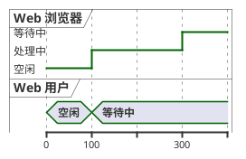

### 10.2 Binary and Clock

It's also possible to have binary and clock signal, using the following keywords:
* binary
* clock

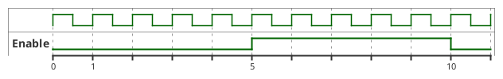

### 10.3 增加消息

使用下述的语法增加对消息的描述。

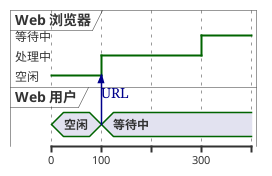

### 10.4 相对时间

It is possible to use relative time with @.

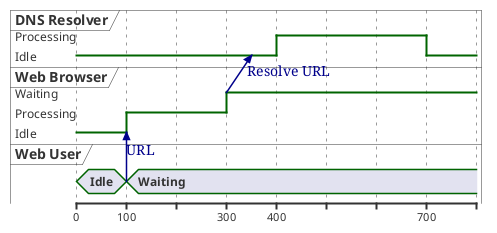

### 10.5 Anchor Points

Instead of using absolute or relative time on an absolute time you can define a time as an anchor point by using the as keyword and starting the name with a :.

@XX as :<anchor point name>

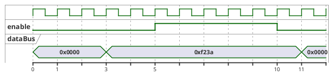

### 10.6 Participant oriented

Rather than declare the diagram in chronological order, you can define it by participant.

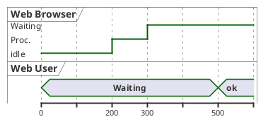

### 10.7 Setting scale

You can also set a specific scale.

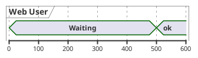

### 10.8 Initial state

You can also define an inital state.

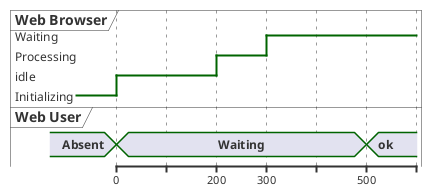

### 10.9 Intricated state

A signal could be in some undefined state.

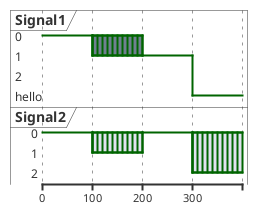

### 10.10 Hidden state

It is also possible to hide some state.

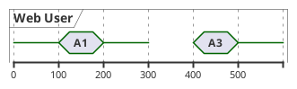

### 10.11 Hide time axis

It is possible to hide time axis.

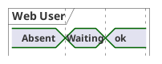

### 10.12 Using Time and Date

It is possible to use time or date.

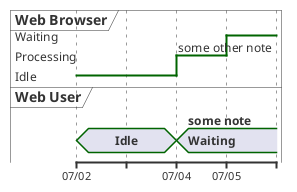

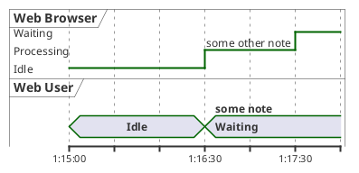

### 10.13 Adding constraint

It is possible to display time constraints on the diagrams.

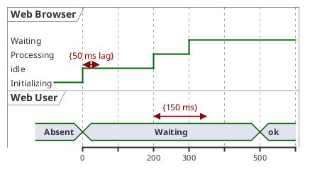

### 10.14 Highlighted period

You can higlight a part of diagram.

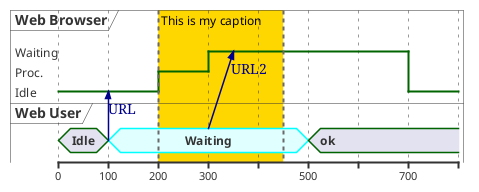

### 10.15 Adding texts

You can optionally add a title, a header, a footer, a legend and a caption:

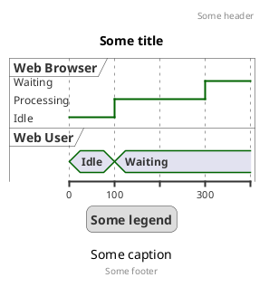

### 10.16 Complete example

Thanks to Adam Rosien for this example.

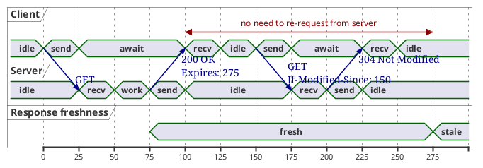

### 10.17 Digital Example

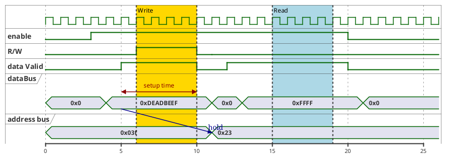

### 10.18 Adding color

You can add color.

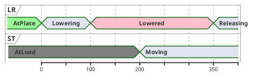

[Ref. QA-5776]
