## 13 Salt

Salt 是 PlantUML 下面的子项目用来帮助用户来设计图形接口.

可以用 @startsalt 关键字，或者使用 @startuml 紧接着下一行使用 salt 关键字.

### 13.1 基本部件

一个窗口必须以中括号开头和结尾。接着可以这样定义:
* 按钮用 [ 和 ]。
* 单选按钮用 ( 和 )。
* 复选框用 [ 和 ]。
* 用户文字域用 "。

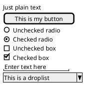

这个工具是用来讨论简单的示例窗口。

### 13.2 使用表格

当在输入关键词 {后，会自动建立一个表格

当输入 | 说明一个单元格

例子如下

```plantuml {hide=false}
@startsalt
{
Login | "MyName "
Password | "**** "
[Cancel] | [ OK ]
}
@endsalt
```

在启用关键词后，你可以使用以下字符来绘制表格中的线及列:

 Symbol | Result
 --|--
 # | 显示所有垂直水平线
 ! | 显示所有垂直线
 - | 显示所有水平线
 + | 显示外框线

```plantuml {hide=false}
@startsalt
{+
Login | "MyName "
Password | "**** "
[Cancel] | [ OK ]
}
@endsalt
```

### 13.3 Group box

more info

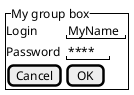

### 13.4 使用分隔符

你可以使用几条横线表示分隔符

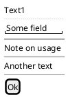

### 13.5 树形外挂

使用树结构，你必须要以 {T 进行起始，然后使用 + 定义层次。

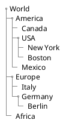

### 13.6 Tree table [T]

You can combine trees with tables.

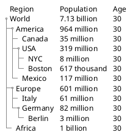

And add lines.

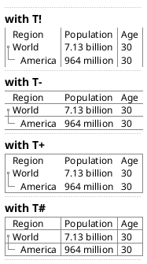

[Ref. QA-1265]

### 13.7 Enclosing brackets [{, }]

You can define subelements by opening a new opening bracket.

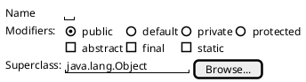

### 13.8 添加选项卡

你可以通过 {/ 标记增加对应的选项卡。注意：可以使用 HTML 代码来增加粗体效果。

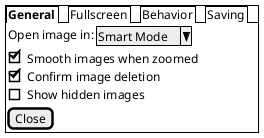

可以定义垂直选项卡，如下:

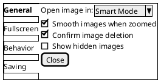

### 13.9 使用菜单


你可以使用记号 {* 来添加菜单。

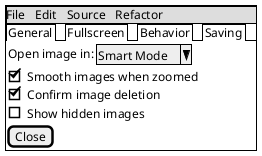

你也可以打开一个菜单：

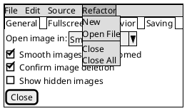

### 13.10 高级表格


对于表格有两种特殊的标记:
* `*` 单元格同时具备 span 和 left 两个属性
* `.` 是空白单元格

```plantuml {hide=false}
@startsalt
{#

### . | Column 2 | Column 3


Row header 1 | value 1 | value 2
Row header 2 | A long cell | *
}
@endsalt
```

You can use {S notation for scroll bar like in following examples:
* {S: for horizontal and vertical scrollbars

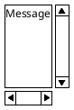

* {SI : for vertical scrollbar only

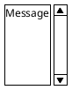

* {S- : for horizontal scrollbar only

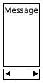

### 13.12 Colors


It is possible to change text color of widget.

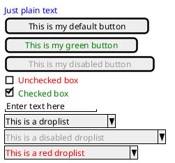

[Ref. QA-12177]

### 13.13 Pseudo sprite [<<, >>]


Using << and >> you can define a pseudo-sprite or sprite-like drawing and reusing it latter.

``` 
@startsalt
{
[X] checkbox|[] checkbox
() radio | (X) radio
This is a text|[This is my button]|This is another text
"A field"|"Another long Field"|[A button]
<<folder
............
.XXXXX......
.X...X......
.XXXXXXXXXX.
.X........X.
.X........X.
.X........X.
.X........X.
.XXXXXXXXXX.
............
>>|<color:blue>other folder|<<folder>>
^Droplist^
}
@endsalt
```

[Ref. QA-5849]

### 13.14 OpenIconic


OpenIconic is an very nice open source icon set. Those icons have been integrated into the creole parser, so you
can use them out-of-the-box.
You can use the following syntax: <&ICON_NAME>.

```plantuml {hide=false}
@startsalt
{
Login<&person> | "MyName "
Password<&key> | "**** "
[Cancel <&circle-x>] | [OK <&account-login>]
}
@endsalt
```

The complete list is available on OpenIconic Website, or you can use the following special diagram:

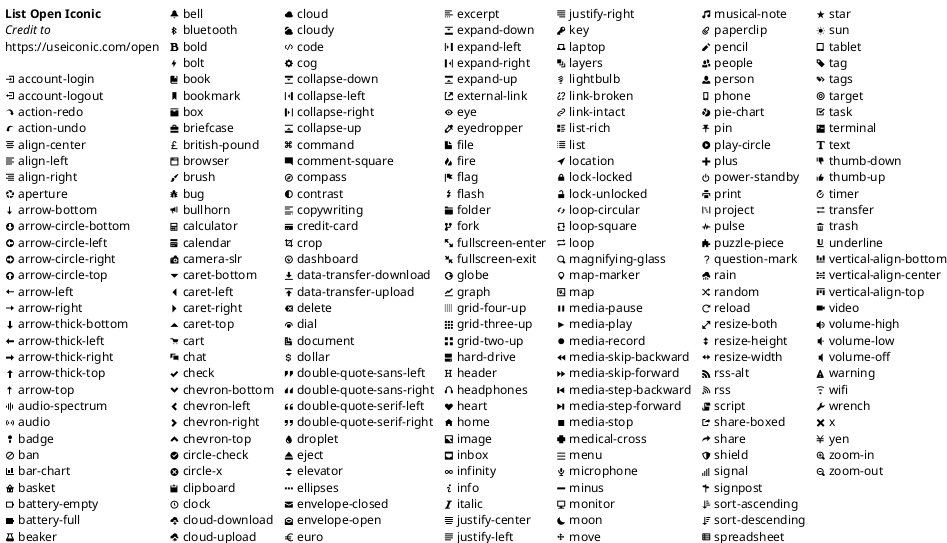


### 13.15 Include Salt "on activity diagram"


You can read the following explanation.

```plantuml {hide=false}
@startuml
(*) --> "
{{
salt
{+
<b>an example
choose one option
()one
()two
[ok]
}
}}
" as choose
choose -right-> "
{{
salt
{+
<b>please wait
operation in progress
<&clock>
[cancel]
}
}}
" as wait
wait -right-> "
{{
salt
{+
<b>success
congratulations!
[ok]
}
}}
" as success
wait -down-> "
{{
salt
{+
<b>error
failed, sorry
[ok]
}
}}
"
@enduml
```

It can also be combined with define macro.

```plantuml {hide=false}
@startuml
!unquoted procedure SALT($x)
"{{
salt
%invoke_procedure("_"+$x)
}}" as $x
!endprocedure
!procedure _choose()
{+
<b>an example
choose one option
()one
()two
[ok]
}
!endprocedure
!procedure _wait()
{+
<b>please wait
operation in progress
<&clock>
[cancel]
}
!endprocedure
!procedure _success()
{+
<b>success
congratulations!
[ok]
}
!endprocedure
!procedure _error()
{+
<b>error
failed, sorry
[ok]
}
!endprocedure
(*) --> SALT(choose)
-right-> SALT(wait)
wait -right-> SALT(success)
wait -down-> SALT(error)
@enduml
```

### 13.16 Include salt "on while condition of activity diagram"

You can include salt on while condition of activity diagram.

```plantuml {hide=false}
@startuml
start
while (\n{{\nsalt\n{+\nPassword | "**** "\n[Cancel] | [ OK ]}\n}}\n) is (Incorrect)
  :log attempt;
  :attempt_count++;
  if (attempt_count > 4) then (yes)
    :increase delay timer;
    :wait for timer to expire;
  else (no)
  endif
endwhile (correct)
:log request;
:disable service;
@enduml
```

[Ref. QA-8547]
