## 16 思维导图

于测试阶段：语法随时可能更改。

### 16.1 OrgMode 语法

同时兼容 OrgMode 语法。

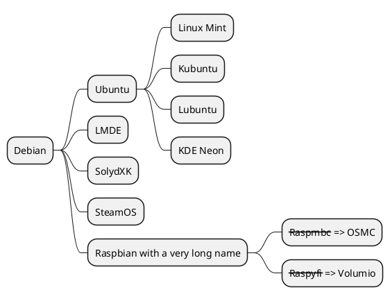

### 16.2 Multilines

You can use : and ; to have multilines box.

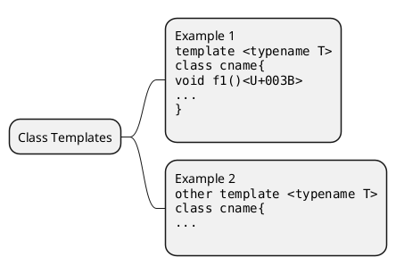

### 16.3 Colors

It is possible to change node color.

#### 16.3.1 With inline color

* OrgMode syntax mindmap

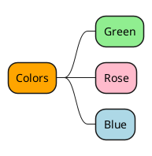

* Markdown syntax mindmap

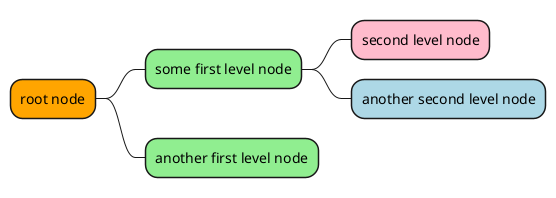

#### 16.3.2 With style color

* OrgMode syntax mindmap

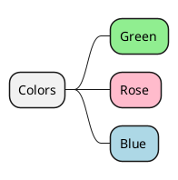

* Markdown syntax mindmap

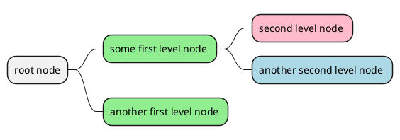
### 16.4 去除外边框

你可以用下划线去除外边框。

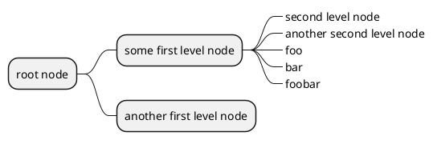

### 16.5 运算符

你可以使用下面的运算符来决定图形方向。

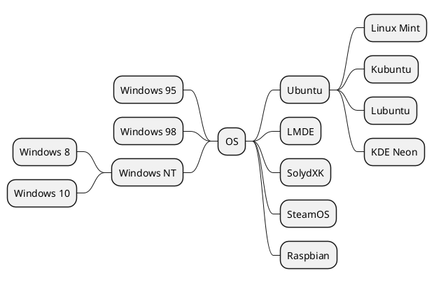

### 16.6 Markdown 语法

同时兼容 Markdown 语法。

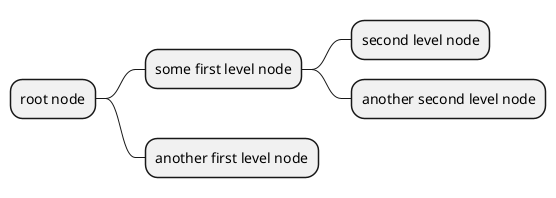

### 16.7 Changing style

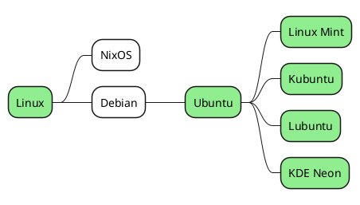

### 16.8 改变图形方向

你可以同时使用图形的左右两侧。

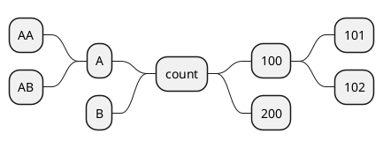

### 16.9 完整示例

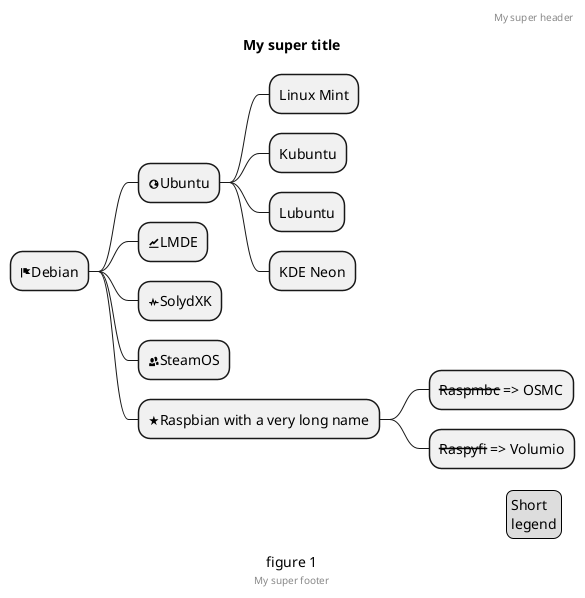

### 16.10 Word Wrap

Using MaximumWidth setting you can control automatic word wrap. Unit used is pixel.

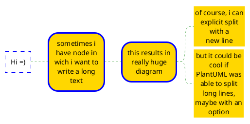
