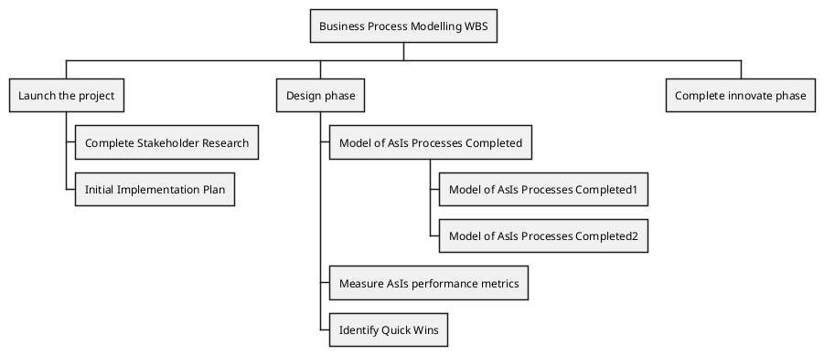
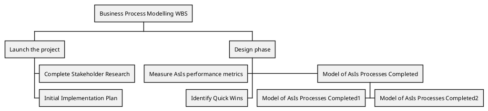
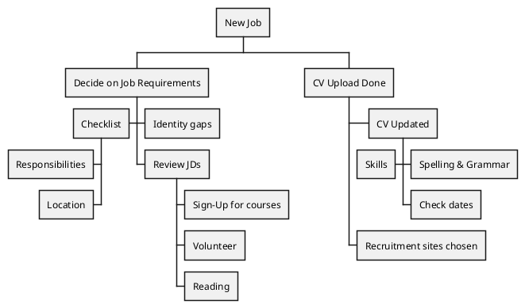
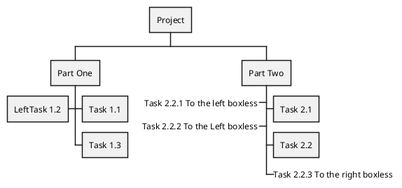
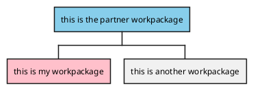
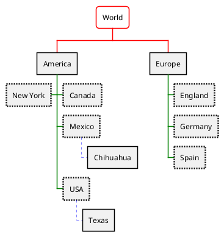
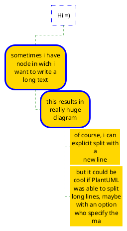

## 17 Work Breakdown Structure (WBS)

WBS diagram are still in beta: the syntax may change without notice.

### 17.1 OrgMode syntax

This syntax is compatible with OrgMode

### 17.2 Change direction

You can change direction using < and >

### 17.3 Arithmetic notation

You can use the following notation to choose diagram side.

### 17.4 Removing box

You can use underscore _ to remove box drawing.

### 17.5 Colors (with inline or style color)

It is possible to change node color:
* with inline color

[Ref. QA-12374, only from v1.2020.20]

* with style color

### 17.6 Using style

It is possible to change diagram style.

### 17.7 Word Wrap

Using MaximumWidth setting you can control automatic word wrap. Unit used is pixel.

