## 2 用例图

Let's have few examples :

Note that you can disable the shadowing using the skinparam shadowing false command.

### 2.1 用例

用例用圆括号括起来。

也可以用关键字 usecase 来定义用例。还可以用关键字 as 定义一个别名，这个别名可以在以后定义关系的时候使用。

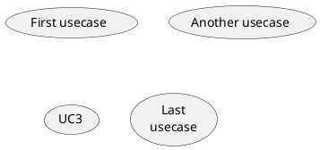

### 2.2 角色

角色用两个冒号包裹起来。

也可以用 actor 关键字来定义角色。还可以用关键字 as 来定义一个别名，这个别名可以在以后定义关系的时候使用。

后面我们会看到角色的定义是可选的。

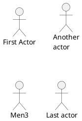

### 2.3 Change Actor style

You can change the actor style from stick man (by default) to:

* an awesome man with the skinparam actorStyle awesome command;
* a hollow man with the skinparam actorStyle hollow command.

#### 2.3.1 Stick man (by default)

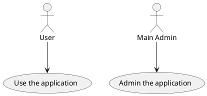

#### 2.3.2 Awesome man

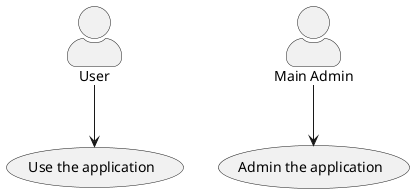

[Ref. QA-10493]

#### 2.3.3 Hollow man

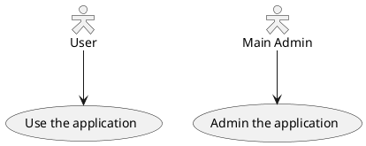

[Ref. PR#396]

### 2.4 用例描述

如果想定义跨越多行的用例描述，可以用双引号将其裹起来。

还可以使用这些分隔符：-- .. == __。并且还可以在分隔符中间放置标题。

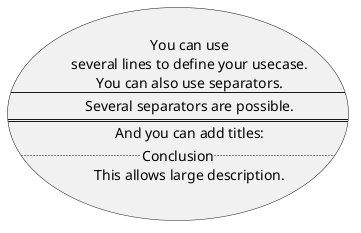

### 2.5 Use package

You can use packages to group actors or use cases.

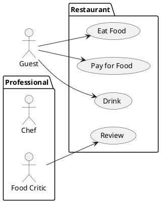

You can use rectangle to change the display of the package.

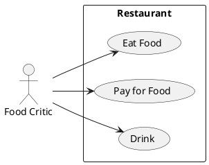

### 2.6 基础示例

用箭头 --> 连接角色和用例。

横杠 -越多，箭头越长。通过在箭头定义的后面加一个冒号及文字的方式来添加标签。

在这个例子中，User 并没有定义，而是直接拿来当做一个角色使用。

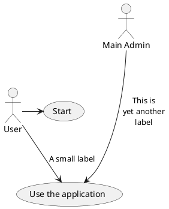

### 2.7 继承

如果一个角色或者用例继承于另一个，那么可以用 <|--符号表示。

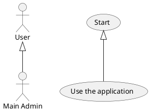

### 2.8 使用注释

可以用 note left of , note right of , note top of , note bottom of 等关键字给一个对象添加注释。

注释还可以通过 note 关键字来定义，然后用.. 连接其他对象。

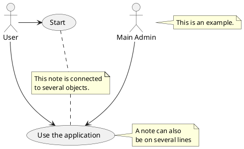

### 2.9 构造类型

用 << 和 >> 来定义角色或者用例的构造类型。

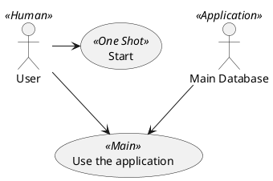

### 2.10 改变箭头方向

默认连接是竖直方向的，用 --表示，可以用一个横杠或点来表示水平连接。

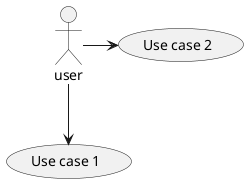

也可以通过翻转箭头来改变方向。

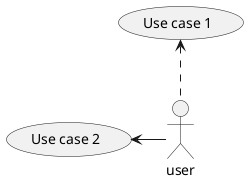

还可以通过给箭头添加 left, right, up 或 down 等关键字来改变方向。

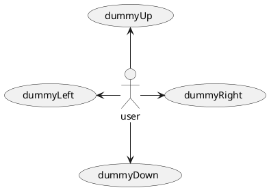

这些方向关键字也可以只是用首字母或者前两个字母的缩写来代替。

但是请注意，这样的缩写不要乱用，Graphviz 不喜欢这样。

### 2.11 分割图示

用 newpage 关键字将图示分解为多个页面。

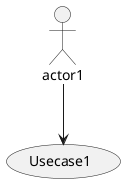

### 2.12 从左向右方向

默认从上往下构建图示。

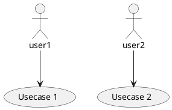

你可以用 left to right direction 命令改变图示方向。

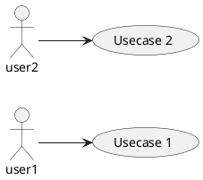

### 2.13 显示参数

用 skinparam 改变字体和颜色。

可以在如下场景中使用：
* 在图示的定义中，
* 在引入的文件中，
* 在命令行或者 ANT任务提供的配置文件中。

你也可以给构造的角色和用例指定特殊颜色和字体。

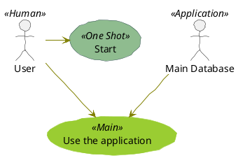

### 2.14 一个完整的例子

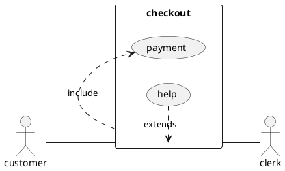