## 20 通用命令

### 20.1 注释

所有以 单引号' 开头的语句，被认为是一个注释.

多行注释，以 /' 和 '/ 作为注释的开始和结束

### 20.2 页眉和页脚

你可以使用 header 和 footer 命令在生成的图中增加页眉和页脚。

你可以选择指定 center, left 或 right 关键字使页眉或页脚实现居中、左对齐和右对齐。

像标题一样，页眉或页脚内容可以在多行中定义，而且同样可以在页眉或页脚中输入一些 HTML 代码。

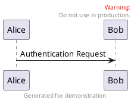

### 20.3 缩放

You can use the scale command to zoom the generated image.

You can use either a number or a fraction to define the scale factor. You can also specify either width or height (in pixel). And you can also give both width and height : the image is scaled to fit inside the specified dimension.
* scale 1.5
* scale 2/3
* scale 200 width
* scale 200 height
* scale 200*100
* scale max 300*200
* scale max 1024 width
* scale max 800 height

```plantuml {hide=false}
@startuml
scale 180*90
Bob->Alice : hello
@enduml
```

### 20.4 标题

使用 title 关键字添加标题。你可以在标题描述中使用 添加新行。

Some skinparam settings are available to put borders on the title.

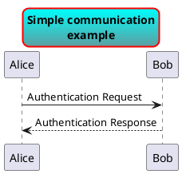

You can use creole formatting in the title.

You can also define title on several lines using title and end title keywords.

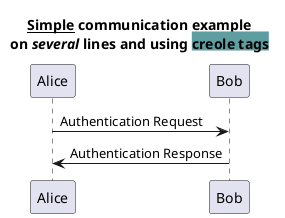

### 20.5 图片标题

使用 caption 关键字在图像下放置一个标题.

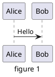

### 20.6 图例说明

legend 和 end legend 作为关键词，用于配置一个图例 (legend). 支持可选地使用 left,right,center 为这个图例指定对齐方式.

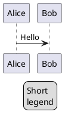

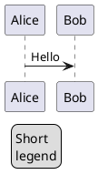

### 20.7 Appendice: Examples on all diagram

#### 20.7.1 Activity

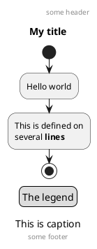

#### 20.7.2 Archimate

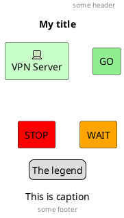

#### 20.7.3 Class

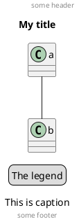

#### 20.7.4 Component, Deployment, Use-Case

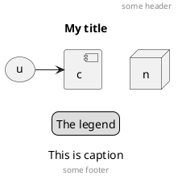

#### 20.7.5 Gantt project planning

```plantuml {hide=false}
@startuml
header some header
footer some footer
title My title
caption This is caption
legend
The legend
end legend
[t] lasts 5 days
@enduml
```

TODO: DONE [(Header, footer) corrected on V1.2020.18]

#### 20.7.6 Object

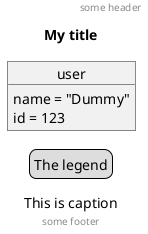

#### 20.7.7 MindMap

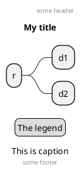

#### 20.7.8 Network (nwdiag)

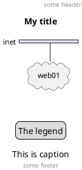

#### 20.7.9 Sequence

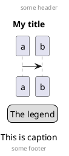

#### 20.7.10 State

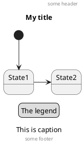

#### 20.7.11 Timing

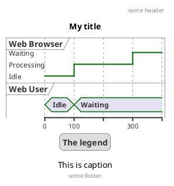

#### 20.7.12 Work Breakdown Structure (WBS)

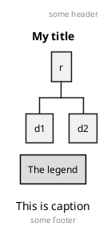

TODO: DONE [Corrected on V1.2020.17]

#### 20.7.13 Wireframe (SALT)

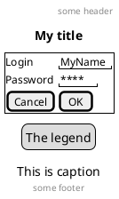

TODO: DONE [Corrected on V1.2020.18]

### 20.8 Appendice: Examples on all diagram with style

TODO: DONE

FYI:
* all is only good for Sequence diagram
* title, caption and legend are good for all diagrams except for salt diagram

TODO: FIXME ?
* Now (test on 1.2020.18-19) header, footer are not good for all other diagrams except only for Sequence diagram.

To be fix; Thanks

TODO: FIXME

Here are tests of title, header, footer, caption or legend on all the diagram with the debug style:

```
<style>
title {
HorizontalAlignment right
FontSize 24
FontColor blue
}
header {
HorizontalAlignment center
FontSize 26
FontColor purple
}
footer {
HorizontalAlignment left
FontSize 28
FontColor red
}
legend {
FontSize 30
BackGroundColor yellow
Margin 30
Padding 50
}
caption {
FontSize 32
}
</style>
```

#### 20.8.1 Activity

```plantuml {hide=false}
@startuml
<style>
title {
HorizontalAlignment right
FontSize 24
FontColor blue
}
header {
HorizontalAlignment center
FontSize 26
FontColor purple
}
footer {
HorizontalAlignment left
FontSize 28
FontColor red
}
legend {
FontSize 30
BackGroundColor yellow
Margin 30
Padding 50
}
caption {
FontSize 32
}
</style>
header some header
footer some footer
title My title
caption This is caption
legend
The legend
end legend
start
:Hello world;
:This is defined on
several **lines**;
stop
@enduml
```

#### 20.8.2 Archimate

```plantuml {hide=false}
@startuml
<style>
title {
HorizontalAlignment right
FontSize 24
FontColor blue
}
header {
HorizontalAlignment center
FontSize 26
FontColor purple
}
footer {
HorizontalAlignment left
FontSize 28
FontColor red
}
legend {
FontSize 30
BackGroundColor yellow
Margin 30
Padding 50
}
caption {
FontSize 32
}
</style>
header some header
footer some footer
title My title
caption This is caption
legend
The legend
end legend
archimate #Technology "VPN Server" as vpnServerA <<technology-device>>
rectangle GO #lightgreen
rectangle STOP #red
rectangle WAIT #orange
@enduml
```

#### 20.8.3 Class

```plantuml {hide=false}
@startuml
<style>
title {
HorizontalAlignment right
FontSize 24
FontColor blue
}
header {
HorizontalAlignment center
FontSize 26
FontColor purple
}
footer {
HorizontalAlignment left
FontSize 28
FontColor red
}
legend {
FontSize 30
BackGroundColor yellow
Margin 30
Padding 50
}
caption {
FontSize 32
}
</style>
header some header
footer some footer
title My title
caption This is caption
legend
The legend
end legend
a -- b
@enduml
```

#### 20.8.4 Component, Deployment, Use-Case

```plantuml {hide=false}
@startuml
<style>
title {
HorizontalAlignment right
FontSize 24
FontColor blue
}
header {
HorizontalAlignment center
FontSize 26
FontColor purple
}
footer {
HorizontalAlignment left
FontSize 28
FontColor red
}
legend {
FontSize 30
BackGroundColor yellow
Margin 30
Padding 50
}
caption {
FontSize 32
}
</style>
header some header
footer some footer
title My title
caption This is caption
legend
The legend
end legend
node n
(u) -> [c]
@enduml
```

#### 20.8.5 Gantt project planning

```plantuml {hide=false}
@startuml
<style>
title {
HorizontalAlignment right
FontSize 24
FontColor blue
}
header {
HorizontalAlignment center
FontSize 26
FontColor purple
}
footer {
HorizontalAlignment left
FontSize 28
FontColor red
}
legend {
FontSize 30
BackGroundColor yellow
Margin 30
Padding 50
}
caption {
FontSize 32
}
</style>
header some header
footer some footer
title My title
caption This is caption
legend
The legend
end legend
[t] lasts 5 days
@enduml
```

#### 20.8.6 Object

```plantuml {hide=false}
@startuml
<style>
title {
HorizontalAlignment right
FontSize 24
FontColor blue
}
header {
HorizontalAlignment center
FontSize 26
FontColor purple
}
footer {
HorizontalAlignment left
FontSize 28
FontColor red
}
legend {
FontSize 30
BackGroundColor yellow
Margin 30
Padding 50
}
caption {
FontSize 32
}
</style>
header some header
footer some footer
title My title
caption This is caption
legend
The legend
end legend
object user {
name = "Dummy"
id = 123
}
@enduml
```

#### 20.8.7 MindMap

```plantuml {hide=false}
@startmindmap
<style>
title {
HorizontalAlignment right
FontSize 24
FontColor blue
}
header {
HorizontalAlignment center
FontSize 26
FontColor purple
}
footer {
HorizontalAlignment left
FontSize 28
FontColor red
}
legend {
FontSize 30
BackGroundColor yellow
Margin 30
Padding 50
}
caption {
FontSize 32
}
</style>
header some header
footer some footer
title My title
caption This is caption
legend
The legend
end legend
* r
** d1
** d2
@endmindmap
```

#### 20.8.8 Network (nwdiag)

```plantuml {hide=false}
@startuml
<style>
title {
HorizontalAlignment right
FontSize 24
FontColor blue
}
header {
HorizontalAlignment center
FontSize 26
FontColor purple
}
footer {
HorizontalAlignment left
FontSize 28
FontColor red
}
legend {
FontSize 30
BackGroundColor yellow
Margin 30
Padding 50
}
caption {
FontSize 32
}
</style>
header some header
footer some footer
title My title
caption This is caption
legend
The legend
end legend
nwdiag {
network inet {
web01 [shape = cloud]
}
}
@enduml
```
#### 20.8.9 Sequence

```plantuml {hide=false}
@startuml
<style>
title {
HorizontalAlignment right
FontSize 24
FontColor blue
}
header {
HorizontalAlignment center
FontSize 26
FontColor purple
}
footer {
HorizontalAlignment left
FontSize 28
FontColor red
}
legend {
FontSize 30
BackGroundColor yellow
Margin 30
Padding 50
}
caption {
FontSize 32
}
</style>
header some header
footer some footer
title My title
caption This is caption
legend
The legend
end legend
a->b
@enduml
```

#### 20.8.10 State

```  puml {hide=false}
@startuml
<style>
title {
HorizontalAlignment right
FontSize 24
FontColor blue
}
header {
HorizontalAlignment center
FontSize 26
FontColor purple
}
footer {
HorizontalAlignment left
FontSize 28
FontColor red
}
legend {
FontSize 30
BackGroundColor yellow
Margin 30
Padding 50
}
caption {
FontSize 32
}
</style>
header some header
footer some footer
title My title
caption This is caption
legend
The legend
end legend
[*] --> State1
State1 -> State2
@enduml
```

#### 20.8.11 Timing

```plantuml {hide=false}
@startuml
<style>
title {
HorizontalAlignment right
FontSize 24
FontColor blue
}
header {
HorizontalAlignment center
FontSize 26
FontColor purple
}
footer {
HorizontalAlignment left
FontSize 28
FontColor red
}
legend {
FontSize 30
BackGroundColor yellow
Margin 30
Padding 50
}
caption {
FontSize 32
}
</style>
header some header
footer some footer
title My title
caption This is caption
legend
The legend
end legend
robust "Web Browser" as WB
concise "Web User" as WU
@0
WU is Idle
WB is Idle
@100
WU is Waiting
WB is Processing
@300
WB is Waiting
@enduml
```

#### 20.8.12 Work Breakdown Structure (WBS)

```plantuml {hide=false}
@startwbs
<style>
title {
HorizontalAlignment right
FontSize 24
FontColor blue
}
header {
HorizontalAlignment center
FontSize 26
FontColor purple
}
footer {
HorizontalAlignment left
FontSize 28
FontColor red
}
legend {
FontSize 30
BackGroundColor yellow
Margin 30
Padding 50
}
caption {
FontSize 32
}
</style>
header some header
footer some footer
title My title
caption This is caption
legend
The legend
end legend
* r
** d1
** d2
@endwbs
```

#### 20.8.13 Wireframe (SALT)

TODO: FIXME Fix all (title,caption, legend, header, footer) for salt. TODO: FIXME

```plantuml {hide=false}
@startsalt
<style>
title {
HorizontalAlignment right
FontSize 24
FontColor blue
}
header {
HorizontalAlignment center
FontSize 26
FontColor purple
}
footer {
HorizontalAlignment left
FontSize 28
FontColor red
}
legend {
FontSize 30
BackGroundColor yellow
Margin 30
Padding 50
}
caption {
FontSize 32
}
</style>
@startsalt
header some header
footer some footer
title My title
caption This is caption
legend
The legend
end legend
{+
Login | "MyName "
Password | "**** "
[Cancel] | [ OK ]
}
@endsalt
```
