## 21 Creole

A light Creole engine has been integrated into PlantUML to have a standardized way of defining text style.

All diagrams are now supporting this syntax.

Note that ascending compatibility with HTML syntax is preserved.

### 21.1 Emphasized text

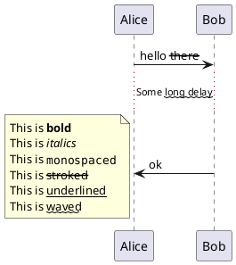

### 21.2 List

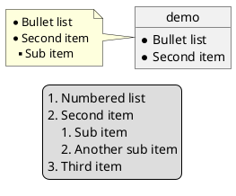

### 21.3 Escape character

You can use the tilde ~ to escape special creole characters.

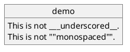

### 21.4 Horizontal lines

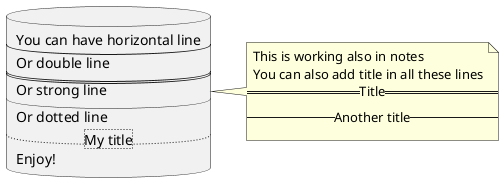

### 21.5 Headings

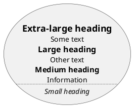

### 21.6 Legacy HTML

Some HTML tags are also working:
* `<b>` for bold text
* `<u>` or `<u:#AAAAAA>` or `<u:[[color|colorName]]>` for underline
* `<i>` for italic
* `<s>` or `<s:#AAAAAA>` or `<s:[[color|colorName]]>` for strike text
* `<w>` or `<w:#AAAAAA>` or `<w:[[color|colorName]]>` for wave underline text
* `<color:#AAAAAA>` or `<color:[[color|colorName]]>`
* `<back:#AAAAAA>` or `<back:[[color|colorName]]>` for background color
* `<size:nn>` to change font size
* `` : the file must be accessible by the filesystem
* ` `: the URL must be available from the Internet

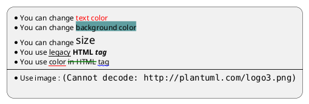

### 21.7 Code

You can use `<code> ` if you put some language code in your diagram.

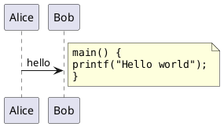

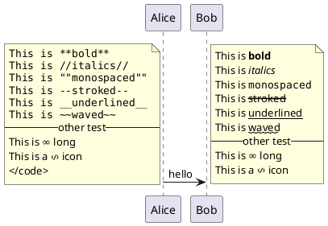

### 21.8 Table

#### 21.8.1 Build a table

It is possible to build table, with | separator.

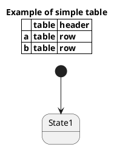

#### 21.8.2 Add color on cells or lines

You can specify background colors for cells and lines.

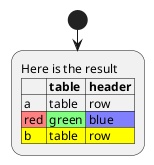

#### 21.8.3 Add color on border

You can also specify background colors and colors for border.

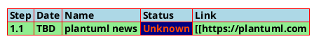

[Ref. QA-7184]

#### 21.8.4 No border or same color as the background

You can also set the border color to the same color as the background.

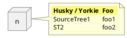

[Ref. QA-12448]

#### 21.8.5 Bold header or not

Yan can have a bold header or not.

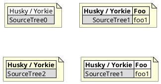

[Ref. QA-10923]


### 21.9 Tree

You can use |_ characters to build a tree.

On common commands, like title:

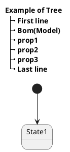

On Class diagram:

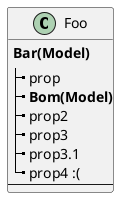

[Ref. QA-3448]

And on component or deployement diagram:

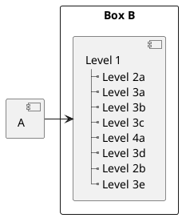

[Ref. QA-11365]

### 21.10 Special characters

It's possible to use any unicode characters with &# syntax or <U+XXXX>

``` puml {hide=false}
@startuml
usecase foo as "this is &#8734; long"
usecase bar as "this is also <U+221E> long"
@enduml
```

### 21.11 OpenIconic

OpenIconic is an very nice open source icon set. Those icons have been integrated into the creole parser, so you can use them out-of-the-box.

You can use the following syntax: <&ICON_NAME>.

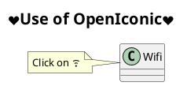

The complete list is available on OpenIconic Website, or you can use the following special diagram:

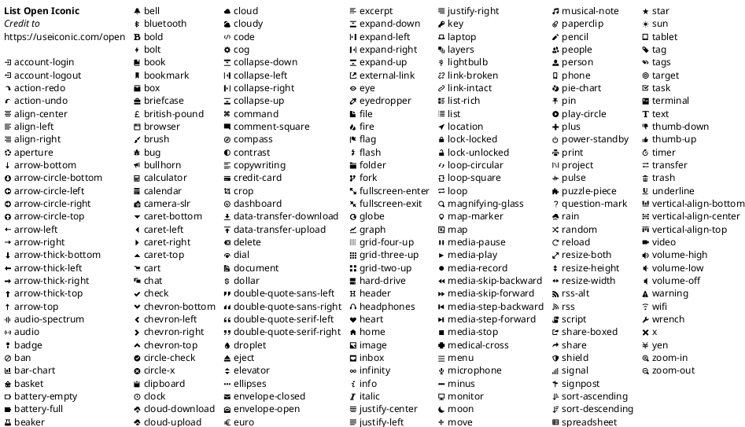

### 21.12 Appendice: Examples of "Creole List" on all diagrams

#### 21.12.1 Activity

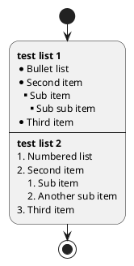

#### 21.12.2 Class


TODO: FIXME ?
* Sub item
* Sub sub item

TODO: FIXME

``` puml {hide=false}
@startuml
class a {
**test list 1**
* Bullet list
* Second item
** Sub item
*** Sub sub item
* Third item
----
**test list 2**
# Numbered list
# Second item
## Sub item
## Another sub item
# Third item
}
a -- b
@enduml
```

#### 21.12.3 Component, Deployment, Use-Case

``` puml {hide=false}
@startuml
node n [
**test list 1**
* Bullet list
* Second item
** Sub item
*** Sub sub item
* Third item
----
**test list 2**
# Numbered list
# Second item
## Sub item
## Another sub item
# Third item
]
file f as "
**test list 1**
* Bullet list
* Second item
** Sub item
*** Sub sub item
* Third item
----
**test list 2**
# Numbered list
# Second item
## Sub item
## Another sub item
# Third item
"
@enduml
```

TODO: DONE [Corrected on V1.2020.18]

#### 21.12.4 Gantt project planning

N/A

#### 21.12.5 Object


TODO: FIXME ?
• Sub item
• Sub sub item
TODO: FIXME

``` puml {hide=false}
@startuml
object user {
**test list 1**
* Bullet list
* Second item
** Sub item
*** Sub sub item
* Third item
----
**test list 2**
# Numbered list
# Second item
## Sub item
## Another sub item
# Third item
}
@enduml
```

#### 21.12.6 MindMap

``` puml {hide=false}
@startmindmap
* root
** d1
**:**test list 1**
* Bullet list
* Second item
** Sub item
*** Sub sub item
* Third item
----
**test list 2**
# Numbered list
# Second item
## Sub item
## Another sub item
# Third item;
@endmindmap
```

#### 21.12.7 Network (nwdiag)

N/A

#### 21.12.8 Note

``` puml {hide=false}
@startuml
note as n
**test list 1**
* Bullet list
* Second item
** Sub item
*** Sub sub item
* Third item
----
**test list 2**
# Numbered list
# Second item
## Sub item
## Another sub item
# Third item
end note
@enduml
```

#### 21.12.9 Sequence

N/A (or on note or common commands)

#### 21.12.10 State

N/A (or on note or common commands)

### 21.13 Appendice: Examples of "Creole horizontal lines" on all diagrams

#### 21.13.1 Activity

TODO: FIXME ? strong line ____ TODO: FIXME

``` puml {hide=false}
@startuml
start
:You can have horizontal line
----
Or double line
====
Or strong line
____
Or dotted line
..My title..
//and title... //
==Title==
--Another title--
Enjoy!;
stop
@enduml
```

#### 21.13.2 Class

``` puml {hide=false}
@startuml
class a {
You can have horizontal line
----
Or double line
====
Or strong line
____
Or dotted line
..My title..
//and title... //
==Title==
--Another title--
Enjoy!
}
a -- b
@enduml
```

#### 21.13.3 Component, Deployment, Use-Case

``` puml {hide=false}
@startuml
node n [
You can have horizontal line
----
Or double line
====
Or strong line
____
Or dotted line
..My title..
//and title... //
==Title==
--Another title--
Enjoy!
]
file f as "
You can have horizontal line
----
Or double line
====
Or strong line
____
Or dotted line
..My title..
//and title... //
==Title==
--Another title--
Enjoy!
"
@enduml
```

#### 21.13.4 Gantt project planning

N/A

#### 21.13.5 Object

``` puml {hide=false}
@startuml
object user {
You can have horizontal line
----
Or double line
====
Or strong line
____
Or dotted line
..My title..
//and title... //
==Title==
--Another title--
Enjoy!
}
@enduml
```

TODO: DONE [Corrected on V1.2020.18]

#### 21.13.6 MindMap

TODO: FIXME ? strong line ____ TODO: FIXME

``` puml {hide=false}
@startmindmap
* root
** d1
**:You can have horizontal line
----
Or double line
====
Or strong line
____
Or dotted line
..My title..
//and title... //
==Title==
--Another title--
Enjoy!;
@endmindmap
```

#### 21.13.7 Network (nwdiag)

N/A

#### 21.13.8 Note

``` puml {hide=false}
@startuml
note as n
You can have horizontal line
----
Or double line
====
Or strong line
____
Or dotted line
..My title..
//and title... //
==Title==
--Another title--
Enjoy!
end note
@enduml
```

#### 21.13.9 Sequence

N/A (or on note or common commands)

#### 21.13.10 State

N/A (or on note or common commands)

### 21.14 Style equivalent (between Creole and HTML)

Style | Creole | Legacy HTML like
------|--------|------
bold | This is `**bold**` | This is `<b>bold</b>`
italics | This is `//italics//` | This is `<i>italics</i>`
monospaced | This is `""monospaced""` | This is `<font:monospaced>monospaced</font>`
stroked | This is `--stroked--` | This is `<s>stroked</s>`
underlined | This is `__underlined__` | This is `<u>underlined</u>`
waved | This is `~~~` | This is `<w>waved</w>`

``` puml {hide=false}
@startmindmap
* Style equivalent\n(between Creole and HTML) 
**:**Creole**
----
<#silver>|= code|= output|
| \n This is ""~**bold**""\n | \n This is **bold** |
| \n This is ""~//italics//""\n | \n This is //italics// |
| \n This is ""~""monospaced~"" ""\n | \n This is ""monospaced"" |
| \n This is ""~--stroked--""\n | \n This is --stroked-- |
| \n This is ""~__underlined__""\n |  \n This is __underlined__ |
| \n This is ""<U+007E><U+007E>waved<U+007E><U+007E>""\n | \n This is ~~waved~~ |;
**:<b>Legacy HTML like
----
<#silver>|= code|= output|
| \n This is ""~<b>bold</b>""\n | \n This is <b>bold</b> |
| \n This is ""~<i>italics</i>""\n | \n This is <i>italics</i> |
| \n This is ""~<font:monospaced>monospaced</font>""\n | \n This is <font:monospaced>monospaced</font> |
| \n This is ""~<s>stroked</s>""\n | \n  This is <s>stroked</s> |
| \n This is ""~<u>underlined</u>""\n | \n This is <u>underlined</u> |
| \n This is ""~<w>waved</w>""\n | \n This is <w>waved</w> |

And color as a bonus...
<#silver>|= code|= output|
| \n This is ""~<s:""<color:green>""green""</color>"">stroked</s>""\n | \n  This is <s:green>stroked</s> |
| \n This is ""~<u:""<color:red>""red""</color>"">underlined</u>""\n | \n This is <u:red>underlined</u> |
| \n This is ""~<w:""<color:#0000FF>""#0000FF""</color>"">waved</w>""\n | \n This is <w:#0000FF>waved</w> |;
@endmindmap
```
