## 22 Defining and using sprites

A Sprite is a small graphic element that can be used in diagrams.

In PlantUML, sprites are monochrome and can have either 4, 8 or 16 gray level.

To define a sprite, you have to use a hexadecimal digit between 0 and F per pixel.

Then you can use the sprite using <$XXX> where XXX is the name of the sprite.

```plantuml {hide=false}
@startuml
sprite $foo1 {
FFFFFFFFFFFFFFF
F0123456789ABCF
F0123456789ABCF
F0123456789ABCF
F0123456789ABCF
F0123456789ABCF
F0123456789ABCF
F0123456789ABCF
F0123456789ABCF
FFFFFFFFFFFFFFF
}
Alice -> Bob : Testing <$foo1>
@enduml
```



You can scale the sprite.

```plantuml {hide=false}
@startuml
sprite $foo1 {
FFFFFFFFFFFFFFF
F0123456789ABCF
F0123456789ABCF
F0123456789ABCF
F0123456789ABCF
F0123456789ABCF
F0123456789ABCF
F0123456789ABCF
F0123456789ABCF
FFFFFFFFFFFFFFF
}
Alice -> Bob : Testing <$foo1{scale=3}>
@enduml
```



### 22.1 Changing colors

Although sprites are monochrome, it's possible to change their color.

```plantuml {hide=false}
@startuml
sprite $foo1 {
FFFFFFFFFFFFFFF
F0123456789ABCF
F0123456789ABCF
F0123456789ABCF
F0123456789ABCF
F0123456789ABCF
F0123456789ABCF
F0123456789ABCF
F0123456789ABCF
FFFFFFFFFFFFFFF
}
Alice -> Bob : Testing <$foo1,scale=3.4,color=orange>
@enduml
```



### 22.2 Encoding Sprite

To encode sprite, you can use the command line like:
`java -jar plantuml.jar -encodesprite 16z foo.png`

where foo.png is the image file you want to use (it will be converted to gray automatically).

After -encodesprite, you have to specify a format: 4, 8, 16, 4z, 8z or 16z.

The number indicates the gray level and the optional z is used to enable compression in sprite definition.

### 22.3 Importing Sprite

You can also launch the GUI to generate a sprite from an existing image.

Click in the menubar then on File/Open Sprite Window.

After copying an image into you clipboard,several possible definitions of the corresponding sprite will be displayed: you will just have to pickup the one you want.

### 22.4 Examples

```plantuml {hide=false}
@startuml
 sprite $bug [15x15/16z] PKzR2i0m2BFMi15p__FEjQEqB1z27aeqCqixa8S4OT7C53cKpsHpaYPDJY_12MHM-BLRyywPhrrlw3qumqNThmXgd1TOterAZmOW8sgiJafogofWRwtV3nCF
 sprite $printer [15x15/8z] NOtH3W0W208HxFz_kMAhj7lHWpa1XC716sz0Pq4MVPEWfBHIuxP3L6kbTcizR8tAhzaqFvXwvFfPEqm0
 sprite $disk {
   444445566677881
   436000000009991
   43600000000ACA1
   53700000001A7A1
   53700000012B8A1
   53800000123B8A1
   63800001233C9A1
   634999AABBC99B1
   744566778899AB1
   7456AAAAA99AAB1
   8566AFC228AABB1
   8567AC8118BBBB1
   867BD4433BBBBB1
   39AAAAABBBBBBC1
}

 title Use of sprites (<$printer>, <$bug>...)

 class Example {
 Can have some bug : <$bug>
 Click on <$disk> to save
 }

 note left : The printer <$printer> is available

@enduml
```




### 22.5 StdLib

The PlantUML StdLib includes a number of ready icons in various IT areas such as architecture, cloud services,logos etc. It including AWS, Azure, Kubernetes, C4, product Logos and many others. To explore these libraries:
* Browse the Github folders of PlantUML StdLib
* Browse the source repos of StdLib collections that interest you. Eg if you are interested in logos you can find that it came from gilbarbara-plantuml-sprites, and quickly find its sprites-list. (The *ext section shows how to list selected sprites but unfortunately that's in grayscale whereas this custom listing is in color.)
* Study the in-depth Hitchhiker’s Guide to PlantUML, eg sections Standard Library Sprites and PlantUML Stdlib Overview

### 22.6 Listing Sprites

You can use the listsprites command to show available sprites:
* Used on its own, it just shows ArchiMate sprites
* If you include some sprite libraries in your diagram, the command shows all these sprites, as explained in View all the icons with listsprites.

(Example from Hitchhikers Guide to PlantUML)

```plantuml {hide=false}
@startuml

!define osaPuml https://raw.githubusercontent.com/Crashedmind/PlantUML-opensecurityarchitecture2-icons/master
!include osaPuml/Common.puml
!include osaPuml/User/all.puml

listsprites
@enduml
```

Most collections have files called all that allow you to see a whole sub-collection at once. Else you need to find the sprites that interest you and include them one by one. Unfortunately, the version of a collection included in StdLib often does not have such all files, so as you see above we include the collection from github, not from StdLib.

All sprites are in grayscale, but most collections define specific macros that include appropriate (vendor-specific) colors.
