## Advanced usage

### ASCII Art

It is possible to generate Sequence Diagrams using ASCII art.

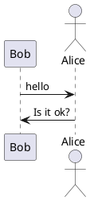

You have to use the -txt flag in the command line, or the format tag in the Ant task :

```
<target name="main">
  <plantuml dir="./src" format="txt" />
</target>
```
Generated files use .atxt extension. ("a" as ASCII art : to NOT overide any existing .txt files!). Here is the result:

```
                      ,-.
                      `-'
                      /|\
     ,---.             |
     |Bob|            / \
     `-+-'           Alice
       |    hello      |
       |-------------->|
       |               |
       |  Is it ok?    |
       |<- - - - - - - |
     ,-+-.           Alice
     |Bob|            ,-.
     `---'            `-'
                      /|\
                       |
                      / \
```

#### Unicode

The default txt format uses only plain ASCII characters. It is possible to use few extended Unicode characters to have a slightly better result. You should use the -utxt flag in the command line, or the utxt format in the Ant task.

They are two drawbacks of using utxt:
* The result is UTF-8 encoded, and sometimes this is an issue (mail gateway, editors...)
* The used font must have the used extended characters (like Courier, Courier New...)

### 命令行

您也可以使用下面的命令行运行PlantUML:

`java -jar plantuml.jar file1 file2 file3`

这将在 file1, file2 和file3 中寻找 @startXYZ。 对于每个图表, 都将创建一个 .png 文件。

对于处理整个文件夹, 您可以使用:

`java -jar plantuml.jar "c:/directory1" "c:/directory2"`

此命令将寻找 @startXYZ 和 @endXYZ 位于 c:/directory1 和 c:/directory2 目录中的 .c, .h, .cpp, .txt, .pu, .tex, .html, .htm 或.java 文件。

#### 通配符

您也可以使用通过符 :
* 对于单个字符，用 ?
* 对于零个或多个字符, 用 *
* 对于零个或多个字符, (包括 / 或 \), 用一对 **

所以处理所有以 dummy 开始的目录的任意 .cpp 文件:

java -jar plantuml.jar "dummy*/*.cpp"
和处理以 dummy 开始的目录及其子目录中的任意 .cpp 文件 :

java -jar plantuml.jar "dummy*/**.cpp"
排除文件Back to topEdit using Dokuwiki syntaxEdit using Asciidoc syntaxEdit using Markdown syntax

您可以使用 -x 选项来排除处理队列中的某些文件:

`java -jar plantuml.jar -x "**/common/**" -x "**/test/Test*" "dummy*/**/*.cpp"`

####  输出目录

您可以使用 -o 开关来指定一个输出所有图片的目录:

`java -jar plantuml.jar -o "c:/outputPng" "c:/directory2"`

如果您递归进入几个目录，如果为此输出目录提供绝对路径或相对路径，则会略有不同。
* 绝对路径: 将使用唯一的输出目录，在其中生成所有图像
* 相对路径: 将在文件树中使用多个输出目录。

####  配置文件

您还可以在每个图表之前提供将包含的配置文件:

`java -jar plantuml.jar -config "./config.cfg" dir1`

#### Metadata

After all preprocessing (includes etc), PlantUML saves the diagram's source code in the generated PNG Metadata in the form of encoded text.
* It is possible to retrieve this source with the -metadata option. This means that the PNG is almost "editable": you can post it on a corporate wiki where you cannot install plugins, and someone in the future can update the diagram by getting the metadata, editing and re-uploading again. Also, the diagram is stand-alone.
* Conversely, the -checkmetadata option checks whether the target PNG has the same source and if there are no changes, doesn't regenerate the PNG, thus saving all processing time. This allows you to run PlantUML on a whole folder (or tree with the -recursive option) incrementally.

Sounds like magic! No, merely clever engineering :-)

Example:

  `java -jar plantuml.jar -metadata diagram.png > diagram.puml`

Unfortunately this option works only with local files. It doesn't work with -pipe so you cannot fetch a URL with eg curl and feed the PNG to PlantUML.

However, the Plantuml server has a similar feature, where it can get a PNG from a URL and extract its metadata.

#### 退出代码

当图表中存在一些错误时，该命令会返回错误 (-1) 退出代码。 但即使某些图表包含一些错误， 所有 图表仍会生成，这对于大型项目来说可能是耗时的。

您可以使用 -failfast 标志来改变这种行为，在错误发生时尽快停止图表生成。在这种情况下，将生成一些图表，而有些图表则不会生成。

同时有 -failfast2 标志做第一次通过检查。 如果出现某些错误，根本不会有图表生成。如果有错误 -failfast2 运行速度比 -failfast 要快, 这可能对大型项目有用。

#### 标准输入输出

使用 -pipe 选项，您可以很容易在脚本中使用 PlantUML。

使用此选项，通过标准输入接收图表描述，并生成png文件到标准输出。在本地文件系统上不会写任何文件。

例如:

`type somefile.txt | java -jar plantuml.jar -pipe > somefile.png`

#### 帮助

您可以用以下命令来获得帮助:

java -jar plantuml.jar -help

### Ditaa

Ditaa 是一个支持通过文本描述生成通用图表的开源项目。这个理念和PlantUML非常相近，所以，支持除UML之外其他图表的文档化将会很有很有意义。

所以最新版本的PlantUML支持下面的语法：


```plantuml
@startuml
ditaa
+--------+   +-------+    +-------+
|        +---+ ditaa +--> |       |
|  Text  |   +-------+    |diagram|
|Document|   |!magic!|    |       |
|     {d}|   |       |    |       |
+---+----+   +-------+    +-------+
    :                         ^
    |       Lots of work      |
    +-------------------------+
@enduml
```


你可以在 [这里](http://ditaa.sourceforge.net/) 找到它的完整的文档。

如果你的插件还不支持@startditaa，可以使用 临时 解决方案：在你的文档描述首行使用@startuml，通过ditta关键字来支持 Ditaa 。

你同样可以在@startditaa或者@ditta关键字后面使用一些设置：
* -E 或者 --no-separation 移除分隔符
* -S 或者 --no-shadows 移除阴影
* scale=XYZ to 缩放图表

```plantuml {hide=false}
@startuml
ditaa(--no-shadows, scale=0.8)
/--------\   +-------+
|cAAA    +---+Version|
|  Data  |   |   V3  |
|  Base  |   |cRED{d}|
|     {s}|   +-------+
\---+----/
@enduml
```

#### Option supported by PlantUML

You can also use some option, after the @startditaa or ditaa keyword:
* -E or --no-separation to remove separator
* -S or --no-shadows to remove shadow
* scale=<XYZ> to scale up or down the diagram

Without option


Remove separator


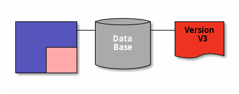

Remove shadow or scale diagram

```plantuml {hide=false}
@startuml
ditaa(--no-shadows, scale=0.7)
+---------+  /--------\   +-------+
| cBLU    +--+cAAA    +---+Version|
|         |  |  Data  |   |   V3  |
|    +----+  |  Base  |   |cRED{d}|
|    |cPNK|  |     {s}|   +-------+
|    |    |  \---+----/
+----+----+    
@enduml
```

Tags

Tag	Description
* {c}	Choice or Decision
* {d}	Document - Symbol representing a document
* {io}	Input/Output - Symbol representing input/output
* {mo}	Manual operation
* {o}	Ellipse
* {s}	Storage - Symbol representing a form of storage, like a database or a hard disk.
* {tr}	Trapezoid

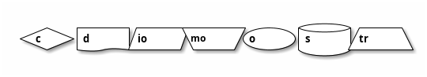

###DOT

You can use the DOT language to create directed graphs (see a Gallery of examples). (Note: PlantUML uses Graphviz/DOT for layout of UML diagrams anyway.)

This allows you to use Graphviz/DOT with all tools that support PlantUML.

You can use @startdot/@enddot or @startuml/@enduml to delineate the diagram, and then the very first line has to be: digraph XYZ {.

Here are some examples:

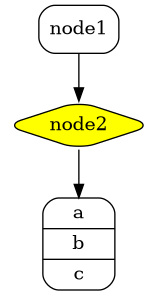


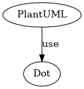

### EPS

EPS is a graphical format which is scalable. It means that when you zoom an image, you don't loose quality. So this format gives good printing result.

EPS SupportBack to topEdit using Dokuwiki syntaxEdit using Asciidoc syntaxEdit using Markdown syntax

You can enable it by using -teps flag with the command line.

You can also use format="eps" in the ant task definition.

```
<target name="main">
<plantuml dir="./src" format="eps" />
</target>

```

### PlantUML GUI

If the double-click does not work fine, you can try the following command:

`java -jar plantuml.jar -gui`

You can then select a directory that will be periodically scanned by PlantUML.

The following window lists all images that are generated by PlantUML. If any modification is done in the directory, the window will be updated.

You can iconify the window while you are creating or changing files into the chosen directory.

You can also double-click on an image title to have a look at it. If the source file of the diagram is modified, the image will be automatically updated.

### Handwritten diagram style

To emphasize the fact that your diagrams are still under work, you can generate handwritten diagrams.

You have to set handwritten skinparam to true to do so.

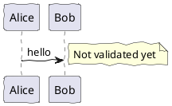

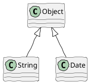

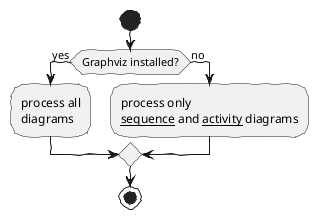

### Upgrading note (about Links and Hyperlinks)

Hyperlinks have been introduced in iterative mode so there have been some slight syntax changes with different versions. Starting with version 8058, syntax about hyperlink is now clearly defined and stable.

Unfortunately, there are some tiny changes from previous legacy syntax, so you may have to update your existing source diagrams. This is something we do not like, because we try to guarantee ascending compatibility as far as possible. But in some cases, we have to move forward.

The good news is that older legacy diagrams will still be generated by newer versions of PlantUML. The only impact is that some links may be displayed differently, so we think it is an acceptable change.

#### Format definition


##### Simple link

Simple links are define using two square brackets.

Example: `[[http://plantuml.com]]`

##### Link with optional label

It is possible to give an optional label that will be printed instead of the link itself. A space is used as separator after the URL itself.

Example: `[[http://plantuml.com This label is printed]]`

##### Link with optional tooltip

Finally you can also have an optional tooltip using round brackets, just after the URL and before the optional label.

Example: [[http://plantuml.com{Optional tooltip} This label is printed]]

#### Links in sequence diagram

The following example lists some links features:

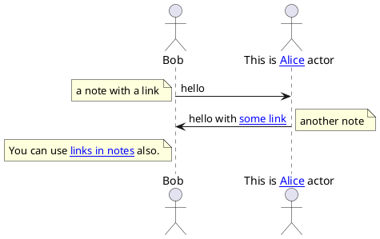

#### Links in class diagram

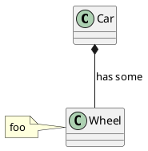

There is a special syntax with 3 square brackets in class definition when you want to define a link on field or method. For example:

```plantuml {hide=false}
@startuml
class Car {
  - Some field [[[http://plantuml.com]]]
  Some method() [[[http://plantuml.com/link]]]
}
@enduml
```

#### Links in activity diagram

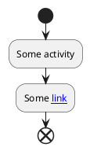

### The Oregon Trail

A version from David Ahl's (named as Westward Ho! for some reasons) has been ported to Java and integrated in PlantUML...

This page is dedicated to:
* Dan Rawitsch
* Bill Heinemann
* Paul Dillenberger
* David Ahl

#### Let's play

To launch the game, you will have to use the good old RUN Basic command :

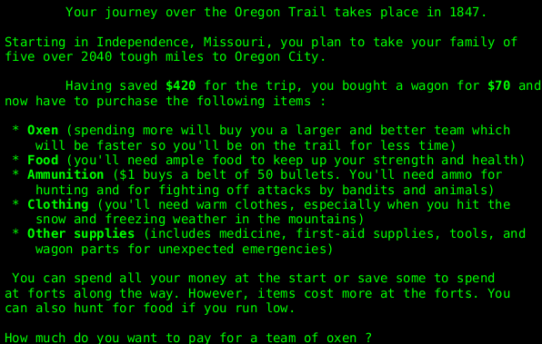

Every input has to be added in the text file:

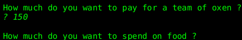

Every input has to be added in the text file:

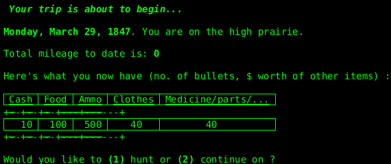

For shooting, you will have to type as fast as possible the word printed on the screen (like in the original version!).

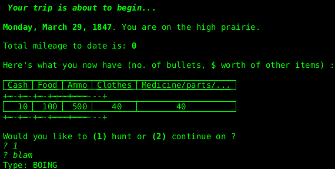

Good luck to you on the Oregon Trail !

### PDF Support

Some users have asked for the ability to generate diagrams directly in PDF format. Unfortunately, this is not an easy task, and would require the need of several external libraries (Batik and FOP).

This goes against the wish to keep plantuml.jar file not too big and to facilitate its integration with other products.

Fortunately, it is possible to use some kind of dynamic linkage, so that those libraries are not needed for compilation or execution if not present. A SVG file is first generated, then translated to PDF.

Note that in some case, shadowing is an issue for PDF export, so you can find here a way to disable it.

Make it workBack to topEdit using Dokuwiki syntaxEdit using Asciidoc syntaxEdit using Markdown syntax

So by default PDF generation is not enabled. This will probably fit a majority of users' needs.

If you want to use PDF, you have to download the following files:
* avalon-framework-4.2.0.jar
* batik-all-1.7.jar
* commons-io-1.3.1.jar
* commons-logging-1.0.4.jar
* fop.jar
* xml-apis-ext-1.3.04.jar
* xmlgraphics-commons-1.4.jar

You have to download those files from Batik and FOP web site.

For testing purposes only, those files have been put together in a zip here.

Those files have to be in the very same folder as plantuml.jar (this is important).

Now, you can use the -tpdf flag in the command line:

`java -jar plantuml.jar -tpdf diagram.txt`

Or format="pdf" in the ant task:

```
<!-- task definition -->
<taskdef name="plantuml" classname="net.sourceforge.plantuml.ant.PlantUmlTask" classpath="plantuml.jar" />
<!-- process diagram.txt file -->
<target name="images">
<plantuml format="pdf">
<fileset file="diagram.txt" />
</plantuml>
</target>
```
### How and where diagrams can be written

Each diagram description begins with the keyword @startuml then ends with the keyword @enduml.

You can refer to the PlantUML Language Reference Guide.

Those descriptions may be included into :
* Text files (.txt),
* Html files (.html or .htm),
* Java sources files (.java),
* C/C++ source files (.c, .h, .cpp)
* LaTeX sources files (.tex),
* APT files(.apt)
* Word files(.doc)
* URL

Of course, if you use Html, LaTeX, APT or Java/C/C++ files, you should put diagram descriptions into comments.

#### File naming

By default, .png file have the same name as the source file used to generated them (only the extension changes).

An automatic sequence is added if a source file contains several instances of @startXXX.

It is possible to use a different file name for the generated file. For example:

```plantuml {hide=false}
@startuml image.png
Alice->Bob: Authentication Request
Bob-->Alice: Authentication Response
@enduml
```

In this example, the .png file will be named image.png.
(Please note that you should not use this feature with Word integration.)

### Enable statistics

By default, statistics generation is disabled in PlantUML. If you want to enable statistic generation, you can either:
* Use -enablestats flag in the command line
* Use enablestats="true" setting with the ANT task
* Globally set the environment variable PLANTUML_STATS to true
* Call OptionFlags.getInstance().setEnableStats(true) from your Java code

Thoses statistics are very general. The goal is to measure PlantUML usage and performance and not to spy on users. When statistics generation is on, a message is printed within the license to inform users about this. (@startuml/license/@enduml).

#### Statistics Report

You can generate statistics about your PlantUML usage either at XML or HTML format.

To do so, you can add -xmlstats or -htmlstats flag in the command line. A file plantuml-stats.xml or plantuml-stats.html will be written at the end of the process:

If you want to generate statistics on the fly (rather than at the end of the process), you can use the flag -realtimestats.

There is also a -loopstats flag in the command line that continuously prints to the console statistics about diagram generations. This could be useful if you have some background daemon running PlantUML.

Some of those options are also available with the ANT task.

Java Integration APIBack to topEdit using Dokuwiki syntaxEdit using Asciidoc syntaxEdit using Markdown syntax

If you use PlantUML as a library, you can use the StatsUtils.getStats() methods that return a Stats object with all datas.

You can retrieve it to use it as you wish.

Here is a short class diagram about this API:

```plantuml {hide=false}
@startuml
class StatsUtil {
{static} +Stats getStats()
}
interface Stats {
+StatsTable getLastSessions()
+StatsTable getCurrentSessionByDiagramType()
+StatsTable getCurrentSessionByFormat()
+StatsTable getAllByDiagramType()
+StatsTable getAllByFormat()
}
StatsUtil -> Stats: build
Stats o--> "5" StatsTable: contains
enum StatsColumn {
SESSION_ID
VERSION
PARSED_COUNT
...
}
interface StatsTable {
+ Collection<StatsColumn> getColumnHeaders()
+ List<StatsLine> getLines()
}
StatsTable o-> StatsColumn: headers
StatsTable *--> StatsLine: contains
interface StatsLine {
}
interface StatsLine {
+Collection<StatsColumn> getColumnHeaders()
+Object getValue(StatsColumn column)
}
StatsLine o--> StatsColumn: headers
@enduml
```

### Steve Jobs, 1955 - 2011

A special command dedicated to Steve Jobs and Steve Wozniak.

```plantuml {hide=false}
@startuml
apple II
@enduml
```

### The context (of Smetana project)

PlantUML uses Graphviz/DOT to compute node positionning for some UML diagrams (only usecase diagrams, class diagrams, object diagrams, component diagrams, deployment diagram, state diagrams and Legacy activity diagrams). The fact that DOT computes automatically the position of node is a key feature, and algorithms implemented in DOT usually give very good result.

However, there are some drawbacks of using DOT : the computation is done by an external program (dot.exe on Windows, dot on linux), and that means that :

* PlantUML has to create a new process for each diagram, (and * communication with this new process could be source of bugs).
* Users have to install DOT on their system, in addition of Java.
* PlantUML is not fully portable.

Another way of using DOT would be to use it as a library, and to link it with PlantUML using JNI (Java Native Interface) but that would not be perfect thought.

If a Java version of Graphviz/DOT would exist, this would allow to greatly simplify the installation and the use of PlantUML. So we have started a port from C to Java of GraphViz/DOT source code: see Smetana project

Note that there is another way of doing this thanks to some portage of GraphViz to Javascript (VizJs).

#### Beta version

Smetana code has been integrated into PlantUML, so you can use the !pragma graphviz_dot smetana directive to force PlantUML to use Smetana (the internal Java port of GraphViz/Dot embedded in PlantUML sources) instead of the regular dot process.

```plantuml {hide=false}
@startuml
!pragma graphviz_dot smetana
class Foo1

Foo1 --> Foo2
Foo1 --> Foo3
Foo1 ---> Foo4 : test 4
Foo1 ----> Foo5 : test 5

@enduml

```

### Have a break: resolve a Sudoku.

Sometimes, when modeling, it's good to have a break....

You can use PlantUML to create Sudoku, like in the following example:

```plantuml {hide=false}
@startuml
sudoku
@enduml
```
The sudoku is randomly generated.

It is also possible to generate a specific Sudoku by providing its seed:

```plantuml
@startuml
sudoku 45azkdf4sqq
@enduml
```

### Scalable Vector Graphics

SVG is a graphical format which is scalable. It means that when you zoom an image, you don't lose quality. So this format gives good printing result.

You can enable SVG generation by using -tsvg flag with the command line.

You can also use format="svg" in the Ant task definition.
```
<target name="main">
  <plantuml dir="./src" format="svg" />
</target>
```

You can also generate SVG directly from Java.

#### Specific SkinParameter for SVG

##### svgLinkTarget

You can change the `target` value in the generated SVG with the svgLinkTarget setting.

According to the HTML specification, you can choose:
* _blank
* _parent
* _self
* _top(by default, if svgLinkTarget is empty)

```plantuml {hide=false}
@startuml
skinparam svgLinkTarget _parent
start
:[[http://plantuml.com]];
stop
@enduml
```

##### pathHoverColor

There is also a setting skinparam pathHoverColor to specify a color change when the mouse pointer goes hover some links.

```plantuml {hide=false}
@startuml
skinparam pathHoverColor green
class Foo2 [[http://www.yahoo.com/Foo2]] {
  +double[] x
  +double y
}
Foo2 --> Foo3
@enduml
```

[Ref. QA-5453]

##### svgDimensionStyle

If you does not want to have the attribut style, width and height on the header of the SVG output, you can set skinparam svgDimensionStyle false.

```plantuml {hide=false}
@startuml
skinparam svgDimensionStyle false

component a {
}
component b {
}
a -(0- b
@enduml
```
[Ref. QA-7334]

#### Specific Pragma for SVG

##### svgSize

This directive !pragma svgSize <U+hhhhh> XX tells to PlantUML: "assume that the size of <U+hhhhh> is the same as 'XX' "

You can play with this directive:
* !pragma svgSize <U+hhhhh> XX
* !pragma svgSize <U+hhhhh> I

to find the best setting.

```plantuml {hide=false}
@startuml
!pragma svgSize <U+1F610> XX

test: text <U+1F610>
test_size45: text <size:45><U+1F610>
@enduml
```

### PlantUML PicoWeb Server

Many plugins take advantage of the online web server to generate images.

For some reasons (security, performance...) you may need to use your own local server instead. This is possible thanks to the PlantUML Server which is available here.

However, installing and configuring a full webserver may be too complex for some users so we have decided to integrated a tiny webserver inside plantuml.jar.

This means that you only need a Java Runtime Environment and plantuml.jar to run this very simple web server.

#### Running the server

Running the server is pretty simple. You just have to launch:

`java -jar plantuml.jar -picoweb`

By default, this server runs on port 8080. You can change the port this way:

`java -jar plantuml.jar -picoweb:8000`

The server is really basic. It only understand GET requests with following patterns:
* /plantuml/png/xyz....
* /plantuml/svg/xyz....

Those GET requests are used by various PlantUML plugins. Once you have launched your server, you can simply test it. With any web browser, you just have to point to: http://127.0.0.1:8080.

This way, you can very easily any plugin which needs some PlantUML HTTP server without the official online server.

### PlantUML Server

You can use PlantUML using the online web service to generate images on-the-fly. A online demonstration is available at `http://www.plantuml.com/plantuml`, but you can also install it on your own JEE web application server.

If you don't want to install a full JEE application server, you may also choose to run PlantUML PicoWeb Server locally.

#### Interactive interface

The big input field is used to enter your diagram description. You can type in any diagram description, then press the submit button and the diagram will be displayed below. It's a good practice to start your diagram by the @startxxx keyword.

When you validate the diagram, you are redirected to an encoded URL encoding your diagram. The encoded form is a convenient way to share your diagrams with others because it's shorter than the many lines of a diagram and it can be easily displayed in a browser using the online PlantUML Server.

For example, `SyfFKj2rKt3CoKnELR1Io4ZDoSa70000` is the encoded form of:
```
@startuml
Bob -> Alice : hello
@enduml
```

#### Specify an initial diagram

By default, the PlantUML Server shows the well-known Bob -> Alice sample but it's easy to invoke it with an other diagram using its encoded form. Just append /uml/ENCODED to the URL.

For example, this link http://www.plantuml.com/plantuml/uml/Aov9B2hXil98pSd9LoZFByf9iUOgBial0000 opens the PlantUML Server with a simple Hello World activity diagram.

#### MetadataBack to top

PlantUML saves the diagram's source code in the generated PNG Metadata in the form of encoded text. So it is possible to retrieve this source by using the query parameter metadata, giving it some image URL.

For example, if you want to retrieve the diagram source of the image http://i.stack.imgur.com/HJvKF.png use the following server request: http://www.plantuml.com/plantuml/?metadata=http://i.stack.imgur.com/HJvKF.png.

Sounds like magic! No, merely clever engineering :-)

#### Web service modeBack to top

The web service interface of the PlantUML Server is dedicated to developers.

#### PNG service


To get a PNG file of a diagram, use the following URL scheme: /plantuml/png/ENCODED

#### SVG service

To get a SVG XML file of a diagram, use the following URL scheme: /plantuml/svg/ENCODED
Note that not all diagrams can be produced in SVG. For example, ditaa diagrams are only available in PNG format.

#### ASCII Art service

To get an ASCII Art representation of a diagram, encoded in UTF-8, use the following URL scheme: /plantuml/txt/ENCODED

Note that only sequence diagrams can be produced in ASCII Art.

#### Image Map service

To get the client image map related to a previously generated PNG image, use the following URL scheme: /plantuml/map/ENCODED

The output is a list of <area> tags, each line matching a link present in the diagram description.

For example, the following diagram:
```
@startuml
participant Bob [[http://plantuml.com]]
Bob -> Alice : [[http://forum.plantuml.net]] hello
@enduml
```
produces the following output:
```
<map id="plantuml_map" name="plantuml_map">
<area shape="rect" id="id1" href="http://forum.plantuml.net" title="http://forum.plantuml.net" alt="" coords="38,50,199,65"/>
<area shape="rect" id="id2" href="http://plantuml.com" title="http://plantuml.com" alt="" coords="8,3,50,116"/>
</map>
```
Note that you need to include these <area... tags inside a <map... html tag to make the complete image map.

#### Proxy service

With the proxy service, the source description of the diagram can be fetched by the PlantUML Server from a remote document.

The proxy service uses the following URL scheme: /plantuml/proxy?src=RESOURCE&idx=INDEX&fmt=FORMAT

RESOURCE is the complete URL of the document which contains the diagram description (with the @startxxx and @endxxx tags), it could be a .html or a .txt file.

INDEX is optional, it specifies the occurrence (starting at 0) of the diagram description that will be parsed when there are more than one diagram descriptions in the remote document. It defaults to zero.

FORMAT is optional, it specifies the format to return. Supported values are: png, svg, eps, epstext and txt. Default is png,

For example, try this link: http:www.plantuml.com/plantuml/proxy?src=https:raw.github.com/plantuml/plantuml-server/master/src/main/webapp/resource/test2diagrams.txt

Note that the address of the remote document is specified as a parameter, so it is not necessary to URL encode the URL.

#### Installation of the PlantUML Server

To install PlantUML Server on your own JEE 5 web server, download the plantuml.war file and copy it on the webapp folder of your server.
PlantUML Server have been successfully tested on Tomcat 6 and 7 and Jetty 8 and 9.

#### Source code

PlantUML Server is open source, the code is available at https://github.com/plantuml/plantuml-server.
(The main source is at https://github.com/plantuml/plantuml)


### Unicode

The PlantUML language use letters to define actor, usecase and soon.

But letters are not only A-Z latin characters, it could be any kind of letter from any language.

Examples

```plantuml {hide=false}
@startuml
skinparam handwritten true
skinparam backgroundColor #EEEBDC

actor 使用者
participant "頭等艙" as A
participant "第二類" as B
participant "最後一堂課" as 別的東西

使用者 -> A: 完成這項工作
activate A

A -> B: 創建請求
activate B

B -> 別的東西: 創建請求
activate 別的東西
別的東西 --> B: 這項工作完成
destroy 別的東西

B --> A: 請求創建
deactivate B

A --> 使用者: 做完
deactivate A
@enduml

```

```plantuml {hide=false}

@startuml

(*) --> "膩平台"
--> === S1 ===
--> 鞠躬向公眾
--> === S2 ===
--> 這傢伙波武器
--> (*)

skinparam backgroundColor #AAFFFF
skinparam activityStartColor red
skinparam activityBarColor SaddleBrown
skinparam activityEndColor Silver
skinparam activityBackgroundColor Peru
skinparam activityBorderColor Peru
@enduml


@startuml

skinparam usecaseBackgroundColor DarkSeaGreen
skinparam usecaseArrowColor Olive
skinparam actorBorderColor black
skinparam usecaseBorderColor DarkSlateGray

使用者 << 人類 >>
"主數據庫" as 數據庫 << 應用程式 >>
(草創) << 一桿 >>
"主数据燕" as (贏余) << 基本的 >>

使用者 -> (草創)
使用者 --> (贏余)

數據庫  --> (贏余)
@enduml

```

```plantuml {hide=false}

@startuml
() "Σωκράτης\nείναι ψεύτης" as Σωκράτης

Σωκράτης - [Πτηνά πολεμοχαρής]
[Πτηνά πολεμοχαρής] ..> () Αθήνα : Αυτές οι φράσεις\nδεν σημαίνουν τίποτα
@enduml

```

#### Charset

The default charset used when reading the text files containing the UML text description is system dependent.

Normally, it should just be fine, but in some case, you may want to the use another charset. For example, with the command line:

`java -jar plantuml.jar -charset UTF-8 files.txt`

Or, with the ant task:
```
<!-- Put images in c:/images directory -->
<target name="main">
<plantuml dir="./src" charset="UTF-8" />
```
Depending of your Java installation, the following charset should be available: ISO-8859-1, UTF-8, UTF-16BE, UTF-16LE, UTF-16.

### The context (of VizJs)

PlantUML uses Graphviz/DOT to compute node positionning for every UML diagrams (except Sequence Diagrams and Activity Beta Diagrams). The fact that DOT computes automatically the position of node is a key feature, and algorithms implemented in DOT usually give very good result.

However, there are some drawbacks of using DOT : the computation is done by an external program (dot.exe on Windows, dot on linux), and that means that :

PlantUML has to create a new process for each diagram, (and communication with this new process could be source of bugs).

Users have to install DOT on their system, in addition of Java.

PlantUML is not fully portable.

There is a work-in-progress to have a full Java implementation of PlantUML. However, even if this is somehow working, this is not finished yet.

Recently, some user points out another possible solution (We thank him by the way!).

Using both VizJs (a port to Javascript of GraphViz) and J2V8 (a highly efficient JavaScript runtime for Java), it is theorically possible to have a (almost) full Java implementation.

With the great help of Andreas Studer that makes a lot of work to test various JavaScript engine, we are now able to propose a working version.

#### Running

This means that it is possible to use PlantUML without installing GraphViz (which can be useful when you do not have administration right for example). To do so, in addition to plantuml.jar, you must have:

* vizjs: A Java library written by Andreas Studer that embed viz.js and call J2V8
* The corresponding J2V8 implementation for your OS:
* For Windows x86/64 bit: j2v8_win32_x86_64-3.1.6.jar
* For Linux x86: j2v8_linux_x86_64-3.1.6.jar
* For Mac OS: j2v8_macosx_x86_64-3.1.6.jar

So, having the three files plantuml.jar, vizjs.jar and j2v8_XXXXX-3.1.6.jar in the very same folder (this is important) you can run PlantUML without having GraphViz installed.

Finally, you have to set up the GRAPHVIZ_DOTenvironment variable value to vizjs (or through the command line with -D flag or -graphvizdot flag).

Then, you can double-check your configuration by running the usual:
```
@startuml
testdot
@enduml
```

#### Limitations

Note that this is only working with Java 8 (because of J2V8). For complex diagrams (especially with labels on arrow), the solution is not working very well.

An issue has been opened on viz.js side (see Error when generating graph).

However, in that case, PlantUML falls back to some degrated solution.

### Earth Day

To celebrate Earth Day, you can use PlantUML...

### XEarth

XEarth is a unix utility written in 1993 by Kirk Lauritz Johnson. It has been ported to Java by Christian Treber. So it was easy to integrate it into PlantUML, even if it won't probably help for documentation.

```plantuml {hide=false}
@startuml
xearth
@enduml

```

### Add more stars

```plantuml {hide=false}
@startuml
xearth(300,300)
starsP = true
starFrequency = 0.025
bigStars = 20
@enduml
```

### Relative view from Sun

```plantuml {hide=false}

@startuml
xearth(300,300)
viewPositionType = Sun-relative
sunPosRelLat = -10
sunPosRelLong = 40
@enduml

```
### Change grid configuration

The default view is from Sun

```plantuml {hide=false}
@startuml
xearth(300,300)
gridP = true
gridDivision = 9
gridPixelDivision = 8
@enduml
```

### Fixed position, without shading


```plantuml {hide=false}
@startuml
xearth(300,300)
viewPositionType = Fixed
viewPosLat = -30
viewPosLong = -30
shadeP = false
gridP = false
@enduml
```

### View from Moon and changing luminosity


```plantuml {hide=false}
@startuml
xearth(300,300)
viewPositionType = Moon
daySideBrightness = 100
nightSideBrightness = 30
terminatorDiscontinuity = 50
@enduml
```

### View set by orbit and changing luminosity


```plantuml {hide=false}
@startuml
xearth(300,300)
viewPositionType = Orbit
orbitPeriod = 1
orbitInclination = 30
daySideBrightness = 100
nightSideBrightness = 30
terminatorDiscontinuity = 50
@enduml
```

### Zooming


```plantuml {hide=false}
@startuml
xearth(300,300)
viewMagnification = 1.2
daySideBrightness = 100
nightSideBrightness = 50
terminatorDiscontinuity = 30
sunPosRelLong = -40
sunPosRelLat = 20
@enduml
```

### Adding cities


```plantuml {hide=false}
@startuml
xearth
 61.17 -150.00 "Anchorage"           # Alaska, USA
 38.00   23.73 "Athens"              # Greece
 33.4    44.4  "Baghdad"             # Iraq
 13.73  100.50 "Bangkok"             # Thailand
 39.92  116.43 "Beijing"             # China
 52.53   13.42 "Berlin"              # Germany
 32.3   -64.7  "Bermuda"             # Bermuda
 42.33  -71.08 "Boston"              # Massachusetts, USA
-15.8   -47.9  "Brasilia"            # Brazil
 -4.2    15.3  "Brazzaville"         # Congo
-34.67  -58.50 "Buenos Aires"        # Argentina
 31.05   31.25 "Cairo"               # Egypt
 22.5    88.3  "Calcutta"            # India
-33.93   18.47 "Cape Town"           # South Africa
 33.6    -7.6  "Casablanca"          # Morocco (Rabat?)
 41.83  -87.75 "Chicago"             # Illinois, USA
 32.78  -96.80 "Dallas"              # Texas, USA
 28.63   77.20 "New Delhi"           # India
 39.75 -105.00 "Denver"              # Colorado, USA
 24.23   55.28 "Dubai"               # UAE (Abu Dhabi?)
-27.1  -109.4  "Easter Island"       # Easter Island
-18.0   178.1  "Fiji"                # Fiji
 13.5   144.8  "Guam"                # Guam
 60.13   25.00 "Helsinki"            # Finland
 22.2   114.1  "Hong Kong"           # Hong Kong
 21.32 -157.83 "Honolulu"            # Hawaii, USA
 52.2   104.3  "Irkutsk"             # Irkutsk, Russia
 41.0    29.0  "Istanbul"            # Turkey (Ankara?)
 -6.13  106.75 "Jakarta"             # Indonesia
 31.8    35.2  "Jerusalem"           # Israel
 34.5    69.2  "Kabul"               # Afghanistan
 27.7    85.3  "Kathmandu"           # Nepal
 50.4    30.5  "Kiev"                # Ukraine
  3.13  101.70 "Kuala Lumpur"        # Malaysia
  6.45    3.47 "Lagos"               # Nigeria
-12.10  -77.05 "Lima"                # Peru
 51.50   -0.17 "London"              # United Kingdom
 40.42   -3.72 "Madrid"              # Spain
 14.6   121.0  "Manila"              # The Phillipines
 21.5    39.8  "Mecca"               # Saudi Arabia
 19.4   -99.1  "Mexico City"         # Mexico
 25.8   -80.2  "Miami"               # Florida, USA
  6.2   -10.8  "Monrovia"            # Liberia
 45.5   -73.5  "Montreal"            # Quebec, Canada
 55.75   37.70 "Moscow"              # Russia
 -1.28   36.83 "Nairobi"             # Kenya
 59.93   10.75 "Oslo"                # Norway
 48.87    2.33 "Paris"               # France
-32.0   115.9  "Perth"               # Australia
 45.5  -122.5  "Portland"            # Oregon, USA
 -0.2   -78.5  "Quito"               # Ecuador
 64.15  -21.97 "Reykjavik"           # Iceland
-22.88  -43.28 "Rio de Janeiro"      # Brazil
 41.88   12.50 "Rome"                # Italy
 11.0   106.7  "Ho Chi Minh City"    # Vietnam (Hanoi?)
 37.75 -122.45 "San Francisco"       # California, USA
  9.98  -84.07 "San Jose"            # Costa Rica
 18.5   -66.1  "San Juan"            # Puerto Rico
-33.5   -70.7  "Santiago"            # Chile
  1.2   103.9  "Singapore"           # Singapore
 42.67   23.30 "Sofia"               # Bulgaria
 59.33   18.08 "Stockholm"           # Sweden
-33.92  151.17 "Sydney"              # Australia
-17.6  -149.5  "Tahiti"              # Tahiti
 16.8    -3.0  "Timbuktu"            # Mali (Bamako?)
 35.67  139.75 "Tokyo"               # Japan
 43.70  -79.42 "Toronto"             # Ontario, Canada
 32.9    13.2  "Tripoli"             # Libya
 47.9   106.9  "Ulan Bator"          # Mongolia
 49.22 -123.10 "Vancouver"           # B.C., Canada
 48.22   16.37 "Vienna"              # Austria
 38.9   -77.0  "Washington"          # United States
-41.28  174.78 "Wellington"          # New Zealand
 62.5  -114.3  "Yellowknife"         # N.T., Canada
 90.00    0.00 "North Pole"          # North Pole
-90.00    0.00 "South Pole"          # South Pole
@enduml
```

### XML Metadata Interchange (XMI)


The nice thing about standards is that there are so many of them to choose from.Andrew S. Tanenbaum

Many users ask for XMI support in PlantUML. So the -xmi flag has been added in the command line (and in the ANT task also), for betatesting. This is only working with class diagrams.

As explain on the Modeling Portal, XMI theoretically allows to interchange data between programs.

So let's have a very simple example, with three classes:

```plantuml {hide=false}
@startuml
class class1 {
  field
}
class1 - class2
class2 - class3
@enduml
```

Imagine that you can have a XMI file that can be imported successfully on several UML tools. It would be nice.

Unfortunately, having the very same file is difficult. For example,
* On StarUML, you have to use testStarUML.xml
* On ArgoUML, you have to use testArgoUML.xml

If someone manages to have an identical file that would work on both tools, please post it there : you will have a free licence of PlantUML :-)

So, they are actually 3 flags:
* -xmi : only classes are exported, without any relationship. This is very basic but should work with on many tools
* -xmi:argo : to be read by ArgoUML
* -xmi:star : to be read by StarUML

Please note that this is an alpha version, and that many things will probably not work. You should use the forum to ask for corrections.

Update: now this feature is in production and is invoked as follows:
* -txmi:argo : to be read by ArgoUML
* -txmi or -txmi:star : to be read by StarUML