## 3 类图

### 3.1 Declaring element

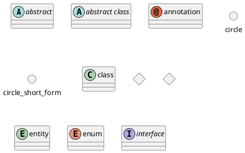

### 3.2 类之间的关系

类之间的关系通过下面的符号定义:

Type Symbol Drawing

* Extension（扩展） <|--
* Composition（组合） *--
* Aggregation（聚合） o--

使用.. 来代替 -- 可以得到点线.

在这些规则下，也可以绘制下列图形

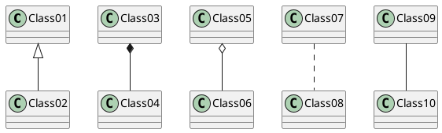

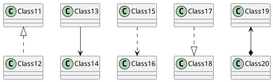

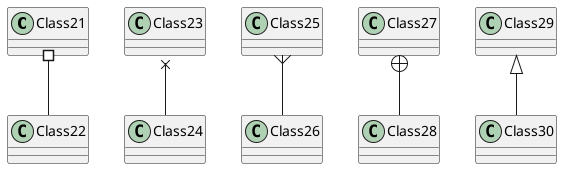

### 3.3 关系上的标识


在关系之间使用标签来说明时, 使用 : 后接标签文字。

对元素的说明，你可以在每一边使用 "" 来说明.


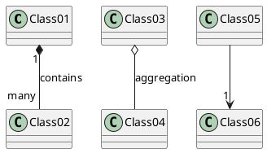

在标签的开始或结束位置添加 < 或 > 以表明是哪个对象作用到哪个对象上。

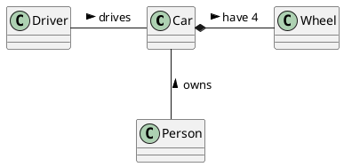

### 3.4 添加方法


为了声明字段 (对象属性）或者方法，你可以使用后接字段名或方法名。

系统检查是否有括号来判断是方法还是字段。

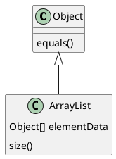

也可以使用 {} 把字段或者方法括起来

注意，这种语法对于类型/名字的顺序是非常灵活的。


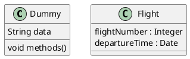

你可以（显式地）使用 {field} 和 {method} 修饰符来覆盖解析器的对于字段和方法的默认行为


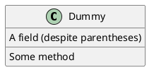

### 3.5 定义可访问性

一旦你定义了域或者方法，你可以定义相应条目的可访问性质。

Character Icon for field Icon for method Visibility
* `-` private
* `#` protected
* `~` package private
* `+` public

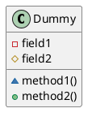

你可以采用以下命令停用这些特性 skinparam classAttributeIconSize 0 ：

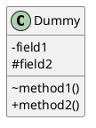

### 3.6 抽象与静态


通过修饰符 {static} 或者 {abstract}，可以定义静态或者抽象的方法或者属性。

这些修饰符可以写在行的开始或者结束。也可以使用 {classifier} 这个修饰符来代替 {static}.

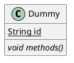

### 3.7 高级类体

PlantUML 默认自动将方法和属性重新分组，你可以自己定义分隔符来重排方法和属性，下面的分隔符都是可用的：-- .. == __.

还可以在分隔符中添加标题：

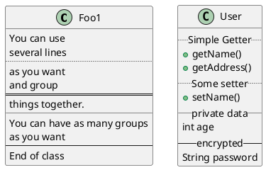

### 3.8 备注和模板

模板通过类关键字 ("<<" 和">>") 来定义

你可以使用 note left of , note right of , note top of , note bottom of 这些关键字来添加备注。

你还可以在类的声明末尾使用 note left, note right,note top, note bottom 来添加备注。

此外，单独用 note 这个关键字也是可以的，使用 .. 符号可以作出一条连接它与其它对象的虚线。

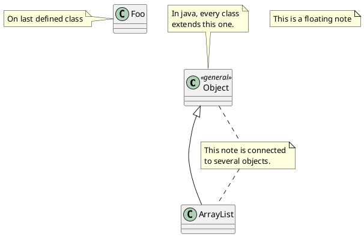

### 3.9 更多注释

可以在注释中使用部分 html 标签：
* `<b>`
* `<u>`
* `<i>`
* `<s>`, `<del>`, `<strike>`
* `<font color="#AAAAAA"> or <font color="colorName">`
* `<color:#AAAAAA>` or `<color:colorName>`
* `<size:nn>` to change font size
* `` or ``: the file must be accessible by the filesystem

你也可以在注释中展示多行。

你也可以在定义的 class 之后直接使用 note left, note right, note top, note bottom 来定义注释。

``` puml {hide=false}
@startuml
class Foo
note left: On last defined class
note top of Object
In java, <size:18>every</size> <u>class</u>
<b>extends</b>
<i>this</i> one.
end note
note as N1
This note is <u>also</u>
<b><color:royalBlue>on several</color>
<s>words</s> lines
And this is hosted by 
end note
@enduml
```

### 3.10 Note on field (field, attribut, member) or method

It is possible to add a note on field (field, attribut, member) or on method.

#### 3.10.1 Note on field or method

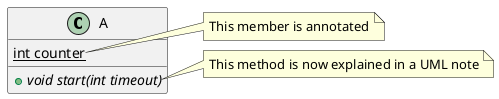

#### 3.10.2 Note on method with the same name

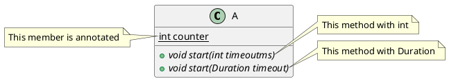
[Ref. QA-3474 and QA-5835]

### 3.11 链接的注释

在定义链接之后，你可以用 note on link 给链接添加注释

如果想要改变注释相对于标签的位置，你也可以用 note left on link，note right on link，note bottom on link。（对应位置分别在 label 的左边，右边，下边）

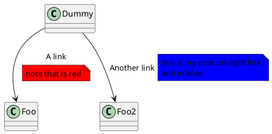

### 3.12 抽象类和接口

用关键字 abstract 或 abstract class 来定义抽象类。抽象类用斜体显示。也可以使用 interface,annotation 和 enum 关键字。

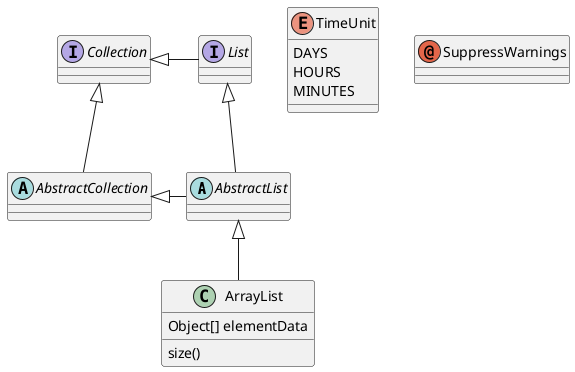

### 3.13 使用非字母字符

如果你想在类（或者枚举）的显示中使用非字母符号，你可以：
* 在类的定义中使用 as 关键字
* 在类名旁边加上""


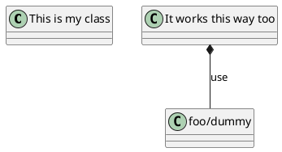

### 3.14 隐藏属性、函数等

通过使用命令“hide/show”，你可以用参数表示类的显示方式。

基础命令是: hide empty members. 这个命令会隐藏空白的方法和属性。

除 empty members 外，你可以用:
* empty fields 或者 empty attributes 空属性,
* empty methods 空函数，
* fields 或 attributes 隐藏字段或属性，即使是被定义了
* methods 隐藏方法，即使是被定义了
* members 隐藏字段 和 方法，即使是被定义了
* circle 类名前带圈的，
* stereotype 原型。

同样可以使用 hide 或show 关键词，对以下内容进行设置：
* class 所有类，
* interface 所有接口，
* enum 所有枚举，
* <<foo1>> 实现 foo1 的类，
* 一个既定的类名。

你可以使用 show/hide 命令来定义相关规则和例外。

``` puml {hide=false}
@startuml
class Dummy1 {
+myMethods()
}
class Dummy2 {
+hiddenMethod()
}
class Dummy3 <<Serializable>> {
String name
}
hide members
hide <<Serializable>> circle
show Dummy1 methods
show <<Serializable>> fields
@enduml
```

### 3.15 隐藏类

你也可以使用 show/hide 命令来隐藏类

如果你定义了一个大的!included 文件，且想在文件包含之后隐藏部分类，该功能会很有帮助。

``` puml {hide=false}
@startuml
class Foo1
class Foo2
Foo2 *-- Foo1
hide Foo2
@enduml
```

### 3.16 泛型（generics）

你可以用 < 和 > 来定义类的泛型。

``` puml {hide=false}
@startuml
class Foo<? extends Element> {
int size()
}
Foo *- Element
@enduml
```

It is possible to disable this drawing using skinparam genericDisplay old command.

### 3.17 指定标记（Spot）

通常标记字符 (C, I, E or A) 用于标记类 (classes), 接口（interface）, 枚举（enum）和抽象类（abstract classes）.

但是当你想定义原型时，可以增加对应的单个字符及颜色，来定义自己的标记（spot），就像下面一样：

``` puml {hide=false}
@startuml
class System << (S,#FF7700) Singleton >>
class Date << (D,orchid) >>
@enduml
```

### 3.18 包

你可以通过关键词 package 声明包，同时可选的来声明对应的背景色（通过使用 html 色彩代码或名称）。
注意：包可以被定义为嵌套。

``` puml {hide=false}
@startuml
package "Classic Collections" #DDDDDD {
Object <|-- ArrayList
}
package net.sourceforge.plantuml {
Object <|-- Demo1
Demo1 *- Demo2
}
@enduml
```

### 3.19 包样式

包可以定义不同的样式。
你可以通过以下的命令来设置默认样式: skinparam packageStyle, 或者对包使用对应的模板:

``` puml {hide=false}
@startuml
scale 750 width
package foo1 <<Node>> {
class Class1
}
package foo2 <<Rectangle>> {
class Class2
}
package foo3 <<Folder>> {
class Class3
}
package foo4 <<Frame>> {
class Class4
}
package foo5 <<Cloud>> {
class Class5
}
package foo6 <<Database>> {
class Class6
}
@enduml
```

你也可以参考下面的示例来定义包之间的连线:

``` puml {hide=false}
@startuml
skinparam packageStyle rectangle
package foo1.foo2 {
}
package foo1.foo2.foo3 {
class Object
}
foo1.foo2 +-- foo1.foo2.foo3
@enduml
```

### 3.20 命名空间（Namespaces）

在使用包（package）时（区别于命名空间），类名是类的唯一标识。也就意味着，在不同的包（package）中的类，不能使用相同的类名。

在那种情况下（译注：同名、不同全限定名类），你应该使用命名空间来取而代之。

你可以从其他命名空间，使用全限定名来引用类，默认命名空间（译注：无名的命名空间）下的类，以一个“." 开头（的类名）来引用（译注：示例中的 BaseClass).

注意：你不用显示地创建命名空间：一个使用全限定名的类会自动被放置到对应的命名空间。

``` puml {hide=false}
@startuml
class BaseClass
namespace net.dummy #DDDDDD {
.BaseClass <|-- Person
Meeting o-- Person
.BaseClass <|- Meeting
}
namespace net.foo {
net.dummy.Person <|- Person
.BaseClass <|-- Person
net.dummy.Meeting o-- Person
}
BaseClass <|-- net.unused.Person
@enduml
```

### 3.21 自动创建命名空间

使用命令 set namespaceSeparator ??? 你可以自定义命名空间分隔符（为“.”以外的字符）.

``` puml {hide=false}
@startuml
set namespaceSeparator ::
class X1::X2::foo {
some info
}
@enduml
```

禁止自动创建包则可以使用 set namespaceSeparator none.

``` puml {hide=false}
@startuml
set namespaceSeparator none
class X1.X2.foo {
some info
}
@enduml
```

### 3.22 棒棒糖接口


需要定义棒棒糖样式的接口时可以遵循以下语法:
* bar ()- foo
* bar ()-- foo
* foo -() bar

``` puml {hide=false}
@startuml
class foo
bar ()- foo
@enduml
```

### 3.23 改变箭头方向

类之间默认采用两个破折号 -- 显示出垂直方向的线. 要得到水平方向的可以像这样使用单破折号 (或者
点):

``` puml {hide=false}
@startuml
Room o- Student
Room *-- Chair
@enduml
```

你也可以通过改变倒置链接来改变方向

``` puml {hide=false}
@startuml
Student -o Room
Chair --* Room
@enduml
```

也可通过在箭头内部使用关键字，例如 left, right, up 或者 down，来改变方向

``` puml {hide=false}
@startuml
foo -left-> dummyLeft
foo -right-> dummyRight
foo -up-> dummyUp
foo -down-> dummyDown
@enduml
```

You can shorten the arrow by using only the first character of the direction (for example, -d- instead of -down-) or the two first characters (-do-).

Please note that you should not abuse this functionality : Graphviz gives usually good results without tweaking.

### 3.24 “关系”类

你可以在定义了两个类之间的关系后定义一个 关系类 association class 例如:

``` puml {hide=false}
@startuml
class Student {
Name
}
Student "0..*" - "1..*" Course
(Student, Course) .. Enrollment
class Enrollment {
drop()
cancel()
}
@enduml
```

也可以用另一种方式:

``` puml {hide=false}
@startuml
class Student {
Name
}
Student "0..*" -- "1..*" Course
(Student, Course) . Enrollment
class Enrollment {
drop()
cancel()
}
@enduml
```

### 3.25 Association on same classe

``` puml {hide=false}
@startuml
class Station {
+name: string
}
class StationCrossing {
+cost: TimeInterval
}
<> diamond
StationCrossing . diamond
diamond - "from 0..*" Station
diamond - "to 0..* " Station
@enduml
```

[Ref. Incubation: Associations]

### 3.26 皮肤参数

用 skinparam 改变字体和颜色。

可以在如下场景中使用：
* 在图示的定义中，
* 在引入的文件中，
* 在命令行或者 ANT任务提供的配置文件中。

``` puml {hide=false}
@startuml
skinparam class {
BackgroundColor PaleGreen
ArrowColor SeaGreen
BorderColor SpringGreen
}
skinparam stereotypeCBackgroundColor YellowGreen
Class01 "1" *-- "many" Class02 : contains
Class03 o-- Class04 : aggregation
@enduml
```

### 3.27 Skinned Stereotypes

You can define specific color and fonts for stereotyped classes.

``` puml {hide=false}
@startuml
skinparam class {
BackgroundColor PaleGreen
ArrowColor SeaGreen
BorderColor SpringGreen
BackgroundColor<<Foo>> Wheat
BorderColor<<Foo>> Tomato
}
skinparam stereotypeCBackgroundColor YellowGreen
skinparam stereotypeCBackgroundColor<< Foo >> DimGray
Class01 <<Foo>>
Class03 <<Foo>>
Class01 "1" *-- "many" Class02 : contains
Class03 o-- Class04 : aggregation
@enduml
```

### 3.28 Color gradient

It's possible to declare individual color for classes or note using the # notation.

You can use either standard color name or RGB code.

You can also use color gradient in background, with the following syntax: two colors names separated either by:
* |,
* /,
* \,
* or -

depending the direction of the gradient.

For example, you could have:

``` puml {hide=false}
@startuml
skinparam backgroundcolor AntiqueWhite/Gold
skinparam classBackgroundColor Wheat|CornflowerBlue
class Foo #red-green
note left of Foo #blue\9932CC
this is my
note on this class
end note
package example #GreenYellow/LightGoldenRodYellow {
class Dummy
}
@enduml
```

### 3.29 辅助布局

有时候，默认布局并不完美...

你可以使用 together 关键词将某些类进行分组：布局引擎会尝试将它们捆绑在一起（如同在一个包(package) 内)

你也可以使用建立 隐藏链接的方式来强制布局

``` puml {hide=false}
@startuml
class Bar1
class Bar2
together {
class Together1
class Together2
class Together3
}
Together1 - Together2
Together2 - Together3
Together2 -[hidden]--> Bar1
Bar1 -[hidden]> Bar2
@enduml
```

### 3.30 拆分大文件

有些情况下，会有一些很大的图片文件。

可以用 page (hpages)x(vpages) 这个命令把生成的图片文件拆分成若干个文件。

hpages 用来表示水平方向页面数，and vpages 用来表示垂直方面页面数。

你也可以使用特定的皮肤设定来给分页添加边框（见例子）

``` puml {hide=false}
@startuml
' Split into 4 pages
page 2x2
skinparam pageMargin 10
skinparam pageExternalColor gray
skinparam pageBorderColor black
class BaseClass
namespace net.dummy #DDDDDD {
.BaseClass <|-- Person
Meeting o-- Person
.BaseClass <|- Meeting
}
namespace net.foo {
net.dummy.Person <|- Person
.BaseClass <|-- Person
net.dummy.Meeting o-- Person
}
BaseClass <|-- net.unused.Person
@enduml
```

### 3.31 Extends and implements

It is also possible to use extends and implements keywords.

``` puml {hide=false}
@startuml
class ArrayList implements List
class ArrayList extends AbstractList
@enduml
```

### 3.32 Inline style of relations (Linking or arrow)

It's also possible to have explicitly bold, dashed, dotted, hidden or plain relation, links or arrows:
* without label

``` puml {hide=false}
@startuml
class foo
foo --> bar
foo -[bold]-> bar1
foo -[dashed]-> bar2
foo -[dotted]-> bar3
foo -[hidden]-> bar4
foo -[plain]-> bar5
@enduml
```

* with label

``` puml {hide=false}
@startuml
class foo
foo --> bar : ?
foo -[bold]-> bar1 : bold
foo -[dashed]-> bar2 : dashed
foo -[dotted]-> bar3 : dotted
foo -[hidden]-> bar4 : hidden
foo -[plain]-> bar5 : plain
@enduml
```

[Adapted from QA-4181]

### 3.33 Change relation, linking or arrow color and style

You can change the color of individual relation or arrows using the following notation: [#color] or #color;line.[bold|dashed|dotted]

* old method

``` puml {hide=false}
@startuml
class foo
foo --> bar
foo -[#red]-> bar1
foo -[#green]-> bar2
foo -[#blue]-> bar3
'foo -[#blue;#yellow;#green]-> bar4
@enduml
```

* new method

``` puml {hide=false}
@startuml
class foo
foo --> bar : normal
foo --> bar1 #line:red;line.bold;text:red : red bold
foo --> bar2 #green;line.dashed;text:green : green dashed
foo --> bar3 #blue;line.dotted;text:blue : blue dotted
@enduml
```

[See similar feature on deployment]

### 3.34 Arrows from/to class members

``` puml {hide=false}
@startuml
class Foo {
+ field1
+ field2
}
class Bar {
+ field3
+ field4
}
Foo::field1 --> Bar::field3 : foo
Foo::field2 --> Bar::field4 : bar
@enduml
```

[Ref. QA-3636]

``` puml {hide=false}
@startuml
left to right direction
class User {
id : INTEGER
..
other_id : INTEGER
}
class Email {
id : INTEGER
..
user_id : INTEGER
address : INTEGER
}
User::id *-- Email::user_id
@enduml
```

[Ref. QA-5261]
