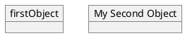
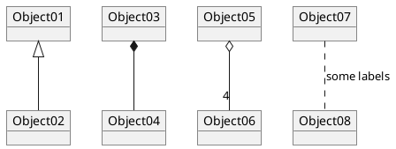
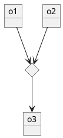
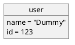
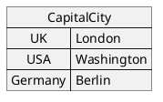
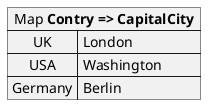
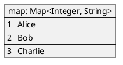
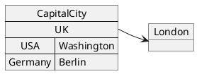
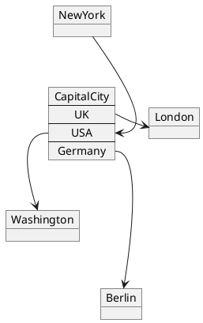

## 4 对象图

### 4.1 对象的定义

使用关键字 object 定义实例。

### 4.2 对象之间的关系

对象之间的关系用如下符号定义：
* Extension   `<|--`
* Composition   `*--`
* Aggregation   `o--`

也可以用 .. 来代替 -- 以使用点线。

知道了这些规则，就可以画下面的图：

可以用冒号给关系添加标签，标签内容紧跟在冒号之后。

用双引号在关系的两边添加基数。

### 4.3 Associations objects

### 4.4 添加属性

用冒号加属性名的形式声明属性。

也可以用大括号批量声明属性。

### 4.5 类图中的通用特性

* 可见性
* 定义注释
* 使用包
* 美化输出内容

### 4.6 Map table or associative array

You can define a map table or associative array, with map keyword and => separator.

And add link with object.

[Ref. #307]
