## 5 活动图

### 5.1 简单活动

使用 (*) 作为活动图的开始点和结束点。

有时，你可能想用 (*top) 强制开始点位于图示的顶端。

使用 --> 绘制箭头。

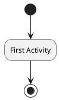

### 5.2 箭头上的标签

默认情况下，箭头开始于最接近的活动。

可以用 [和] 放在箭头定义的后面来添加标签。

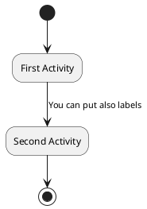

### 5.3 改变箭头方向

你可以使用 -> 定义水平方向箭头，还可以使用下列语法强制指定箭头的方向：
* -down-> (default arrow)
* -right-> or ->
* -left->
* -up->

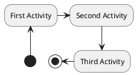

### 5.4 分支

你可以使用关键字 if/then/else 创建分支。

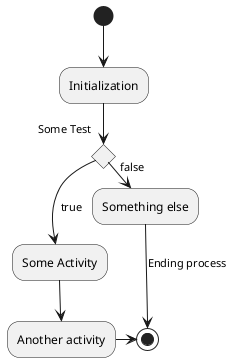

不过，有时你可能需要重复定义同一个活动：

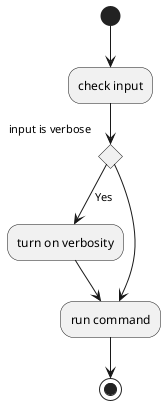

### 5.5 更多分支

默认情况下，一个分支连接上一个最新的活动，但是也可以使用 if关键字进行连接。

还可以嵌套定义分支。

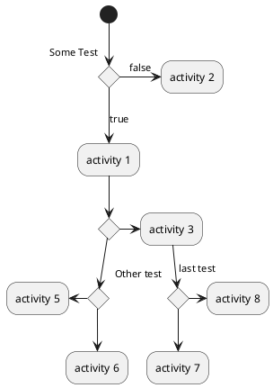

### 5.6 同步

你可以使用 === code === 来显示同步条。

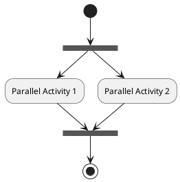

### 5.7 长的活动描述

定义活动时可以用来定义跨越多行的描述。

还可以用 as 关键字给活动起一个短的别名。这个别名可以在接下来的图示定义中使用。

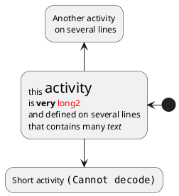

### 5.8 注释

你可以在活动定义之后用 note left,note right, note top or note bottom, 命令给活动添加注释。

如果想给开始点添加注释，只需把注释的定义放在活动图最开始的地方即可。

也可以用关键字 endnote 定义多行注释。

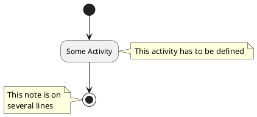

### 5.9 分区

用关键字 partition 定义分区，还可以设置背景色 (用颜色名或者颜色值)。
定义活动的时候，它自动被放置到最新的分区中。
用} 结束分区的定义。

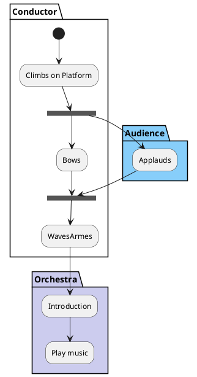

### 5.10 显示参数

用 skinparam 命令修改字体和颜色。

如下场景可用：
* 在图示定义中
* 在引入的文件中
* 在命令行或 ANT 任务提供的配置文件中。

还可以为构造类型指定特殊颜色和字体。

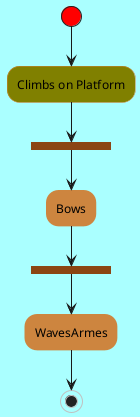

### 5.11 八边形活动

可用用 skinparam activityShape octagon 命令将活动的外形改为八边形。

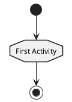

### 5.12 一个完整的例子

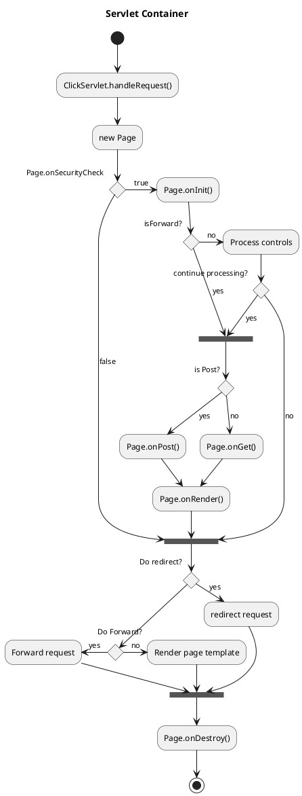
