## 7 组件图

我们来看几个例子: Let's have few examples.

### 7.1 组件

组件必须用中括号括起来。

还可以使用关键字 component 定义一个组件。并且可以用关键字 as 给组件定义一个别名。这个别名可以在稍后定义关系的时候使用。

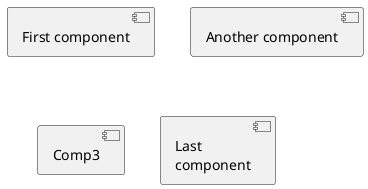

### 7.2 接口

接口可以使用 () 来定义 (因为这个看起来像个圆)。

还可以使用关键字 interface 关键字来定义接口。并且还可以使用关键字 as 定义一个别名。这个别名可以在稍后定义关系的时候使用。

我们稍后可以看到，接口的定义是可选的。

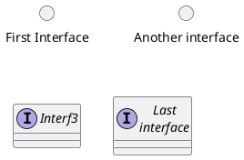

### 7.3 基础的示例

元素之间可以使用虚线 (..)、直线 (--)、箭头 (-->) 进行连接。

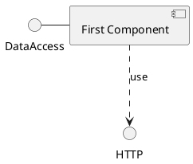

### 7.4 使用注释

你可以使用 note left of , note right of , note top of , note bottom of 等关键字定义相对于对象位置的注释。

也可以使用关键字 note 单独定义注释，然后使用虚线 (..) 将其连接到其他对象。

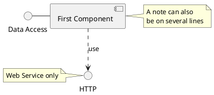

### 7.5 组合组件

你可以使用多个关键字将组件和接口组合在一起。
* package
* node
* folder
* frame
* cloud
* database

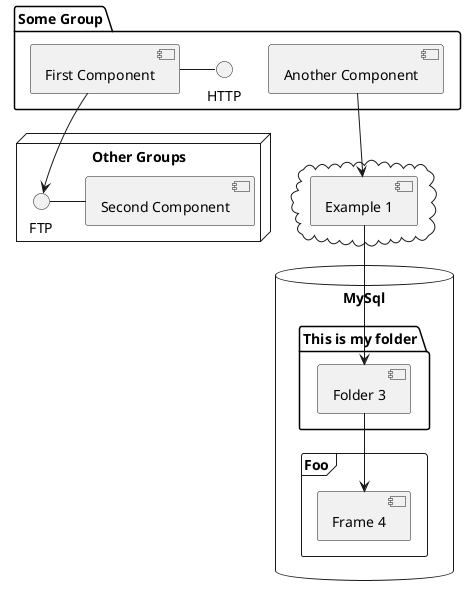

### 7.6 改变箭头方向

默认情况下，对象之间用 --连接，并且连接是竖直的。不过可以使用一个横线或者点设置水平方向的连接，就行这样：

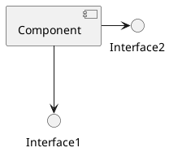

也可以使用反向连接：

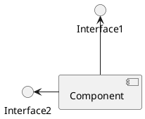

还可以使用关键字 left, right, up or down 改变箭头方向。

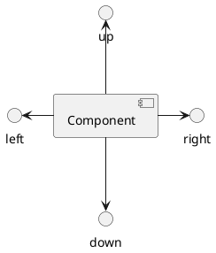

允许使用方向单词的首字母或者前两个字母表示方向 (例如 -d-, -do-, -down-都是等价的)。

请不要乱用这些功能：Graphviz(PlantUML 的后端引擎) 不喜欢这个样子。

### 7.7 Use UML2 notation

By default (from v1.2020.13-14), UML2 notation is used.

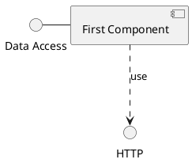

### 7.8 使用 UML1 标记符

命令 skinparam componentStyle uml1 可以切换到 UML1 标记符。

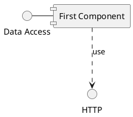

### 7.9 Use rectangle notation (remove UML notation)

The skinparam componentStyle rectangle command is used to switch to rectangle notation (without any UML notation).

### 7.10 长描述

可以用方括号"[ ]" 在连线上添加描述。

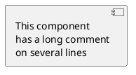

### 7.11 不同的颜色表示

你可以在声明一个组件时加上颜色的声明。

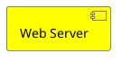

### 7.12 在定型组件中使用精灵图

你可以在定型组件中使用精灵图（sprite）。

```plantuml {hide=false}
@startuml
sprite $businessProcess [16x16/16] {
FFFFFFFFFFFFFFFF
FFFFFFFFFFFFFFFF
FFFFFFFFFFFFFFFF
FFFFFFFFFFFFFFFF
FFFFFFFFFF0FFFFF
FFFFFFFFFF00FFFF
FF00000000000FFF
FF000000000000FF
FF00000000000FFF
FFFFFFFFFF00FFFF
FFFFFFFFFF0FFFFF
FFFFFFFFFFFFFFFF
FFFFFFFFFFFFFFFF
FFFFFFFFFFFFFFFF
FFFFFFFFFFFFFFFF
FFFFFFFFFFFFFFFF
}
rectangle " End to End\nbusiness process" <<$businessProcess>> {
rectangle "inner process 1" <<$businessProcess>> as src
rectangle "inner process 2" <<$businessProcess>> as tgt
src -> tgt
}
@enduml
```

### 7.13 显示参数

用 skinparam 改变字体和颜色。

可以在如下场景中使用：
* 在图示的定义中，
* 在引入的文件中，
* 在命令行或者 ANT任务提供的配置文件中。

可以为构造类型和接口定义特殊的颜色和字体。

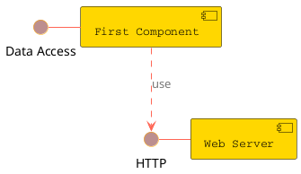

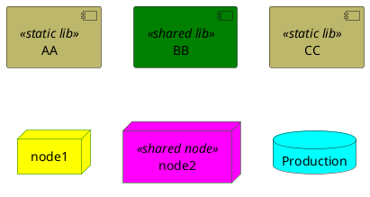
### 7.14 Specific SkinParameter

#### 7.14.1 componentStyle

* By default (or with skinparam componentStyle uml2), you have an icon for component

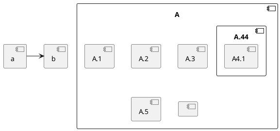

* If you want to suppress it, and to have only the rectangle, you can use skinparam componentStyle
rectangle

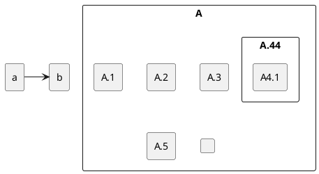

[Ref. 10798]
