## 9 状态图

### 9.1 简单状态

使用 ([*]) 开始和结束状态图。

使用 --> 添加箭头。

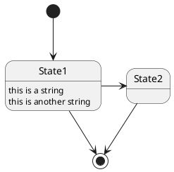

### 9.2 Change state rendering

You can use `hide empty description` to render state as simple box.

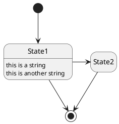

### 9.3 合成状态

一个状态也可能是合成的，必须使用关键字 state 和花括号来定义合成状态。

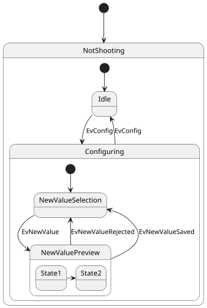

### 9.4 长名字

也可以使用关键字 state 定义长名字状态。

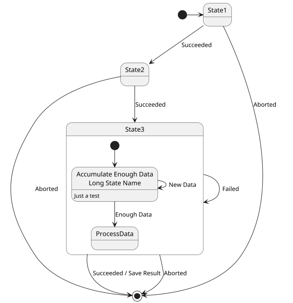

### 9.5 History `[[H], [H*]]`

You can use [H] for the history and [H*] for the deep history of a substate.

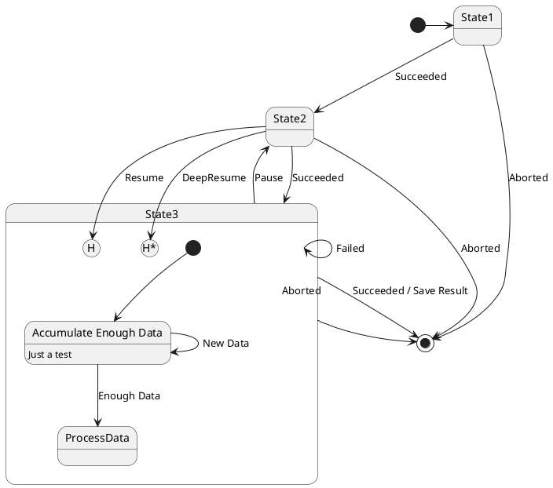

### 9.6 Fork [fork, join]

You can also fork and join using the `<<fork>>` and `<<join>>` stereotypes.

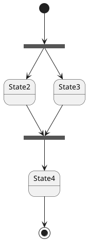

### 9.7 并发状态

用 `--` or `||` 作为分隔符来合成并发状态。

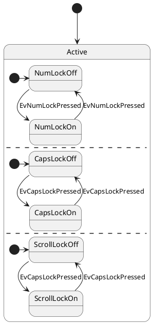

### 9.8 Conditional [choice]

The stereotype `<<choice>>` can be used to use conditional state.

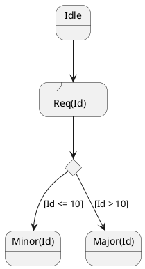

### 9.9 Stereotypes full example [choice, fork, join, end]

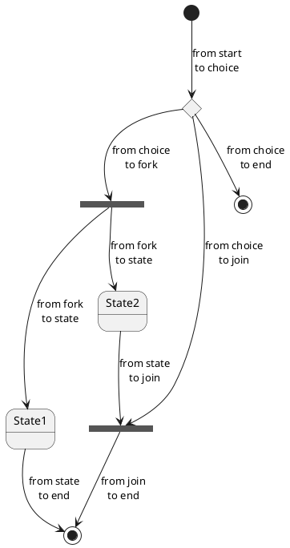

[Ref. QA-404 and QA-1159]

### 9.10 Point [entryPoint, exitPoint]

You can added point with `<<entryPoint>>` and `<<exitPoint>>` stereotypes:

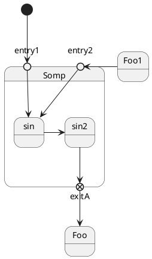

### 9.11 Pin [inputPin, outputPin]

You can added pin with `<<inputPin>>` and `<<outputPin>>` stereotypes:

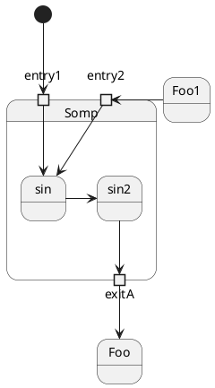

[Ref. QA-4309]

### 9.12 Expansion [expansionInput, expansionOutput]

You can added expansion with `<<expansionInput>>` and `<<expansionOutput>>` stereotypes:

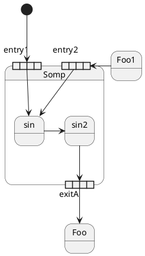

[Ref. QA-4309]

### 9.13 箭头方向

使用 -> 定义水平箭头，也可以使用下列格式强制设置箭头方向：
* -down-> (default arrow)
* -right-> or ->
* -left->
* -up->

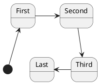

可以用首字母缩写或者开始的两个字母定义方向 (如, -d-，-down-和 -do-是完全等价的)。

请不要滥用这些功能，Graphviz 不喜欢这样。

### 9.14 Change line color and style

You can change line color and/or line style.

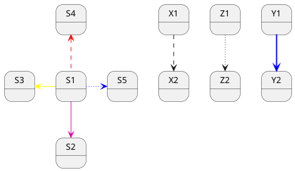

[Ref. Incubation: Change line color in state diagrams]

### 9.15 注释


可以用 `note left of`, `note right of`, `note top of`, `note bottom of` 关键字来定义注释。

还可以定义多行注释。

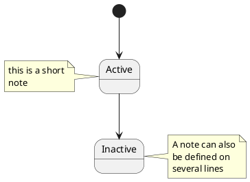

以及浮动注释。

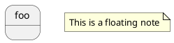

### 9.16 Note on link

You can put notes on state-transition or link, with `note on link` keyword.

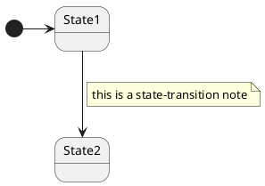

### 9.17 更多注释

可以在合成状态中放置注释。

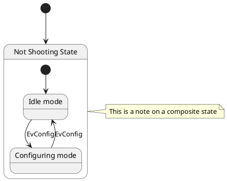

### 9.18 Inline color


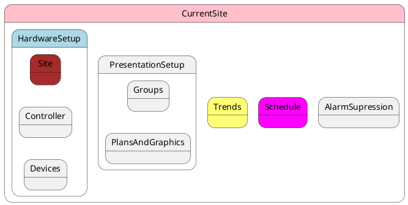

[Ref. QA-1812]

### 9.19 显示参数


用 skinparam 改变字体和颜色。

可以在如下场景中使用：
* 在图示的定义中，
* 在引入的文件中，
* 在命令行或者 ANT任务提供的配置文件中。

还可以为状态的构造类型指定特殊的字体和颜色。

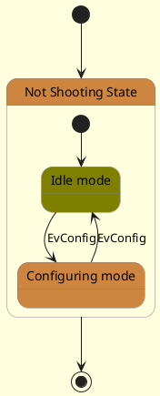

### 9.20 Changing style

You can change style.

```plantuml {hide=false}
@startuml
<style>
stateDiagram {
BackgroundColor Peru
'LineColor Gray
FontName Impact
FontColor Red
arrow {
FontSize 13
LineColor Blue
}
}
</style>
[*] --> NotShooting
state "Not Shooting State" as NotShooting {
state "Idle mode" as Idle <<Warning>>
state "Configuring mode" as Configuring
[*] --> Idle
Idle --> Configuring : EvConfig
Configuring --> Idle : EvConfig
}
NotShooting --> [*]
@enduml
```
