# UML 快速入门

## 一、UML 简介

### UML 图类型

UML 图类型如下图所示：

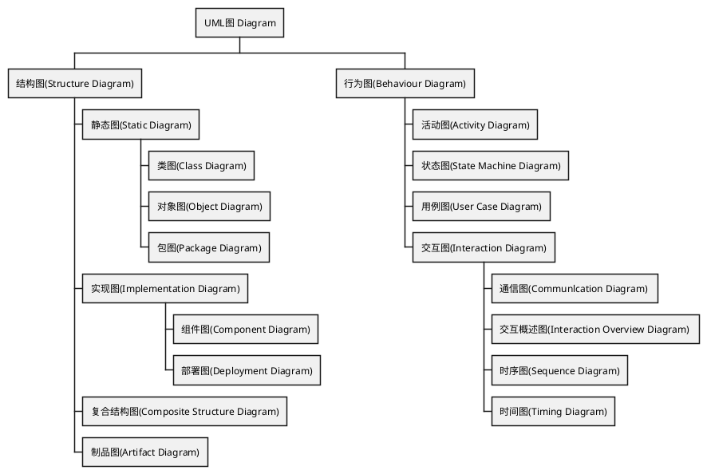


### UML 概念

UML 从来源中使用相当多的概念。我们将之定义于统一建模语言术语汇表。下面仅列代表性的概念。

- 对于结构而言 - 执行者，属性，类，元件，接口，对象，包。
- 对于行为而言 - 活动（UML），事件（UML），消息（UML），方法（UML），操作（UML），状态（UML），用例（UML）。
- 对于关系而言 - 聚合，关联，组合，相依，广义化（or 继承）。
- 其他概念
  - 构造型—这规范符号应用到的模型
  - 多重性—多重性标记法与资料库建模基数对应，例如：`1, 0..1, 1..*`

## 二、UML 结构建模图

> 结构图定义了一个模型的静态架构。它们通常被用来对那些构成模型的‘要素'建模，诸如：类，对象，接口和物理组件。另外，它们也被用来对元素间关联和依赖关系进行建模。
>

### 部署图


> **部署图（Deployment Diagram）用于对系统的物理结构建模**。部署图将显示系统中的软件组件和硬件组件之间的关系以及处理工作的物理分布。


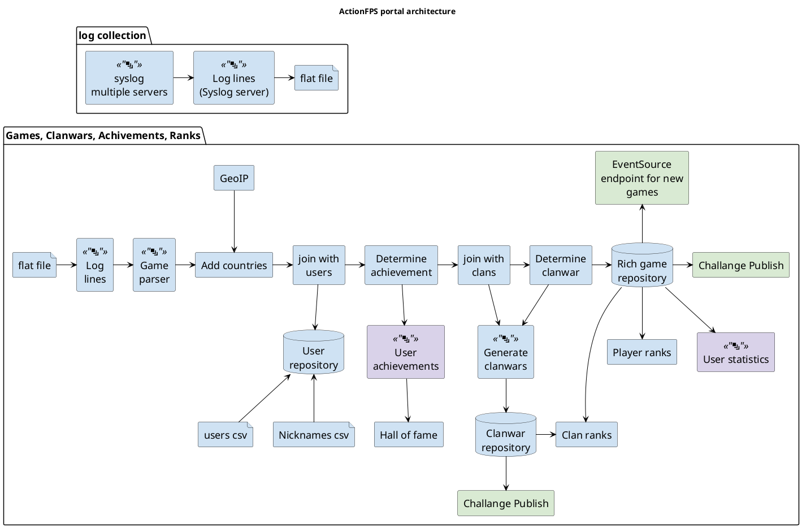

#### 节点

节点既可以是硬件元素，也可以是软件元素。它显示为一个立方体，如下图所示。

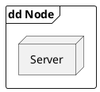

#### 节点实例

图可以显示节点实例，实例与节点的区分是：实例的名称带下划线，冒号放在它的基本节点类型之前。实例在冒号之前可以有名称，也可以没有名称。下图显示了一个具名的计算机实例。

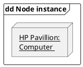

#### 节点构造型

为节点提供了许多标准的构造型，分别命名为 «cdrom»， «cd-rom»， «computer»， «disk array»， «pc»， «pc client»， «pc server»， «secure»， «server»， «storage»， «unix server»， «user pc»。 并在节点符号的右上角显示适当的图标。

<div align="center"></div>

#### 工件

工件是软件开发过程中的产品。包括过程模型（如：用例模型，设计模型等），源文件，执行文件，设计文档，测试报告，构造型，用户手册等等。

工件表示为带有工件名称的矩形，并显示«artifact»关键字和文档符号。
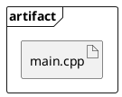

#### 关联

在部署图的上下文联系中，关联代表节点间的联系通道。


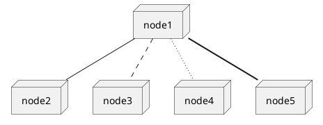


#### 作为容器的节点

节点可以包含其他元素，如组件和工件。下图显示了一个嵌入式系统某个部分的部署图。描写了一个被主板节点包含的可执行工件。

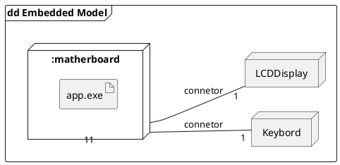


### 组件图

> **组件图（Component Diagram）描绘了组成一个软件系统的模块和嵌入控件**。组件图比类图具有更高层次的抽象－通常运行时一个组件被一个或多个类（或对象）实现。它们象积木那样使得组件能最终构成系统的绝大部分。

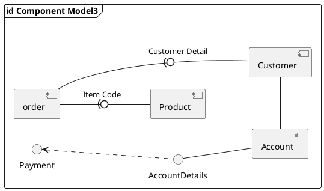

上图演示了一些组件和它们的内部关系。装配连接器（Assembly connectors）“连接”由"Product"和"Customer"的提供接口到由 "Order"指定的需求接口。 一个依赖关系映射了客户相关的帐户信息到“Order”需要的 "Payment"需求接口。

实际上，组件图同包图很相似，它们都有明确的界限，把元素分组到逻辑结构中。他们之间的不同是：组件图提供了语义更丰富的分组机制，在组件图中，所有的模型元素都是私有的，而包图只显示公有的成员。

#### 表现组件

组件可表示为带关键字 «component»的矩形类元；也可用右上角有组件图标的矩形表示。

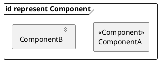

#### 装配连接器

装配连接器在组件 “Component1”的需求接口和另一个组件 “Component2”的提供接口之间建立桥梁; 这个桥梁使得一个组件能提供另一个组件所需要的服务。

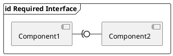
<div align="center"></div>

### 带端口组件

使用端口的组件图允许在它的环境指定一个服务和行为，同时这个服务和行为也是组件需要的。当端口进行双向操作的时候，它可以指定输入和输出。下图详述了用于在线服务的带端口组件，它有两个提供接口 “order entry”和 “tracking”，也有 “payment” 需求接口。
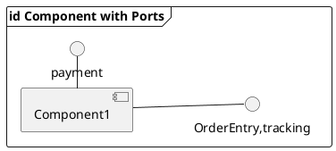

### 包图

> **包图（Package Diagram）用来表现包和它所包含元素的组织**。当用来代表类元素时，包图提供了命名空间的可视化。包图最常用的用途是用来组织用例图和类图，尽管它不局限于这些 UML 元素。

下面是一个包图的例子。
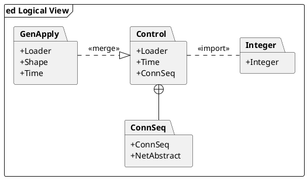


包中的元素共享相同的命名空间，因此，一个指定命名空间的元素必须有唯一的名称。

包可以用来代表物理或逻辑关系。选择把类包括在指定的包里，有助于在同一个包里赋予这些类相同继承层次。通常认为把通过复合相关联的类，以及与它们相协作的类放在同一个包里。

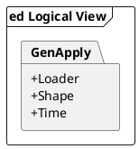

在 UML2.5 中，包用文件夹来表示，包中的元素共享同一个命名空间，并且必须是可识别的，因此要有唯一的名称或类型。包必须显示包名，在附属方框部分有选择的显示包内的元素。

- **包的合并** - 包之间的合并连接符«merge»定义了源包元素与目标包同名元素之间的泛化关系。源包元素的定义被扩展来包含目标包元素定义。当源包元素与目标包内没有同名元素时，目标包元素的定义不受影响。
- **包的导入** - 导入连接符 «import»表明目标包的元素，在该例中是一个类 ，在源包中被引用要用非限定修饰名。源包的命名空间获得目标类的接口，目标包的命名空间则不受影响。
- **嵌套连接符** - 源包和目标包间的嵌套连接符说明目标包完全包含源包。

### 类图

> **类图（Class Diagram）展示了面向对象系统的构造模块**。描绘了模型或部分模型的静态视图，显示它包含的属性和行为，而不是详细描述操作的功能或完善方法。类图最常用来表达多个类和接口之间的关系。泛化（Generalizations），聚合（aggregations）和关联（associations）分别是类之间继承，复合或应用，及连接的表现。

下面的图显示了类之间的聚合关系。弱聚合（浅色箭头）表现在类 "Account" 使用 "AddressBook"，但是不必要包含它的一个实例。强聚合（图中的黑色箭头）表示了目标类包含源类，例如，"Contact" 和 "ContactGroup"值被包含在 "AddressBook"中。

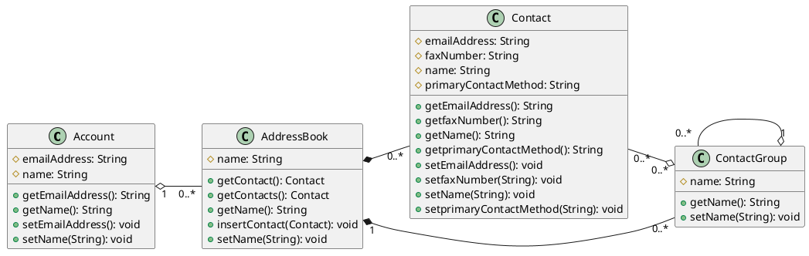

#### 类（Classes）

类是定义对象所具有的属性和行为的元素。行为用类能理解的合适消息和适合每条消息的操作来描述。 类中也可能定义约束，标记值，构造型。

#### 类的标柱（Class Notation）

类用矩形表示。除类的名称外，还可以选择性地显示属性和操作。 分栏分别用来显示类的名称，属性和操作。

在下面图中，类的类名显示在最上面的分栏，它下面的分栏显示详细属性，如："center" 属性显示初始化的值。最后面的分栏显示操作，如： setWidth，setLength 和 setPosition 以及他们的参数。 属性和操作名前的标注表示了该属性或操作的可见性: 如果使用 "+"号，这个属性或操作是公共的 ; "-" 号则代表这个属性或操作是私有的。 "#"号是这个属性或操作被定义为保护的，" \~" 号代表包的可见性。
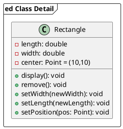

#### 接口（Interfaces）

接口是实施者同意满足的行为规范，是一种约定。实现一个接口，类必需支持其要求的行为，使系统按照同样的方式，即公共的接口，处理不相关的元素。
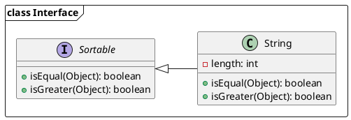

接口有相似于类的外形风格，含有指定的操作，如下图所示。如果没有明确的详细操作，也可以画成一个圆环。当画成圆环的时候，到这个环形标柱的实现连接没有目标箭头。
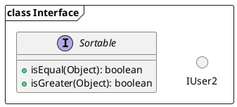

#### 表（Tables）

表尽管不是基本 UML 的一部分，仍然是“图型”能完成的实例用。在右上角画一个表的小图标来表示。表属性用“图型” «column»表示。 绝大多数表单有一个主键，是由一个或几个字段组成的一个唯一的字码组合加主键操作来访问表格，主键操作“图型”为«PK»。 一些表有一个或多个外键，使用一个或多个字段加一个外键操作，映射到相关表的主键上去，外键操作“图型”为«FK»。

<div align="center"></div>

### 关联（Associations）

关联表明两个模型元素之间有关系，通常用在一个类中被实现为一个实例变量。连接符可以包含两端的命名的角色，基数性，方向和约束。关联是元素之间普通的关系。如果多于两个元素，也可以使用菱形的关联关系。当从类图生成代码时，关联末端的对象将变成目标类中实例变量。见下图示例 "playsFor" 将变成"Player"类中的实例变量。
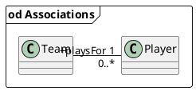

#### 泛化（Generalizations）

泛化被用来说明继承关系。连接从特定类元到一般类元。泛化的含义是源类继承了目标类的特性。下图的图显示了一个父类泛化一个子类， 类“Circle”的一个实例将会有属性 “ x_position”，“ y_position” ， “radius” 和 方法 “display()”。 注意：类 "Shape" 是抽象的，类名显示为斜体。
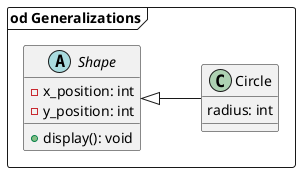


#### 聚合（Aggregations）

聚合通常被用来描述由更小的组件所构成的元素。聚合关系表示为白色菱形箭头指向目标类或父类。

聚合的更强形式 -组合聚合（强聚合） - 显示为黑色菱形箭头，用来组合每次最大化的包含组件。如果一个组合聚合的父类被删除，通常与他相关的所有部分都会被删除，但是，如果一个部件从组合中去掉，将不用删除整个组合。组合是可迁，非对称的关系和递归的。

下面的图示：显示了弱聚合和强聚合的不同。“ address book” 由许多 “contacts” 和 “contact groups”组成。 “contact group” 是一个“contacts”的虚分组; “contact”可以被包含在不止一个 “ contact group”。 如果你删除一个“ address book”，所有的 “contacts” 和 “contact groups” 也将会被删除；如果你删除“ contact group”， 没有 “contacts”会被删除。
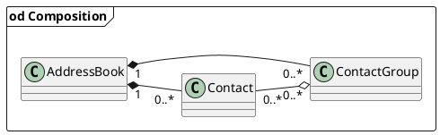


#### 关联类（Association Classes）

关联类是一个允许关联连接有属性和操作的构造。下面的示例：显示了远不止简单连接两个类的连接，如给“employee”分配项目。“ employee”在项目中所起的作用是一个复杂的实体，既有自身的也有不属于“employee” 或 “project” 类的细节。 例如，“ employee”可以同时为几个项目工作，有不同的职务头衔和对应的安全权限。

``` puml
@startuml
left to right direction
frame "od Association Classes"  {
class Project {
-ProjectName: String
}
class Employee {
-JobTitle: String
}
class Role {
-Title: String
-SecurityLevel: int
-PartTime: boolean
}

Project <- Employee   
(Employee, Project) .. Role
}
@enduml
```

#### 依赖（Dependencies）

依赖被用来描述模型元素间广泛的依赖关系。通常在设计过程早期显示两个元素之间存在某种关系，因为是初期而不能确定具体是什么关系，在设计过程末期，该继承关系会被归入已有构造型 (构造型 可以是实例化 «instantiate»，跟踪 «trace»，导入 «import»， 和其它的关系)，或被替换成一个更明确类型的连接符。

#### 跟踪（Traces）

跟踪关系是一种特殊化的依赖关系。连接模型元素或跨模型但是具有相同概念的模型元素集。跟踪被经常用来追踪需求和模型的变化。由于变化是双向的，这种依赖关系的顺序通常被忽略。这种关系的属性可以被指定为单向映射，但跟踪是双向的，非正式的和很少可计算的。

#### 实现（Realizations）

是源对象执行或实现目标，实现被用来表达模型的可跟踪性和完整性－业务模型或需求被一个或多个用例实现，用例则被类实现，类被组件实现，等等。这种实现贯穿于系统设计的映射需求和类等，直至抽象建模水平级。从而确保整个系统的一张宏图，它也反映系统的所有微小组成，以及约束和定义它的细节。实现关系用带虚线的实箭头表示。
``` puml 
@startuml
'left to right direction
frame "class Interface"  {
interface Sortable
{
    +isEqual(Object): boolean
    +isGreater(Object): boolean
}
class String
{
    -length: int
    +isEqual(Object): boolean
    +isGreater(Object): boolean
}
Sortable<|.. String
}
@enduml
```

#### 嵌套（Nestings）

嵌套连接符用来表示源元素嵌套在目标元素中。下图显示“ inner class”的定义，尽管在 EA 中，更多地按照着他们在项目层次视图中的位置来显示这种关系。
``` puml 
@startuml
left to right direction
frame "Inner Class"  {
class Class 
Class +-- InnerClass
@enduml
```

### 复合结构图

> **复合结构图显示类的内部结构，包括它与系统其他部分的交互点。也显示各部分的配置与关系，这些部分一起执行类元的行为。**

类元素已经在类图部分被详细地阐述，这部分用来说明类表现复合元素的方式，如：暴露接口，包含端口和部件。
``` puml 
@startuml
'left to right direction
frame "od Class"  {
rectangle Class {
    card part
}

Class - ProvideInterface
Class --( RequiredInterface
}
@enduml
```

#### 部件

部件是代表一组（一个或多个）实例的元素，这组实例的拥有者是一类元实例，例如：如果一个图的实例有一组图形元素，则这些图形元素可以被表示为部件，并可以对他们之间的某种关系建模。注意：一个部件可以在它的父类被删除之前从父类中被去掉，这样部件就不会被同时删除了。
部件在类或组件内部显示为不加修饰的方框。
``` puml 
@startuml
'left to right direction
frame "od Part"  {
component component1 {
    card part1
    card part2
}

}
@enduml
```

#### 端口

端口是类型化的元素，代表一个包含类元实例的外部可视的部分。端口定义了类元和它的环境之间的交互。端口显示在包含它的部件，类或组合结构的边缘上。端口指定了类元提供的服务，以及类元要求环境提供的服务。
端口显示为所属类元边界指定的方框。

<div align="center"></div>

#### 接口

接口与类相似，但是有一些限制，所有的接口操作都是公共和抽象的，不提供任何默认的实现。所有的接口属性都必须是常量。然而，当一个类从一个单独的超级类继承而来，它可以实现多个接口。
当一个接口在图中单列出来，它既可以显示为类元素的方框，带 «interface» 关键字和表明它是抽象的斜体名称，也可以显示为圆环。
``` puml 
@startuml
'left to right direction
frame "od Part"  {
() IUser2
interface interface1 {
    +UserName(): void
    +UserAge(): void
}
}
@enduml
```

注意：圆环标注不显示接口操作。当接口显示为类所有的接口，它们会被当作暴露接口引用。暴露接口可以定义为是提供的，还是需求的。提供接口确认包含它的类元提供指定接口元素定义的操作，可通过类和接口间实现的连接来定义。需求接口说明该类元能与其他类元进行通信，这些类元提供了指定接口元素所定义的操作。需求接口可通过在类和接口间建立依赖连接来定义。
提供接口显示为“带棒球体”，依附在类元边缘。需求接口显示为“带棒杯体”，也是依附在类元边缘。
``` puml 
@startuml
'left to right direction
frame "od Class"  {
class Class
() RequiredInterface
() ProvideInterface
 
Class - ProvideInterface
Class --( RequiredInterface
}
@enduml
```

#### 委托

委托连接器用来定义组件外部端口和接口的内部工作方式。委托连接器表示为带有 «delegate» 关键字的箭头。它连接组件的外部约定，表现为它的端口，到组件部件行为的内部实现。
``` puml 
@startuml
left to right direction
frame "od Delegate"  {

component component {
    class Class
}


() ProvideInterface
 
Class --> ProvideInterface :«delegate»
component - ProvideInterface
}
@enduml
```


#### 协作

协作定义了一系列共同协作的角色，它们集体展示一个指定的设计功能。协作图应仅仅显示完成指定任务或功能的角色与属性。隔离主要角色是用来简化结构和澄清行为，也用于重用。一个协作通常实现一个模式。
协作元素显示为椭圆。

``` puml 
@startuml
'left to right direction
frame "od Collaboration"  {

storage Collaboration {
    object Computer
    object "Backup Device" as b
    object "Software" as s

    Computer -- b
    Computer -- s
}

}
@enduml
```


#### 角色绑定

角色绑定连接器是一条从连接协作到所要完成该任务类元的连线。它显示为虚线，并在类元端显示作用名。

``` puml 
@startuml
left to right direction
frame "class Role Binding"  {

storage Collaboration
card Part
Collaboration ..> "Role" Part
}
@enduml
```

#### 表现

表现连接器用于连接协作到类元来表示此类元中使用了该协作。显示为带关键字 «represents»的虚线箭头。

``` puml 
@startuml
left to right direction
frame "class Role Binding"  {
card Class
storage Collaboration

Collaboration ..> Class :<<represents>>
}
@enduml
```

发生
发生连接器用于连接协作到类元来表示此协作表现了（同原文）该类元；显示为带关键字«occurrence»的虚线箭头。

``` puml 
@startuml
left to right direction
frame "class Role Binding"  {
card Class
storage Collaboration

Collaboration ..> Class :<<occurrence>>
}
@enduml
```

### 对象图

> **对象图（Object Diagram）可以认为是类图的特殊情形，是类图元素子集，被用来及时强调在某些点，类的实例间的关系**。这对理解类图很有帮助。他们在构造上与类图显示没有不同，但是反映出多样性和作用。

#### 类和对象元素

下面的图显示了类元素和对象元素外观上的不同。注意：类元素包括三个部分，分别是名字栏，属性栏和操作栏；对象元素默认为没有分栏。名称显示也有不同：对象名称有下划线，并可能显示该对象实例化所用类元的名称。
``` puml 
@startuml
left to right direction
frame "od Object"  {
class Class
{
    -attribute: int
    +operation(): void
}
object "Object :Class" as o

}
@enduml
```

#### 运行状态

类元元素可以有任意数量的属性和操作。在对象实例中不会被显示出来。但可能定义对象的运行状态，显示特殊实例的属性设置值。

``` puml 
@startuml
left to right direction
frame "od Run Time State"  {

object "Manager :Employee" as m{
 last_name = "Smith"
 first_name = "John"
 age = 42
} 
}
@enduml
```

### 类和对象图示例

下图是一个对象图，其中插入了类定义图。它例示如何用对象图来测试类图中任务多重性的方法。“car” 类对 “wheel” 类有“1 对多” 的多重性，但是如果已经选择用“1 对 4” 来替代，那样就不会在对象图显示“3 个轮子”的汽车。

``` puml 
@startuml
left to right direction
frame "od Object Diagram"  {

frame "od Class Diagram"  {
class Car
Wheel --o Car
}

object "FrontLeft :Wheel" as fl
object "FrontRight :Wheel" as fr
object "Rear :Wheel" as r
object "Morgan :Car" as m
m -right- fr
m -left- fl
m -down- r

}
@enduml
```

## 行为建模图

> 行为图用来记录在一个模型内部，随时间的变化，模型执行的交互变化和瞬间的状态；并跟踪系统在真实环境下如何表现，以及观察系统对一个操作或事件的反应，以及它的结果。
>
> 关键词：`活动图`, `状态机图`, `用例图`, `通信图`, `交互概述图`, `时序图`, `时间图`


### 活动图

> UML 中，活动图用来展示活动的顺序。**显示了从起始点到终点的工作流，描述了活动图中存在于事件进程的判断路径**。活动图可以用来详细阐述某些活动执行中发生并行处理的情况。活动图对业务建模也比较有用，用来详细描述发生在业务活动中的过程。
> 一个活动图的示例如下所示。

``` puml 
@startuml
start
:Receive Order;
if () then (order accepted)
:Fill Order;
fork
:Skip Order;
fork again
:send Invoice;
:Invoice]
:make Payment;
:Accept Payment;
end fork
else (order reject)
(A)
detach
(A)
endif
:Close Order;
stop
@enduml
```

下面描述组成活动图的元素。

#### 活动

活动是行为参数化顺序的规范。活动被表示为圆角矩形，内含全部的动作，工作流和其他组成活动的元素。

<div align="center"></div>

#### 动作

一个动作代表活动中的一个步骤。动作用圆角矩形表示。

``` puml 
@startuml
:Perform Action;
@enduml
```
<div align="center"></div>

#### 动作约束

动作可以附带约束，下图显示了一个带前置条件和后置条件的动作。

<div align="center"></div>

#### 控制流

控制流显示一个动作到下一个动作的流。表示为带箭头实线

``` puml 
@startuml
:Send Payment;
:Accept Payment;
@enduml
```
<div align="center"></div>

#### 初始节点

一个开始或起始点用大黑圆点表示，如下图。

``` puml 
@startuml
start
:Perform Action;
@enduml
```

#### 结束节点

结束节点有两种类型：活动结束节点和流结束节点。活动结束节点表示为中心带黑点的圆环。

``` puml 
@startuml
:Close Order;
stop
@enduml
```

流结束节点表示为内部为叉号的圆环。

``` puml 
@startuml
:Close Order;
end
@enduml
```

这两种不同类型节点的区别为：流结束节点表明单独的控制流的终点。活动结束终点是活动图内所有控制流的结束。

#### 对象和对象流

对象流是对象和数据转递的通道。对象显示为矩形。

``` puml 
@startuml
:Document]
@enduml
```

对象流显示为带箭头的连接器，表明方向和通过的对象。

``` puml 
@startuml
:send Invoice;
:Invoice]
:make Payment;
@enduml
```

一个对象流在它的至少一个终端有一个对象。在上图中，可以采用带输入输出引脚的速记标柱表示。

<div align="center"></div>

数据存储显示为带 «datastore» 关键字的对象。

<div align="center"></div>

#### 判断节点和合并节点

判断节点和合并节点是相同标注：菱形。它们可以被命名。从判断节点出来的控制流有监护条件，当监护条件满足时，可以对流控制。下图显示了判断节点和合并节点的使用。

``` puml 
@startuml
start
if (Decision Node) then (condition is true)
:Action on True;
else (condition is false)
:Action on True;
endif 
stop
@enduml
```

#### 分叉和结合节点

分叉和结合节点有同样的标柱：垂直或水平条（方向取决于工作流从左到右，还是从上到下）。它们说明了控制的并发线程的起始和终点，下图显示他们的使用示例。

``` puml 
@startuml
start
fork
:Concurrent1;
fork again
:Concurrent1;
end fork
stop
@enduml
```

结合节点与合并节点不同之处在于：结合节点同步两个输入量，产生一个单独的输出量。来自结合节点的输出量要接收到所有的输入量后才能执行。合并节点直接将控制流传递通过。如果两个或更多的输入量到达合并节点。则它的输出流指定的动作会被执行两次或更多次。

#### 扩展域

扩展域是会执行多次的结构活动域。输入输出扩展节点表示为一组“3 厢” ，代表多个选择项。关键词 "iterative"， "parallel" 或 "stream"显示在区域的左上角

<div align="center"></div>

#### 异常处理器

异常处理器在活动图中可以建模。

<div align="center"></div>

#### 可中断活动区

可中断活动区环绕一组可以中断的动作。在下面非常简单的例子中： 当控制被传递到结束订单 "Close Order" 动作，定单处理"Process Order" 动作会执行直到完成，除非"Cancel Request"取消请求中断被接受，这会将控制传递给"Cancel Order"动作。

<div align="center"></div>

#### 分割

一个活动分割显示为垂直或水平泳道。在下图中，分割被用来在活动图中分隔动作，有在 "accounting department"中执行的，有在 "customer"中执行的。
``` puml 
@startuml
|accounting department|
start
:foo1;
|#AntiqueWhite|customer|
:foo2;
:foo3;
|accounting department|
:foo4;
|customer|
:foo5;
stop
@enduml
```

### 状态机图

> **状态机图（state-machine-diagram）对一个单独对象的行为建模，指明对象在它的整个生命周期里，响应不同事件时，执行相关事件的顺序。**

如下示例， 下列的状态机图显示了门在它的整个生命周期里如何运作。

``` puml 
@startuml
[*]--> Opended : Create/
Opended --> Closed : Close/(doorWay->isEmpty)
Closed --> Opended : Open/
Closed --> Locked : Locked/
Locked --> Closed : unLocked/
@enduml
```

门可以处于以下的三种状态之一： "Opened"打开状态， "Closed"关闭状态，或者"Locked"锁定状态。 它分别响应事件：“Open”开门， “Close”关门， “Lock”锁门 和 “Unlock”解锁。 注意：不是所有的事件，在所有的状态下都是有效的。如：一个门打开的时候是不可能锁定的，除非你关上门。并且，状态转移可能有附加监护条件：假设门是开的，如果“doorWay->isEmpty”（门是空的）被满足，那么它只能响应关门事件。状态机图使用的语法和约定将在下面的部分进行讨论。

#### 状态

状态被表示为圆角矩形，状态名写在里面。

``` puml 
@startuml
state idel
@enduml
```

#### 起始和结束状态

初始状态表示为实心黑圆环，可以标注名称。结束状态表示为中心带黑点圆环，也可以被标注名称。

``` puml 
@startuml
[*] --> Alive : Creat
Alive --> [*] : Destoy
@enduml
```

#### 转移

一个状态到下一个状态的转移表示为带箭头实线。转移可以有一个“Trigger”触发器，一个“Guard”监护条件和一个“effect”效果。如下所示：

``` puml 
@startuml
State "Source State" as s
State "Target State" as t
s --> t : Trigger[Guard]/Effect
@enduml
```

"Trigger"触发器是转移的起因，它可以是某个条件下的一个信号，一个事件，一个变化或一个时间通路。"Guard"监护是一个条件，而且必须为真，以便于让触发器引起转移。效果"Effect"是直接作用到对象上的一个动作，该对象具有做为转移结果的状态机。

#### 状态活动

在上面的状态转移示例中，一个效果与该转移相关联。如果目标状态有多个转移到达，并且每一个转移都有相同的效果与它相关联，那最好将该效果与目标状态相关联，而不与转移相关联。你可以通过为这个状态定义初始动作来实现。下图显示了一个带入口动作和出口动作的状态。

``` puml 
@startuml
state Receiving 
Receiving :  + On Entry/pickup
Receiving :  + On Exit/disconnect
@enduml
```

可以定义发生在事件上的动作或一直发生的动作。每一种类型的动作是可以定义任意数量的。

#### 自转移

一个状态可能有一个返回到自身的转移，如下图。效果与转移关联是十分有帮助。

``` puml 
@startuml
state Waiting 
Waiting --> Waiting : after 2 seconds /poll input
@enduml
```

### 复合状态

一个状态机图可以有子状态机图，如下图所示：

``` puml 
@startuml
state "Check Pin" as cp {
    state "Enter PIN" as ep
    [*] --> ep
    state c <<choice>>
    ep --> c : /check PIN 
    c --> ep : [pin invalid]
    c --> [*] : [pin OK]
} 
state "Search Network" as sn
[*] --> cp
cp --> sn : [pin OK]
sn --> Ready :Network found
sn --> Off : power off
Ready --> Off : power off
cp --> Off : power off
@enduml
```

可选择不同方式显示相同信息，如下图所示：

<div align="center"></div>

上面版本的标注说明"Check PIN"的子状态机图显示在单独的图中。

#### 入口点

有时，你不想在正常的初始状态进入子状态机。例如下面的子状态机，它通常从"初始化"状态开始，但是如果因为某些原因，它不必执行初始化，可能靠转移到指定的入口点来从 "Ready" 状态开始。

``` puml 
@startuml
[*] --> Initializing 
Initializing --> Ready
Ready --> Ready 
state "Skip Initializing" as i
i --> Ready
@enduml
```

下图显示了状态机的上一层。

``` puml 
@startuml
state "Not Already Initializing" as nai
state "Already Initializing" as ai
state "Perform Activity" as pa{
state "Skip Initializing" as si <<entryPoint>>
}

nai --> pa
ai -->si
@enduml
```

#### 出口点

有与入口点相类似的方式，它可能也指定可选择的出口点。下图给出了主处理状态执行后，所执行状态的去向将取决于该状态转移时所使用的路径。

``` puml 
@startuml
state "Waiting Error Report" as wer
state "Display Result" as dr
state Processing{
    state "Readying Instructions" as ri
    state "Pressing Instructions" as pi
    [*] --> ri
    ri --> fr
    ri --> pi
    pi --> [*]
    state "Failled to Ready" as fr <<exitPoint>>
}

fr --> wer
Processing --> dr
wer --> dr
dr --> [*]
@enduml
```

#### 选择伪状态

选择伪状态显示为菱形，有一个转移输入，两个或多个输出。下图显示不管到达哪一个状态，经过选择伪状态后的去向，取决于在伪状态中执行时所选择的消息格式。

``` puml 
@startuml
state "Select Message Format" as smf
state "Creating Voice Message" as cvm
state "Creating SMS Message" as csm
state "Creating Fax Message" as cfm
state c <<choice>>
smf --> c
c --> cvm :[Voice]
c --> csm :[SMS]
c --> cfm :[Fax]
@enduml
```

#### 连接伪状态

连接伪状态用来将多个状态转移链接在一起。一个单独的连接伪状态可以有一个或多个输入和一个或多个输出，监护可能应用于每一个转移，连接是没有语义的。连接可以把一个输入转移分成多个输出转移来实现一个静态分支。与之对照的是选择伪状态实现一个动态条件分支。

<div align="center"></div>

#### 终止伪状态

进入终止伪状态是指状态机生命线已经终止。终止伪状态表示为叉号。

<div align="center"></div>

#### 历史状态

历史状态用来当状态机中断时，恢复状态机之前状态。下面例图说明了历史状态的使用。这个例子是关于洗衣机的状态机。

在这个状态机中，当洗衣机运行时，它会按照"Washing" 到 Rinsing"再到"Spinning"来进行。如果电源被切断 ，洗衣机会停止运行并进入"Power Off" 状态。当电源恢复，运行状态在"History State"符号处进入，表示它会从上次离开的地方恢复。

#### 并发区

一个状态可以被分成几个不同的区，包含同时存在和执行的子状态。下面的例子显示状态 "Applying Brakes"， "front brake"和"rear brakes" 将同时独立运作。注意使用了分叉和结合伪状态而不是选择和合并伪状态。这些符号用来同步并发的线程。

``` puml
@startuml
state fork_state <<fork>>
state "Applying Front Brakes" as State2
state "Applying Rear Brakes" as State3
[*] --> fork_state
fork_state --> State2
fork_state --> State3
state join_state <<join>>
State2 --> join_state
State3 --> join_state
join_state --> [*]
@enduml
```

### 用例图

> **用例图用来记录系统的需求，它提供系统与用户及其他参与者的一种通信手段。**

#### 执行者

用例图显示了系统和系统外实体之间的交互。这些实体被引用为执行者。执行者代表角色，可以包括：用户，外部硬件和其他系统。执行者往往被画成简笔画小人。也可以用带«actor»关键字的类矩形表示。

``` puml 
@startuml
:Customer:
@enduml
```

在下图中，执行者可以详细的泛化其他执行者:

``` puml 
@startuml
:Customer: <|-- :CommercialCustomer:
@enduml
```

#### 用例

用例是有意义的单独工作单元。它向系统外部的人或事提供一个易于观察的高层次行为视图。 用例的标注符号是一个椭圆。
``` puml 
@startuml
(Perform ATM \nTransaction)
@enduml
```

使用用例的符号是带可选择箭头的连接线，箭头显示控制的方向。下图说明执行者 "Customer"使用 "Withdraw"用例。
``` puml 
@startuml
:Customer: --> (Withdraw)
@enduml
```

用途连接器（uses connector）可以有选择性的在每一个端点有多重性值，如下图，显示客户一次可能只执行一次取款交易。但是银行可以同时执行许多取款交易。

``` puml 
@startuml
:Customer: "1" -- "0..1" (Withdraw)
(Withdraw) "0..*" -- "1" :Bank:
@enduml
```

###$ 用例定义

一个典型的用例包括:

- **名称和描述** - 用例通常用一个动词词组定义，而且有一个简短的文字说明。
- **需求** - 需求定义了一个用例必须提供给终端用户的正式功能性需求。它们符合构造方法建立的功能性规范。一个需求是用例将执行一个动作或提供多个值给系统的约定或承诺。
- **约束** - 一个约束是一个用例运行的条件或限制。它包括：前置条件，后置条件和不变化条件 。前置条件指明了用例在发生之前需要符合的条件。后置条件用来说明在用例执行之后一些条件必须为"真"。不变化条件说明用例整个执行过程中该条件始终为"真"。
- **情形** - 情形是用例的实例在执行过程中，事件发生流程的形式描述。它定义了系统和外部执行者之间的事件指定顺序。通常用文本方式来表示，并对应时序图中的文字描述。
- **情形图**
- **附加信息**

#### 包含用例

用例可能包含其他用例的功能来作为它正常处理的一部分。通常它假设，任何被包含的用例在基本程序运行时每一次都会被调用。下面例子：用例“卡的确认”`<Card Identification>` 在运行时，被用例“取钱”`<Withdraw>`当作一个子部分。

``` puml 
@startuml
(Withdraw)  .>  (Card Identification) :<<include>>
@enduml
```

用例可以被一个或多个用例包含。通过提炼通用的行为，将它变成可以多次重复使用的用例。有助于降低功能重复级别。

#### 扩展用例

一个用例可以被用来扩展另一个用例的行为，通常使用在特别情况下。例如：假设在修改一个特别类型的客户订单之前，用户必须得到某种更高级别的许可，然后“获得许可”`<Get Approval>`用例将有选择的扩展常规的“修改订单”`<Modify Order>`用例。

``` puml 
@startuml
(Modify Order)  <.  (Get Approval) :<<exclude>>
@enduml
```

**扩展点** - 扩展用例的加入点被定义为扩展点。

``` puml 
@startuml
usecase pt as "Perform Transaction
--
Extension points:
selection
"
(On-line Help) as oh
pt <. oh :"<<extend>>"
note top on link  :Condition:{customer selected HELP}\n Extension point selection

@enduml
```

**系统边界** - 它用来显示用例在系统内部，执行者在系统的外部。
``` puml 
@startuml
rectangle "<<subsystem>> ATM System" {
(Withdraw)    
}
:Customer: --> (Withdraw)
@enduml
```

### 通信图

> 通信图，以前称之为协作图，是一种交互图，**所显示消息与时序图相似，但是它更侧重于对象间的联系**。

在通信图中，对象之间显示关联连接器。消息附加到这些关联上，显示短箭头指向消息流的方向。消息的顺序通过编号码显示。

下面的两个图用通信图和时序图分别显示相同的信息。尽管我们可能从通信图的编号码得到消息顺序，但它不是立即可见的。通信图十分清楚的显示了邻近对象间全部完整的消息传递。

<div align="center"></div>

<div align="center"></div>

### 交互概述图

> **一个交互概览图是活动图的一种形式，它的节点代表交互图。交互图包含时序图，通信图，交互概览图和时间图。 大多数交互概览图标注与活动图一样。例如：起始，结束，判断，合并，分叉和结合节点是完全相同。并且，交互概览图介绍了两种新的元素：交互发生和交互元素。**

#### 交互发生

交互发生引用现有的交互图。显示为一个引用框，左上角显示 "ref" 。被引用的图名显示在框的中央。
``` puml 
@startuml
partition ref {
:Activity Diagram]
}
@enduml
```


#### 交互元素

交互元素与交互发生相似之处在于都是在一个矩形框中显示一个现有的交互图。不同之处在内部显示参考图的内容不同。
``` puml 
@startuml
partition “ad Activity Diagram” {
start
:Action;
stop
}
@enduml
```

<div align="center"></div>

#### 将它们放在一起

所有的活动图控件，都可以相同地被使用于交互概览图，如：分叉，结合，合并等等。它把控制逻辑放入较低一级的图中。下面的例子就说明了一个典型的销售过程。子过程是从交互发生抽象而来。
``` puml 
@startuml
partition “ad Activity Diagram” 
@enduml
```
<div align="center"></div>

### 时序图

> **时序图是交互图的一种形式，它显示对象沿生命线发展，对象之间随时间的交互表示为从源生命线指向目标生命线的消息。时序图能很好地显示那些对象与其它那些对象通信，什么消息触发了这些通信，时序图不能很好显示复杂过程的逻辑。**

#### 生命线

一条生命线在时序图中代表一个独立的参与者。表示为包含对象名的矩形，如果它的名字是"self"，则说明该生命线代表控制带时序图的类元。

``` puml
@startuml
participant Self
participant Lifeline
participant IC as "Instant:Class"
@enduml
```

有时，时序图会包含一个顶端是执行者的生命线。这情况说明掌握这个时序图的是用例。健壮图中的边界，控制和实体元素也可以有生命线。

``` puml
@startuml
actor Actor
boundary Boundary
control Control
entity Entity
@enduml
```

#### 消息

消息显示为箭头。消息可以完成传输，也可能丢失和找回，它可以是同步的，也可以是异步的，即可以是调用，也可以是信号。在下图中，第一条消息是同步消息(标为实箭头)完成传输，并隐含一条返回消息。第二条消息是异步消息 (标为实线箭头)，第三条是异步返回消息(标为虚线)。

``` puml
@startuml
Source ++
Source -> Target ++ :return := message(parameter)
Target --
Source ->> Target ++:message(parameter)
Source <<-- Target :message(return)
@enduml
```

#### 执行发生

向下延伸的细条状矩形表示执行事件或控制焦点的激活。在上图中有三个执行事件。第一个是源对象发送两条消息和收到两条回复。第二个是目标对象收到一条同步消息并返回一条回复。第三个是目标对象收到一条异步消息并返回一条回复。

#### 内部通信

内部消息表现为一个操作的递归调用，或一个方法调用属于同一个对象的其他方法。显示为生命线上执行事件的嵌套控制焦点。

``` puml
@startuml
Source ++
Source -> Source ++ :selfmessage
Source -> Source ++ :recursion
@enduml
```

#### 迷路消息和拾取消息

迷路消息是那些发送了却没有到达指定接收者，或者到达的接收者不再当前图中。拾取消息是收到来自那些未知的发送者，或者来自没有显示在当前图的发送者的消息。它们都表明是去往或来自一个终点元素。

``` puml
@startuml
Lifeline ->]:lost message 
Lifeline <-]:lost message 

@enduml
```

#### 生命线开始与结束

生命线可以在时序图时间刻度范围内创建和销毁，在下面的例子中，生命线被停止符号（叉号）终止。在前面的例子中，生命线顶端的符号（Child）显示在比创建它的对象符号（parent）沿页面要低的位置上。下图显示创建和终止对象。

``` puml
@startuml
Source ++
Source -> Target ++ :return := message(parameter)
Target --
Source ->> Target ++:message(parameter)
Target -->> Source  :message(return)
destroy Target
@enduml
```

#### 时间和期限约束

消息默认显示为水平线。因为生命线显示为沿屏幕向下的时间通道，所以当给实时系统建模，或是有时间约束的业务过程建模，考虑执行动作所需时间长度是很重要的。因此可以给消息设置一个期限约束，这样的消息显示为下斜线。

<div align="center"></div>

``` puml
@startuml
Source ++
Source -> Target ++ :call(>10ms)
... 10ns later ... 
Target --> Source :reply(>5ms)
@enduml
```

#### 复合片段

如前面所说，时序图不适合表达复杂的过程逻辑。在一种情况下，有许多机制允许把一定程度的过程逻辑加入到图中，并把它们放到复合片段的标题下。复合片段是一个或多个处理顺序被包含在一个框架中，并在指定名称的环境下执行。片段可以是:

- 选择性片段 (显示 “alt”) 为 if…then…else 结构建模。
- 选项片段 (显示 “opt”) 为 "switch"(开关) 结构建模。
- 中断片段对被处理事件的可选择顺序建模，而不是该图的其他部分。
- 并行片段(显示 “par”) 为并发处理建模。
- 弱顺序片段 (显示 “seq”) 包含了一组消息，这组消息必须在后继片段开始之前被处理。但不会把片段内消息的先后顺序强加到不共享同一条生命线的消息上。
- 严格顺序片段 (显示 “strict”) 包含了一系列需要按照给定顺序处理的消息。
- 非片段 (显示 “neg”) 包含了一系列不可用的消息。
- 关键片段 具有关键部分。
- 忽略片段 声明一个没有意义的消息，如果它出现在当前上下文中。
- 考虑片段与忽略片段相反，不包含在考虑片段内的消息都应该被忽略。
- 断言片段 (显示 “assert”)标明任何没有显示为声明操作数的顺序都是无效的。
- 循环片段 包含一系列被重复的消息。

下图显示的是循环片段：

<div align="center"></div>

``` puml
@startuml
Alice -> Bob: Authentication Request
alt successful case
Bob -> Alice: Authentication Accepted
else some kind of failure
Bob -> Alice: Authentication Failure
group My own label
Alice -> Log : Log attack start
loop 1000 times
Alice -> Bob: DNS Attack
end
Alice -> Log : Log attack end
end
else Another type of failure
Bob -> Alice: Please repeat
end
@enduml
```
这也是一个类似于复合片段的交互发生。 交互发生被其他图参考，显示为左上角带"ref"，将被参考图名显示在方框的中间。

``` puml 
@startuml
participant Alice
actor Bob
ref over Alice, Bob : init
Alice -> Bob : hello
ref over Bob
This can be on
several lines
end ref
@enduml
```
#### 门

门是连接片段内消息和片段外消息的连接点。 在 EA 中，门显示为片段框架上的小正方形。作用为时序图与页面外的连接器。 用来表示进来的消息源，或者出去消息的终点。下面两个图显示它们在实践中的使用。注意：" top level diagram"中的门用消息箭头指向参考片段，在这里没有必要把它画成方块。

<div align="center"></div>

<div align="center"></div>

#### 部分分解

一个对象可以引出多条生命线，使得对象内部和对象之间的消息显示在同一图上。

<div align="center"></div>

#### 状态常量/延续

状态常量是生命线的约束，运行时始终为"真"。显示为两侧半圆的矩形，如下图：

<div align="center"></div>

延续虽与状态常量有同样的标注，但是被用于复合片段，并可以延伸跨越多条生命线。

### 时间图

> **UML 时间图被用来显示随时间变化，一个或多个元素的值或状态的更改。也显示时控事件之间的交互和管理它们的时间和期限约束。**

#### 状态生命线

状态生命线显示随时间变化，一个单项状态的改变。不论时间单位如何选择，X 轴显示经过的时间，Y 轴被标为给出状态的列表。状态生命线如下所示：

``` puml {hide=false}
@startuml
robust "Time Line 1" as WB
@0
WB is "state 1"
@20
WB is "state 2" :(Time Constraint)
@90
WB is "state 3" :Event
@100
WB@20 <-> @90 :[Duration Constraint]
@enduml
```

#### 值生命线

值生命线显示随时间变化，一个单项的值的变化。X 轴显示经过的时间，时间单位为任意，和状态生命线一样。平行线之间显示值，每次值变化，平行线交叉。如下图所示。

``` puml {hide=false}
@startuml
concise "Time Line 2" as WU
@0
WU is 0
@20
WU is 2.5:(Time Constraint)
@70
WU is 1 :Event
@90
WU is 10
WU@20 <-> @70 :[Duration Constraint]

@enduml
```

#### 将它们放在一起

状态和值的生命线能叠加组合。它们必须有相同的 X 轴。 消息可以从一个生命线传递到另一个。每一个状态和值的变换能有一个定义的事件，一个时间限制是指一个事件何时必须发生，和一个期限限制说明状态或值多长时间必须有效。一旦这些已经被应用，其时间图可能显示如下。

``` puml {hide=false}
@startuml
robust User 
robust ACSystem
concise "User Accepted" as WU
WU is Idle
@User
0 is Idel :start
20 is WaitCard :Code
User -> ACSystem@+10
60 is WaitAccess :0..13
70 is Idel :OK(t,t+3)
@20 <-> @60 :[d..d*3]
@ACSystem
0 is "NoCard"
30 is "HasCard"
ACSystem@40 -> User@60
65 is "NoCard"
@WU
20 is WaitCard
60 is WaitAccess
75 is Idle
@20 <-> @60 :[d..d*3]
@enduml
```