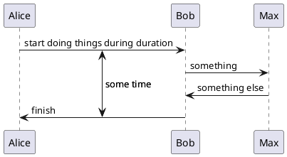
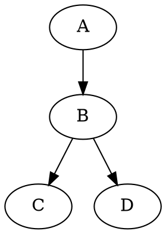

# 图像

**Markdown Preview Enhanced** 内部支持 `flow charts`, `sequence diagrams`, `mermaid`, `PlantUML`, `WaveDrom`, `GraphViz`，`Vega & Vega-lite`，`Ditaa` 图像渲染。
你也可以通过使用 [Code Chunk](zh-cn/code-chunk.md) 来渲染 `TikZ`, `Python Matplotlib`, `Plotly` 等图像。

> Please note that some diagrams doesn't work well with file export like PDF, pandoc, etc.

## [Flow Charts](flowchart.md)

这一特性基于 [flowchart.js](https://flowchart.js.org/)。

- `flow` 代码快中的内容将会被 [flowchart.js](https://flowchart.js.org/) 渲染。

``` flow {hide=false}
st=>start: Start:>http://www.google.com[blank]
e=>end:>http://www.google.com
op1=>operation: My Operation
sub1=>subroutine: My Subroutine
cond=>condition: Yes
or No?:>http://www.google.com
io=>inputoutput: catch something...
para=>parallel: parallel tasks

st->op1->cond
cond(yes)->io->e
cond(no)->para
para(path1, bottom)->sub1(right)->op1
para(path2, top)->op1
```

## [Sequence Diagrams](sequence-diagrams.md)

这一特性基于 [js-sequence-diagrams](https://bramp.github.io/js-sequence-diagrams/)。

- `sequence` 代码快中的内容将会被 [js-sequence-diagrams](https://bramp.github.io/js-sequence-diagrams/) 渲染。
- 支持两个主题 `simple`（默认主题）和 `hand`。

``` sequence {hide=false theme='hand'} 
Andrew->China: Says Hello
Note right of China: China thinks\nabout it
China-->Andrew: How are you?
Andrew->>China: I am good thanks!
```

## [Mermaid](Mermaid.md)

Markdown Preview Enhanced 使用 [mermaid](https://github.com/knsv/mermaid) 来渲染流程图和时序图。

- `mermaid` 代码块中的内容将会渲染 [mermaid](https://github.com/knsv/mermaid) 图像。
- 查看 [mermaid 文档](https://knsv.github.io/mermaid/#flowcharts-basic-syntax) 了解更多如果创建图形。
 
``` Mermaid {hide=false}
flowchart TB
    c1-->a2
    subgraph one
    a1-->a2
    end
    subgraph two
    b1-->b2
    end
    subgraph three
    c1-->c2
    end
    one --> two
    three --> two
    two --> c2
```


三个 mermaid 主题是支持的，并且你可以在 [插件设置](zh-cn/usages.md?id=package-settings) 中设置主题：

- `mermaid.css`
- `mermaid.dark.css`
- `mermaid.forest.css`
  

你还可以通过 `Markdown Preview Enhanced: Open Mermaid Config` 命令打开 mermaid 配置文件。

## [PlantUML](PlantUML.md)

Markdown Preview Enhanced 使用 [PlantUML](https://plantuml.com/) 来创建各种图形。（**Java** 是需要先被安装好的）

- 你可以安装 [Graphviz](https://www.graphviz.org/)（非必需）来辅助生成各种各种图形。
- `puml` 或者 `plantuml` 代码块中的内容将会被 [PlantUML](https://plantuml.com/) 渲染。



如果代码中 `@start...` 没有被找到，那么 `@startuml ... @enduml` 将会被自动添加。

## [WaveDrom](WaveDrom.md)

Markdown Preview Enhanced 使用 [WaveDrom](https://wavedrom.com/) 来渲染 digital timing diagram.

- `wavedrom` 代码块中的内容将会被 [WaveDrom](https://github.com/drom/wavedrom) 渲染。


``` wavedrom {hide=false}
{ signal: [
  { name: "CK",   wave: "P.......",                                              period: 2  },
  { name: "CMD",  wave: "x.3x=x4x=x=x=x=x", data: "RAS NOP CAS NOP NOP NOP NOP", phase: 0.5 },
  { name: "ADDR", wave: "x.=x..=x........", data: "ROW COL",                     phase: 0.5 },
  { name: "DQS",  wave: "z.......0.1010z." },
  { name: "DQ",   wave: "z.........5555z.", data: "D0 D1 D2 D3" }
]}
```

## GraphViz

Markdown Preview Enhanced 使用 [Viz.js](https://github.com/mdaines/viz.js) 来渲染 [dot 语言](https://tinyurl.com/kjoouup) 图形。

- `viz` 或者 `dot` 代码块中的内容将会被 [Viz.js](https://github.com/mdaines/viz.js) 渲染。
- 你可以通过 `{engine="..."}` 来选择不同的渲染引擎。 引擎 `circo`，`dot`，`neato`，`osage`，或者 `twopi` 是被支持的。默认下，使用 `dot` 引擎。



``` viz {hide=false,engine="circo"}
digraph G {
A -> B
B -> C
B -> D
}
```
## Vega 和 Vega-lite

Markdown Preview Enhanced 支持 [vega](https://vega.github.io/vega/) 以及 [vega-lite](https://vega.github.io/vega-lite/) 的**静态**图像.

- `vega` 代码块中的内容将会被 [vega](https://vega.github.io/vega/) 渲染。
- `vega-lite` 代码块中的内容将会被 [vega-lite](https://vega.github.io/vega-lite/) 渲染。
- `JSON` 以及 `YAML` 的输入是支持的。

``` vega-lite {hide=false}
{
  "$schema": "https://vega.github.io/schema/vega-lite/v4.json",
  "description": "A simple bar chart with embedded data.",
  "data": {
    "values": [
      {"a": "A", "b": 28}, {"a": "B", "b": 55}, {"a": "C", "b": 43},
      {"a": "D", "b": 91}, {"a": "E", "b": 81}, {"a": "F", "b": 53},
      {"a": "G", "b": 19}, {"a": "H", "b": 87}, {"a": "I", "b": 52}
    ]
  },
  "mark": "bar",
  "encoding": {
    "x": {"field": "a", "type": "nominal", "axis": {"labelAngle": 0}},
    "y": {"field": "b", "type": "quantitative"}
  }
}
```

你也可以 [@import](zh-cn/file-imports.md) 一个 `JSON` 或者 `YAML` 文件作为 `vega` 图像，例如：

```markdown
@import "your_vega_source.json" {as="vega"}
@import "your_vega_lite_source.json" {as="vega-lite"}
```

## [Ditaa](Ditaa.md) 

Markdown Preview Enhanced 支持 [ditaa](https://github.com/stathissideris/ditaa)。

(**Java** 是需要先被安装好的)

`ditaa` 整合于 [code chunk](zh-cn/code-chunk.md), for example:


  ```ditaa {cmd=true args=["-E"],hide=false}
  +--------+   +-------+    +-------+
  |        | --+ ditaa +--> |       |
  |  Text  |   +-------+    |diagram|
  |Document|   |!magic!|    |       |
  |     {d}|   |       |    |       |
  +---+----+   +-------+    +-------+
      :                         ^
      |       Lots of work      |
      +-------------------------+
  ```


> <kbd>shift-enter</kbd> 来运行 code chunk。
> 设置 `{hide=true}` 来隐藏代码块。
> 设置 `{run_on_save=true}` 启动当文件保存时，渲染 ditaa 图像。


---

如果你只是想要显示代码块而不想画图，则只要在后面添加 `{code_block=true}` 即可：

    ```mermaid {code_block=true}
    // 你的 mermaid 代码
    ```

---

你可以为图像的容器添加属性。
例如：

    ```puml {align="center"}
    a->b
    ```

将会把 puml 的图像放在中间。

---

当你保存你的 markdown 文件到 [GFM Markdown](zh-cn/markdown.md) 时， 所有图像将会被保存为 png 文件到 `imageFolderPath` 文件夹。
你可以设置导出文件的文件名 `{filename="图片.png"}`。

例如：

    ```mermaid {filename="我的mermaid.png"}
    ...
    ```


