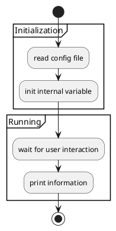
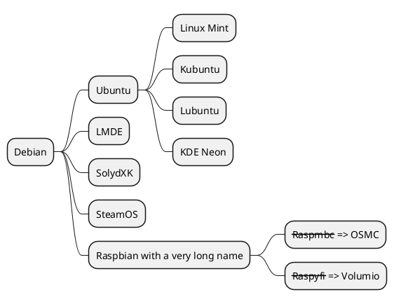

---
presentation:
  # presentation 主题
  # === 可选的主题 ===
  # "beige.css"
  # "black.css"
  # "blood.css"
  # "league.css"
  # "moon.css"
  # "night.css"
  # "serif.css"
  # "simple.css"
  # "sky.css"
  # "solarized.css"
  # "white.css"
  # "none.css"
  theme: black.css

  # The "normal" size of the presentation, aspect ratio will be preserved
  # when the presentation is scaled to fit different resolutions. Can be
  # specified using percentage units.
  width: 960
  height: 700

  # Factor of the display size that should remain empty around the content
  margin: 0.1

  # Bounds for smallest/largest possible scale to apply to content
  minScale: 0.2
  maxScale: 1.5

  # Display controls in the bottom right corner
  controls: true

  # Display a presentation progress bar
  progress: true

  # Display the page number of the current slide
  slideNumber: false

  # Push each slide change to the browser history
  history: false

  # Enable keyboard shortcuts for navigation
  keyboard: true

  # Enable the slide overview mode
  overview: true

  # Vertical centering of slides
  center: false

  # Enables touch navigation on devices with touch input
  touch: true

  # Loop the presentation
  loop: false

  # Change the presentation direction to be RTL
  rtl: false

  # Randomizes the order of slides each time the presentation loads
  shuffle: false

  # Turns fragments on and off globally
  fragments: true

  # Flags if the presentation is running in an embedded mode,
  # i.e. contained within a limited portion of the screen
  embedded: false

  # Flags if we should show a help overlay when the questionmark
  # key is pressed
  help: true

  # Flags if speaker notes should be visible to all viewers
  showNotes: false

  # Number of milliseconds between automatically proceeding to the
  # next slide, disabled when set to 0, this value can be overwritten
  # by using a data-autoslide attribute on your slides
  autoSlide: 0

  # Stop auto-sliding after user input
  autoSlideStoppable: true

  # Enable slide navigation via mouse wheel
  mouseWheel: false

  # Hides the address bar on mobile devices
  hideAddressBar: true

  # Opens links in an iframe preview overlay
  previewLinks: false

  # Transition style
  transition: 'default' # none/fade/slide/convex/concave/zoom

  # Transition speed
  transitionSpeed: 'default' # default/fast/slow

  # Transition style for full page slide backgrounds
  backgroundTransition: 'default' # none/fade/slide/convex/concave/zoom

  # Number of slides away from the current that are visible
  viewDistance: 3

---

<!-- slide -->

在这里编写你的幻灯片。。。


<!-- slide data-background="#ff0000" -->

- Item 1 <!-- .element: class="fragment" data-fragment-index="2"  -->
- Item 2 <!-- .element: class="fragment" data-fragment-index="1" -->

<!-- slide -->

``` js [1-2|3|4]
    let a = 1;
    let b = 2;
    let c = x => 1 + 2 + x;
    c(3);
```
<!-- slide data-background-color="aquamarine" -->
# Color Backgrounds
## 🐟

<!-- slide data-background-color="rgb(70, 70, 255)" -->
# Color Backgrounds
## 🐳

<!-- slide data-background-image="https://static.boredpanda.com/blog/wp-content/uploads/2017/11/My-most-popular-pic-since-I-started-dog-photography-5a0b38cbd5e1e__880.jpg" -->

## background Image <!-- .element: style="color:red"  -->

<!-- slide data-background-image="https://tse3-mm.cn.bing.net/th/id/OIP.S5j-APUCScnmR72MOfYtIwAAAA?pid=Api&w=464&h=350&rs=1"   data-background-size="500px" data-background-repeat="repeat"  -->
## This background image will be sized to 100px and repeated

<!-- slide  data-background-video="https://static.slid.es/site/homepage/v1/homepage-video-editor.mp4"  data-background-video-loop data-background-video-muted -->

## Video


<!-- slide  data-background-iframe="https://bing.com" data-background-interactive  -->
## Iframe

<!-- slide -->

video

<video data-autoplay src="http://clips.vorwaerts-gmbh.de/big_buck_bunny.mp4"></video>

<!-- slide -->



<!-- slide -->



<!-- slide -->
$$ J(\theta_0,\theta_1) = \sum_{i=0}^{10}\theta_0*i/\theta_1 $$

<!-- slide -->
1. Item 1 <!-- .element: class="fragment" data-fragment-index="2"  -->
2. Item 2 <!-- .element: class="fragment" data-fragment-index="1" -->

<!-- slide -->
<p class="fragment">Fade in</p>
<p class="fragment fade-out">Fade out</p>
<p class="fragment highlight-red">Highlight red</p>
<p class="fragment fade-in-then-out">Fade in, then out</p>
<p class="fragment fade-up">Slide up while fading in</p>

<!-- slide -->

<span class="fragment fade-in">
  <span class="fragment highlight-red"> 
    <span class="fragment fade-out">   
        Fade in > Turn red > Fade out  
    </span>
  </span>
</span>

<!-- slide -->

1. another Fade in > Turn red > Fade out <!-- .element: class="fragment fade-in highlight-red fade-out"   -->

<!-- slide -->
[Go to the last slide](#/grand-finale)


<!-- slide -->
## SLIDE 2

<!-- slide -->
<button class="navigate-left">Left</button>
<button class="navigate-right">Right</button>
<button class="navigate-up">Up</button>
<button class="navigate-down">Down</button>

<!-- Previous vertical OR horizontal slide -->
<button class="navigate-prev">Prev</button>

 <!-- Next vertical OR horizontal slide -->
<button class="navigate-next">Next</button>

<!-- slide  class="r-stack" -->


<!-- slide  id ="grand-finale" -->

[Back to the first](#/0)

## THE END

<!-- slide  data-transition="convex" -->
## This slide will override the presentation transition and zoom!
<!-- slide  data-transition-speed="slow"  -->
## from three transition speeds: default, fast or slow!
<!-- slide  data-transition="slide" -->
The train goes on …
<!-- slide data-transition="slide"  -->
and on …
<!-- slide  data-transition="slide-in fade-out" -->
and stops.
<!-- slide  data-transition="fade-in slide-out" -->
 (Passengers entering and leaving)
<!-- slide  data-transition="slide" -->
And it starts again.

<!-- slide data-auto-animate -->
* Item 1 
* Item 2 

<!-- slide  data-auto-animate -->
* Item 1 
* Item 2 
* Item 3
* Item 4 

<!-- slide   -->
<!-- slide   -->


