# Activity Diagram

## Simple Action!

You can use&nbsp;`(*)`&nbsp;for the starting point and ending point of the activity diagram.

In some occasion, you may want to use&nbsp;`(*top)`&nbsp;to force the starting point to be at the top of the diagram.

Use&nbsp;`-->`&nbsp;for arrows.

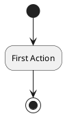

## Label on arrows!

By default, an arrow starts at the last used activity.

You can put a label on an arrow using brackets&nbsp;`[`&nbsp;and&nbsp;`]`&nbsp;just after the arrow definition.

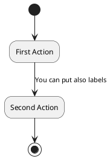

## Changing arrow direction!

You can use&nbsp;`->`&nbsp;for horizontal arrows. It is possible to force arrow's direction using the following syntax:

*  `-down->`&nbsp;(default arrow)
*  `-right->`&nbsp;or&nbsp;`->`
*  `-left->`
*  `-up->`

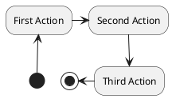

## Branches!

You can use&nbsp;`if/then/else`&nbsp;keywords to define branches.

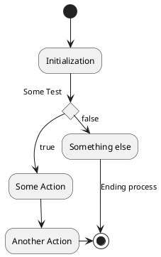

Unfortunately, you will have to sometimes repeat the same activity in the diagram text:

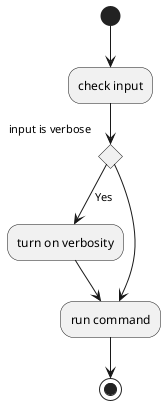

## More on Branches!

By default, a branch is connected to the last defined activity, but it is possible to override this and to define a link with the&nbsp;`if`&nbsp;keywords.

It is also possible to nest branches.

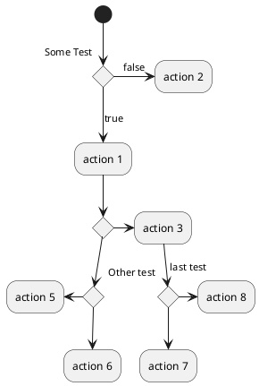

## Synchronization!

You can use&nbsp;`=== code ===`&nbsp;to display synchronization bars.

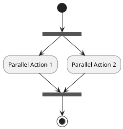

## Long action description!

When you declare activities, you can span on several lines the description text. You can also add&nbsp;`\n`&nbsp;in the description.

You can also give a short code to the activity with the&nbsp;`as`&nbsp;keyword. This code can be used latter in the diagram description.

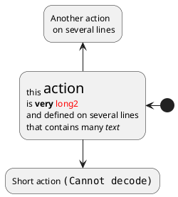

## Notes!

You can add notes on a activity using the commands&nbsp;`note left`,&nbsp;`note right`,&nbsp;`note top`&nbsp;or&nbsp;`note bottom`, just after the description of the activity you want to note.

If you want to put a note on the starting point, define the note at the very beginning of the diagram description.

You can also have a note on several lines, using the&nbsp;`endnote`&nbsp;keywords.

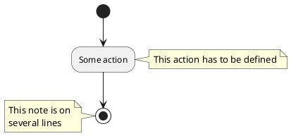

## Partition!

You can define a partition using the&nbsp;`partition`&nbsp;keyword, and optionally declare a background color for your partition (Using a html color code or name)

When you declare activities, they are automatically put in the last used partition.

You can close the partition definition using a closing bracket&nbsp;`}`.

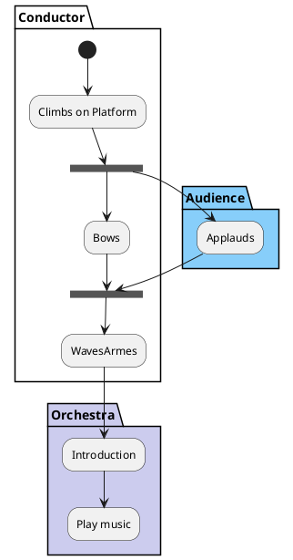

## Skinparam!

You can use the&nbsp;[skinparam](https://plantuml.com/en/skinparam)&nbsp;command to change colors and fonts for the drawing.

You can use this command :

*  In the diagram definition, like any other commands,
*  In an&nbsp;[included file](https://plantuml.com/en/preprocessing),
*  In a configuration file, provided in the&nbsp;[command line](https://plantuml.com/en/command-line)&nbsp;or the&nbsp;[ANT task](https://plantuml.com/en/ant-task).

You can define specific color and fonts for stereotyped activities.

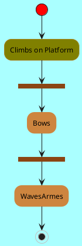

## Octagon!

You can change the shape of activities to octagon using the&nbsp;`skinparam activityShape octagon`&nbsp;command.

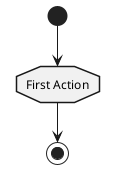

## Complete example!

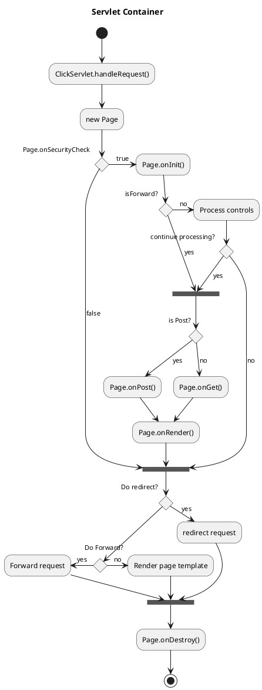

