# Activity Diagram (beta)

Current&nbsp;[syntax for activity diagram](https://plantuml.com/en/activity-diagram-legacy)&nbsp;has several limitations and drawbacks (for example, it's difficult to maintain).

So a completely new syntax and implementation is proposed as&nbsp;**beta version**&nbsp;to users (starting with V7947), so that we could define a better format and syntax.

Another advantage of this new implementation is that it's done without the need of having Graphviz installed (as for sequence diagrams).

The new syntax will replace the old one. However, for compatibility reason, the old syntax will still be recognized, to ensure&nbsp;_ascending compatibility_.

Users are simply encouraged to migrate to the new syntax.

## Simple action!

Activities label starts with&nbsp;`:`&nbsp;and ends with&nbsp;`;`.

Text formatting can be done using&nbsp;[creole wiki syntax](https://plantuml.com/en/creole).

They are implicitly linked in their definition order.

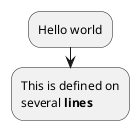

## Start/Stop!

You can use&nbsp;`start`&nbsp;and&nbsp;`stop`&nbsp;keywords to denote the beginning and the end of a diagram.

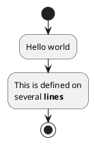

You can also use the&nbsp;`end`&nbsp;keyword.

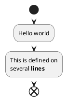

## Conditional!

You can use&nbsp;`if`,&nbsp;`then`&nbsp;and&nbsp;`else`&nbsp;keywords to put tests in your diagram. Labels can be provided using parentheses.

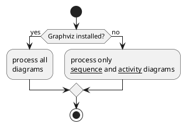

You can use the&nbsp;`elseif`&nbsp;keyword to have several tests :

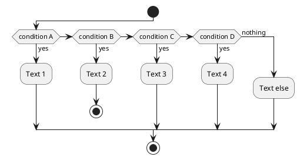

## Repeat loop!

You can use&nbsp;`repeat`&nbsp;and&nbsp;`repeatwhile`&nbsp;keywords to have repeat loops.

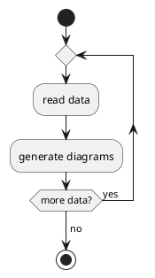

It is also possible to use a full action as&nbsp;`repeat`&nbsp;target and insert an action in the return path using the&nbsp;`backward`&nbsp;keyword.

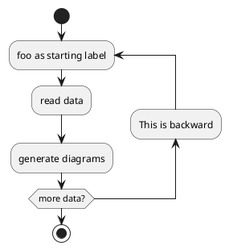

## While loop!

You can use&nbsp;`while`&nbsp;and&nbsp;`end while`&nbsp;keywords to have repeat loops.

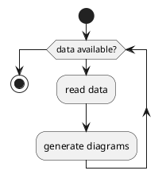

It is possible to provide a label after the&nbsp;`endwhile`&nbsp;keyword, or using the&nbsp;`is`&nbsp;keyword.

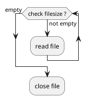

## Parallel processing!

You can use&nbsp;`fork`,&nbsp;`fork again`&nbsp;and&nbsp;`end fork`&nbsp;keywords to denote parallel processing.

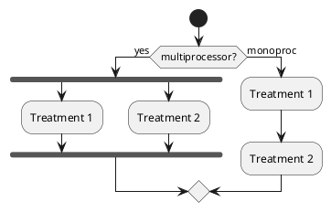

## Notes!

Text formatting can be done using&nbsp;[creole wiki syntax](https://plantuml.com/en/creole).

A note can be floating, using&nbsp;`floating`&nbsp;keyword.

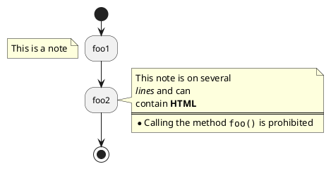

## Colors!

You can specify a&nbsp;[color](https://plantuml.com/en/color)&nbsp;for some activities.

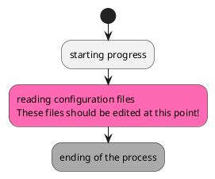

## Arrows!

Using the&nbsp;`->`&nbsp;notation, you can add texts to arrow, and change their&nbsp;[color](https://plantuml.com/en/color).

It's also possible to have dotted, dashed, bold or hidden arrows.

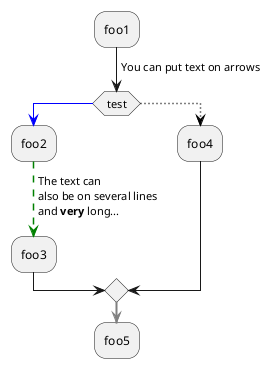

## Connector!

You can use parentheses to denote connector.

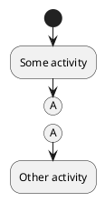

## Grouping!

You can group activity together by defining partition:

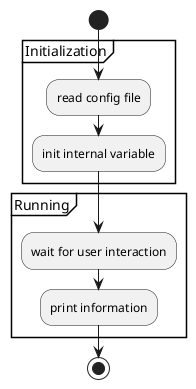

## Swimlanes!

Using pipe&nbsp;`|`, you can define swimlanes.

It's also possible to change swimlanes&nbsp;[color](https://plantuml.com/en/color).

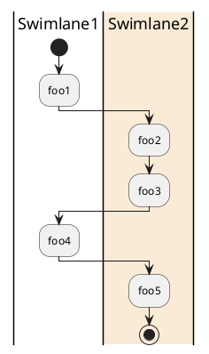

## Detach!

It's possible to remove an arrow using the&nbsp;`detach`&nbsp;keyword.

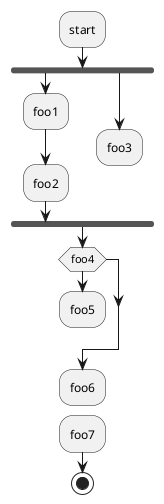

## SDL (Specification and Description Language)!

By changing the final&nbsp;`;`&nbsp;separator, you can set different rendering for the activity:

*  `|`
*  `<`
*  `>`
*  `/`
*  `\\`
*  `]`
*  `}`

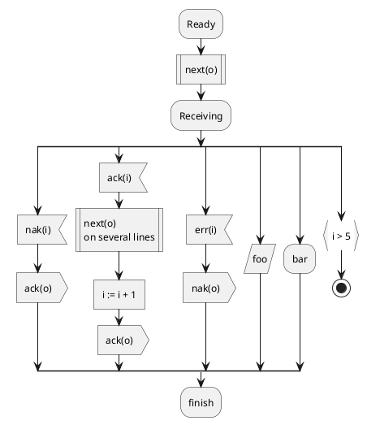

## Complete example!

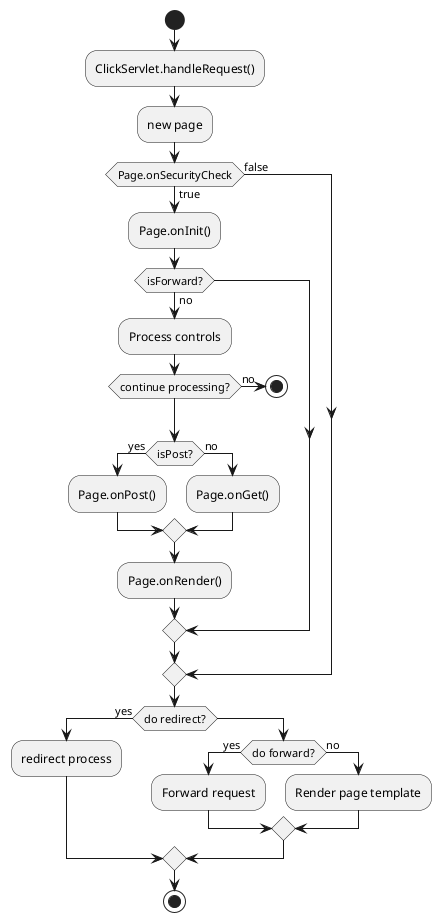
