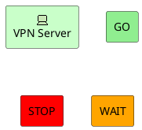
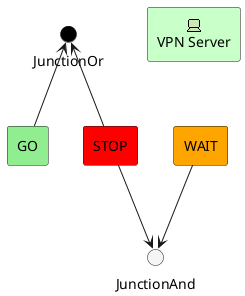
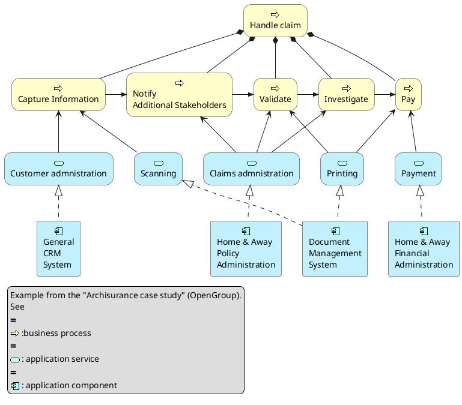
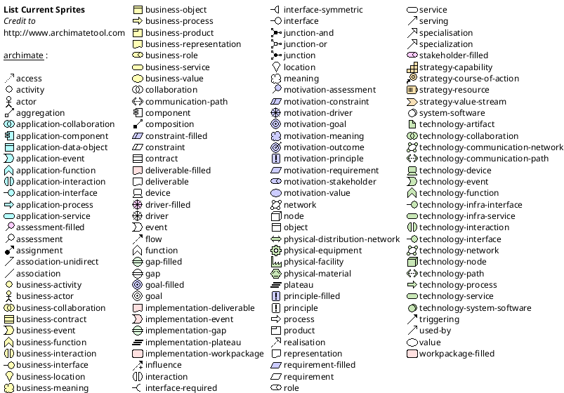

# Archimate Diagram

This is only a proposal and subject to change.

You are very welcome&nbsp;[to create a new discussion](http://forum.plantuml.net/)&nbsp;on this future syntax. Your feedbacks, ideas and suggestions help us to find the right solution.

## Archimate keyword!

You can use the&nbsp;`archimate`&nbsp;keyword to define an element. Stereotype can optionally specify an additional icon. Some colors (`Business`,&nbsp;`Application`,&nbsp;`Motivation`,&nbsp;`Strategy`,&nbsp;`Technology`,&nbsp;`Physical`,&nbsp;`Implementation`) are also available.

## Defining Junctions!

Using the&nbsp;`circle`&nbsp;keyword and the&nbsp;[preprocessor](https://plantuml.com/en/preprocessing), you can also create junctions.

## Example 1!

## Example 2!

``` puml {hide=false}
@startuml
skinparam roundcorner 25
rectangle "Capture Information"  as CI <<$archimate/business-process>> #Business
@enduml
```

## List possible sprites!

You can list all possible sprites for Archimate using the following diagram:

## ArchiMate Macros!

A list of Archimate marcros are defined&nbsp;[Archimate-PlantUML](https://github.com/ebbypeter/Archimate-PlantUML)&nbsp;here which simplifies the creation of ArchiMate diagrams.

Using the macros, creation of ArchiMate elements are done using the following format:&nbsp;`Category_ElementName(nameOfTheElement, "description")`

For Example:

*  To define a Stakeholder element, which is part of Motivation category, the syntax will be&nbsp;`Motivation_Stakeholder(StakeholderElement, "Stakeholder Description")`
*  To define a Business Service element,

`Business_Service(BService, "Business Service")`

The ArchiMate relationships are defined with the following pattern:&nbsp;`Rel_RelationType(fromElement, toElement, "description")`&nbsp;and to define the direction / orientation of the two elements:&nbsp;`Rel_RelationType_Direction(fromElement, toElement, "description")`

The RelationTypes supported are:

*  Access
*  Aggregation
*  Assignment
*  Association
*  Composition
*  Flow
*  Influence
*  Realization
*  Serving
*  Specilization
*  Triggering

The Directions supported are:

*  Up
*  Down
*  Left
*  Right

For example:

*  To denote a composition relationship between the Stakeholder and Business Service defined above, the syntax will be

`Rel_Composition(StakeholderElement, BService, "Description for the relationship")`

*  Unordered List ItemTo orient the two elements in top - down position, the syntax will be

`Rel_Composition_Down(StakeholderElement, BService, "Description for the relationship")`