# Class Diagram

## Relations between classes!


Relations between classes are defined using the following symbols :


|   |   |   |
|---|---|---|
| **Type** | **Symbol** | **Drawing** |
| Extension | `<|--` |  |
| Composition | `*--` |  |
| Aggregation | `o--` |  |


It is possible to replace&nbsp;`--`&nbsp;by&nbsp;`..`&nbsp;to have a dotted line.


Knowing those rules, it is possible to draw the following drawings:


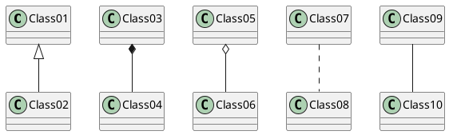


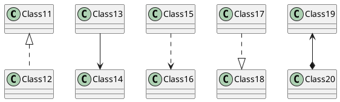


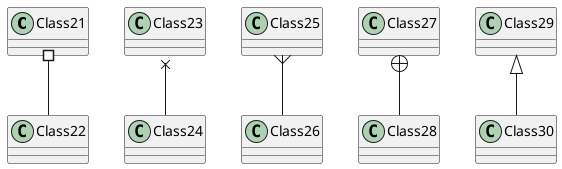


## Label on relations!


It is possible to add a label on the relation, using&nbsp;`:`, followed by the text of the label.


For cardinality, you can use double-quotes&nbsp;`""`&nbsp;on each side of the relation.


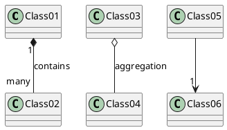


You can add an extra arrow pointing at one object showing which object acts on the other object, using&nbsp;`<`&nbsp;or&nbsp;`>`&nbsp;at the begin or at the end of the label.


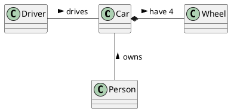


## Adding methods!


To declare fields and methods, you can use the symbol&nbsp;`:`&nbsp;followed by the field's or method's name.


The system checks for parenthesis to choose between methods and fields.


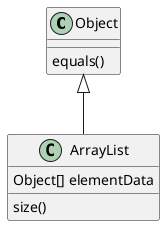


It is also possible to group between brackets&nbsp;`{}`&nbsp;all fields and methods.


Note that the syntax is highly flexible about type/name order.


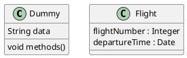


You can use&nbsp;`{field}`&nbsp;and&nbsp;`{method}`&nbsp;modifiers to override default behaviour of the parser about fields and methods.


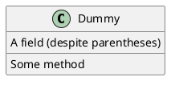


## Defining visibility!


When you define methods or fields, you can use characters to define the visibility of the corresponding item:


|   |   |   |   |
|---|---|---|---|
| **Character** | **Icon for field** | **Icon for method** | **Visibility** |
| `-` |  |  | private |
| `#` |  |  | protected |
| `~` |  |  | package private |
| `+` |  |  | public |


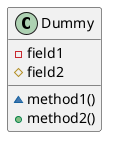


You can turn off this feature using the&nbsp;`skinparam classAttributeIconSize 0`&nbsp;command :


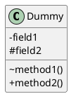


## Abstract and Static!


You can define static or abstract methods or fields using the&nbsp;`{static}`&nbsp;or&nbsp;`{abstract}`&nbsp;modifier.


These modifiers can be used at the start or at the end of the line. You can also use&nbsp;`{classifier}`&nbsp;instead of&nbsp;`{static}`.


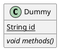


## Advanced class body!


By default, methods and fields are automatically regrouped by PlantUML. You can use separators to define your own way of ordering fields and methods. The following separators are possible :&nbsp;`--``..``==``__`.


You can also use titles within the separators:


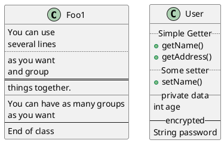


## Notes and stereotypes!


Stereotypes are defined with the&nbsp;`class`&nbsp;keyword,&nbsp;`<<`&nbsp;and&nbsp;`>>`.


You can also define notes using&nbsp;`note left of`&nbsp;,&nbsp;`note right of`&nbsp;,&nbsp;`note top of`&nbsp;,&nbsp;`note bottom of`&nbsp;keywords.


You can also define a note on the last defined class using&nbsp;`note left`,&nbsp;`note right`,&nbsp;`note top`,&nbsp;`note bottom`.


A note can be also define alone with the&nbsp;`note`&nbsp;keywords, then linked to other objects using the&nbsp;`..`&nbsp;symbol.


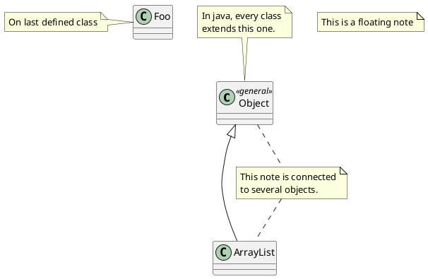


## More on notes!


It is also possible to use few html tags like :


*  `<b>`
*  `<u>`
*  `<i>`
*  `<s>`,&nbsp;`<del>`,&nbsp;`<strike>`
*  `<font color="#AAAAAA">`&nbsp;or&nbsp;`<font color="colorName">`
*  `<color:#AAAAAA>`&nbsp;or&nbsp;`<color:colorName>`
*  `<size:nn>`&nbsp;to change font size
*  ``&nbsp;or&nbsp;``: the file must be accessible by the filesystem


You can also have a note on several lines.


You can also define a note on the last defined class using&nbsp;`note left`,&nbsp;`note right`,&nbsp;`note top`,&nbsp;`note bottom`.


``` puml {hide=false}
@startuml

class Foo
note left: On last defined class

note top of Object
  In java, <size:18>every</size> <u>class</u>
  <b>extends</b>
  <i>this</i> one.
end note

note as N1
  This note is <u>also</u>
  <b><color:royalBlue>on several</color>
  <s>words</s> lines
  And this is hosted by 
end note

@enduml
```


## Note on links!


It is possible to add a note on a link, just after the link definition, using&nbsp;`note on link`.


You can also use&nbsp;`note left on link`,&nbsp;`note right on link`,&nbsp;`note top on link`,&nbsp;`note bottom on link`&nbsp;if you want to change the relative position of the note with the label.


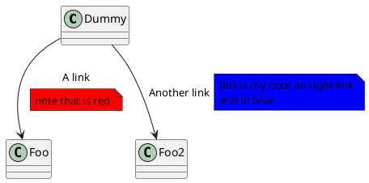


## Abstract class and interface!


You can declare a class as abstract using&nbsp;`abstract`&nbsp;or&nbsp;`abstract class`&nbsp;keywords.


The class will be printed in&nbsp;_italic_.


You can use the&nbsp;`interface`,&nbsp;`annotation`&nbsp;and&nbsp;`enum`&nbsp;keywords too.


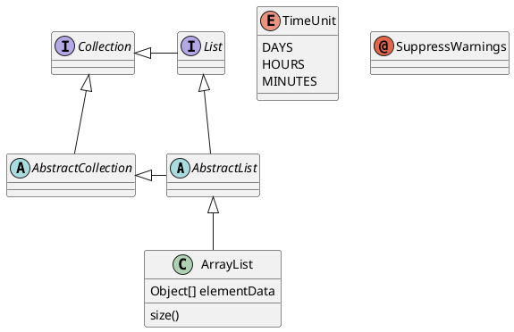


## Using non-letters!


If you want to use&nbsp;[non-letters](https://plantuml.com/en/unicode)&nbsp;in the class (or enum...) display, you can either :

*  Use the&nbsp;`as`&nbsp;keyword in the class definition
*  Put quotes&nbsp;`""`&nbsp;around the class name


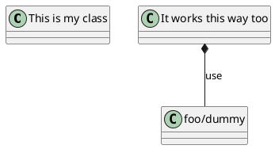


## Hide attributes, methods...!


You can parameterize the display of classes using the&nbsp;`hide/show`&nbsp;command.


The basic command is:&nbsp;`hide empty members`. This command will hide attributes or methods if they are empty.


Instead of&nbsp;`empty members`, you can use:

*  `empty fields`&nbsp;or&nbsp;`empty attributes`&nbsp;for empty fields,
*  `empty methods`&nbsp;for empty methods,
*  `fields`&nbsp;or&nbsp;`attributes`&nbsp;which will hide fields, even if they are described,
*  `methods`&nbsp;which will hide methods, even if they are described,
*  `members`&nbsp;which will hide fields&nbsp;<u>and</u>&nbsp;methods, even if they are described,
*  `circle`&nbsp;for the circled character in front of class name,
*  `stereotype`&nbsp;for the stereotype.


You can also provide, just after the&nbsp;`hide`&nbsp;or&nbsp;`show`&nbsp;keyword:

*  `class`&nbsp;for all classes,
*  `interface`&nbsp;for all interfaces,
*  `enum`&nbsp;for all enums,
*  `<<foo1>>`&nbsp;for classes which are stereotyped with&nbsp;_foo1_,
*  an existing class name.


You can use several&nbsp;`show/hide`&nbsp;commands to define rules and exceptions.


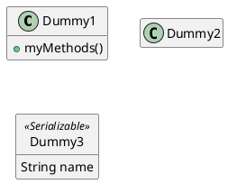


## Hide classes!


You can also use the&nbsp;`show/hide`&nbsp;commands to hide classes.


This may be useful if you define a large&nbsp;[!included file](https://plantuml.com/en/preprocessing), and if you want to hide come classes after&nbsp;[file inclusion](https://plantuml.com/en/preprocessing).


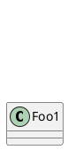


## Use generics!


You can also use bracket&nbsp;`<`&nbsp;and&nbsp;`>`&nbsp;to define generics usage in a class.


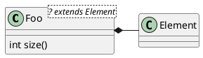


It is possible to disable this drawing using&nbsp;`skinparam genericDisplay old`&nbsp;command.


## Specific Spot!


Usually, a spotted character (C, I, E or A) is used for classes, interface, enum and abstract classes.


But you can define your own spot for a class when you define the stereotype, adding a single character and a color, like in this example:


``` puml {hide=false}
@startuml

class System << (S,#FF7700) Singleton >>
class Date << (D,orchid) >>
@enduml
```


## Packages!


You can define a package using the&nbsp;`package`&nbsp;keyword, and optionally declare a background color for your package (Using a html color code or name).


Note that package definitions can be nested.


``` puml {hide=false}
@startuml

package "Classic Collections" #DDDDDD {
  Object <|-- ArrayList
}

package net.sourceforge.plantuml {
  Object <|-- Demo1
  Demo1 *- Demo2
}

@enduml
```


## Packages style!


There are different styles available for packages.


You can specify them either by setting a default style with the command :&nbsp;`skinparam packageStyle`, or by using a stereotype on the package:


``` puml {hide=false}
@startuml
scale 750 width
package foo1 <<Node>> {
  class Class1
}

package foo2 <<Rectangle>> {
  class Class2
}

package foo3 <<Folder>> {
  class Class3
}

package foo4 <<Frame>> {
  class Class4
}

package foo5 <<Cloud>> {
  class Class5
}

package foo6 <<Database>> {
  class Class6
}

@enduml
```


You can also define links between packages, like in the following example:


``` puml {hide=false}
@startuml

skinparam packageStyle rectangle

package foo1.foo2 {
}

package foo1.foo2.foo3 {
  class Object
}

foo1.foo2 +-- foo1.foo2.foo3

@enduml
```


## Namespaces!


In packages, the name of a class is the unique identifier of this class. It means that you cannot have two classes with the very same name in different packages.


In that case, you should use&nbsp;[namespaces](http://en.wikipedia.org/wiki/Namespace_%28computer_science%29)&nbsp;instead of packages.


You can refer to classes from other namespaces by fully qualify them. Classes from the default namespace are qualified with a starting dot.


Note that you don't have to explicitly create namespace : a fully qualified class is automatically put in the right namespace.


``` puml {hide=false}
@startuml

class BaseClass

namespace net.dummy #DDDDDD {
    .BaseClass <|-- Person
    Meeting o-- Person

    .BaseClass <|- Meeting
}

namespace net.foo {
  net.dummy.Person  <|- Person
  .BaseClass <|-- Person

  net.dummy.Meeting o-- Person
}

BaseClass <|-- net.unused.Person

@enduml
```


## Automatic namespace creation!


You can define another separator (other than the dot) using the command :&nbsp;`set namespaceSeparator ???`.


``` puml {hide=false}
@startuml

set namespaceSeparator ::
class X1::X2::foo {
  some info
}

@enduml
```


You can disable automatic package creation using the command&nbsp;`set namespaceSeparator none`.


``` puml {hide=false}
@startuml

set namespaceSeparator none
class X1.X2.foo {
  some info
}

@enduml
```


## Lollipop interface!


You can also define lollipops interface on classes, using the following syntax:

*  `bar ()- foo`
*  `bar ()-- foo`
*  `foo -() bar`


``` puml {hide=false}
@startuml
class foo
bar ()- foo
@enduml
```


## Changing arrows direction!


By default, links between classes have two dashes&nbsp;`--`&nbsp;and are vertically oriented. It is possible to use horizontal link by putting a single dash (or dot) like this:


``` puml {hide=false}
@startuml
Room o- Student
Room *-- Chair
@enduml
```


You can also change directions by reversing the link:


``` puml {hide=false}
@startuml
Student -o Room
Chair --* Room
@enduml
```


It is also possible to change arrow direction by adding&nbsp;`left`,&nbsp;`right`,&nbsp;`up`&nbsp;or&nbsp;`down`&nbsp;keywords inside the arrow:


``` puml {hide=false}
@startuml
foo -left-> dummyLeft
foo -right-> dummyRight
foo -up-> dummyUp
foo -down-> dummyDown
@enduml
```


You can shorten the arrow by using only the first character of the direction (for example,&nbsp;`-d-`&nbsp;instead of&nbsp;`-down-`) or the two first characters (`-do-`).


Please note that you should not abuse this functionality :&nbsp;_Graphviz_&nbsp;gives usually good results without tweaking.


## Association classes!


You can define&nbsp;_association class_&nbsp;after that a relation has been defined between two classes, like in this example:


``` puml {hide=false}
@startuml
class Student {
  Name
}
Student "0..*" - "1..*" Course
(Student, Course) .. Enrollment

class Enrollment {
  drop()
  cancel()
}
@enduml
```


You can define it in another direction:


``` puml {hide=false}
@startuml
class Student {
  Name
}
Student "0..*" -- "1..*" Course
(Student, Course) . Enrollment

class Enrollment {
  drop()
  cancel()
}
@enduml
```


## Skinparam!


You can use the&nbsp;[skinparam](https://plantuml.com/en/skinparam)&nbsp;command to change colors and fonts for the drawing.


You can use this command :

*  In the diagram definition, like any other commands,
*  In an&nbsp;[included file](https://plantuml.com/en/preprocessing),
*  In a configuration file, provided in the&nbsp;[command line](https://plantuml.com/en/command-line)&nbsp;or the&nbsp;[ANT task](https://plantuml.com/en/ant-task).


``` puml {hide=false}
@startuml

skinparam class {
BackgroundColor PaleGreen
ArrowColor SeaGreen
BorderColor SpringGreen
}
skinparam stereotypeCBackgroundColor YellowGreen

Class01 "1" *-- "many" Class02 : contains

Class03 o-- Class04 : aggregation

@enduml
```


## Skinned Stereotypes!


You can define specific color and fonts for stereotyped classes.


``` puml {hide=false}
@startuml

skinparam class {
BackgroundColor PaleGreen
ArrowColor SeaGreen
BorderColor SpringGreen
BackgroundColor<<Foo>> Wheat
BorderColor<<Foo>> Tomato
}
skinparam stereotypeCBackgroundColor YellowGreen
skinparam stereotypeCBackgroundColor<< Foo >> DimGray

Class01 <<Foo>>
Class03 <<Foo>>
Class01 "1" *-- "many" Class02 : contains

Class03 o-- Class04 : aggregation

@enduml
```


## Color gradient!


It's possible to declare individual color for classes or note using the # notation.


You can use either&nbsp;[standard color name](https://plantuml.com/en/color)&nbsp;or RGB code.


You can also use color gradient in background, with the following syntax: two colors names separated either by:

*  `|`,
*  `/`,
*  `\`,
*  or&nbsp;`-`

depending the direction of the gradient.


For example, you could have:


``` puml {hide=false}
@startuml

skinparam backgroundcolor AntiqueWhite/Gold
skinparam classBackgroundColor Wheat|CornflowerBlue

class Foo #red-green
note left of Foo #blue\9932CC
  this is my
  note on this class
end note

package example #GreenYellow/LightGoldenRodYellow {
  class Dummy
}

@enduml
```


## Help on layout!


Sometimes, the default layout is not perfect...


You can use&nbsp;`together`&nbsp;keyword to group some classes together : the layout engine will try to group them (as if they were in the same package).


You can also use&nbsp;`hidden`&nbsp;links to force the layout.


``` puml {hide=false}
@startuml

class Bar1
class Bar2
together {
  class Together1
  class Together2
  class Together3
}
Together1 - Together2
Together2 - Together3
Together2 -[hidden]--> Bar1
Bar1 -[hidden]> Bar2


@enduml
```


## Splitting large files!


Sometimes, you will get some very large image files.


You can use the&nbsp;`page (hpages)x(vpages)`&nbsp;command to split the generated image into several files :


`hpages`&nbsp;is a number that indicated the number of horizontal pages, and&nbsp;`vpages`&nbsp;is a number that indicated the number of vertical pages.


You can also use some specific skinparam settings to put borders on splitted pages (see example).


``` puml {hide=false}
@startuml
' Split into 4 pages
page 2x2
skinparam pageMargin 10
skinparam pageExternalColor gray
skinparam pageBorderColor black

class BaseClass

namespace net.dummy #DDDDDD {
    .BaseClass <|-- Person
    Meeting o-- Person

    .BaseClass <|- Meeting

}

namespace net.foo {
  net.dummy.Person  <|- Person
  .BaseClass <|-- Person

  net.dummy.Meeting o-- Person
}

BaseClass <|-- net.unused.Person
@enduml
```


## Extends and implements!


It is also possible to use&nbsp;`extends`&nbsp;and&nbsp;`implements`&nbsp;keywords.


``` puml {hide=false}
@startuml
class ArrayList implements List
class ArrayList extends AbstractList
@enduml
```