# Colors

You can use specify fill and line colors either:

*  with&nbsp;[its standard name](https://www.w3schools.com/colors/colors_names.asp)
*  using HEX value&nbsp;[`#AABBCC`](https://www.w3schools.com/colors/colors_hexadecimal.asp)
*  using short HEX value&nbsp;`#ABC`


``` puml {hide=false}
@startgantt
[Activity1] lasts 5 days
[Activity2] lasts 5 days
[Activity1] is colored in White/Red
[Activity2] is colored in Silver/Green
[Activity1] -> [Activity2]
@endgantt
```


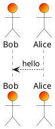


Also see:&nbsp;[skinparam](http://plantuml.com/skinparam)


## Automatic color


The special value&nbsp;`automatic`&nbsp;can be used for text. In that case, the color is either black or white, depending on the current background.


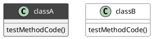


## View colors in PlantUML

A user has recently created an image to display&nbsp;[all names colors used by PlantUML](https://github.com/sledgeh/PlantUML-colors). (We thank him by the way!)

So a new feature has been added to print all those colors using a special diagram description:


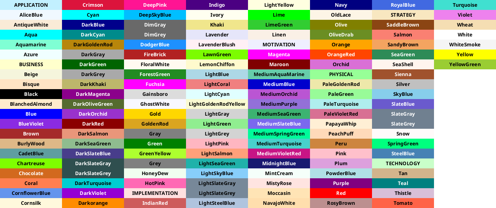

It is also possible to print a palette of colors close to some other color (using its name or HEX value).


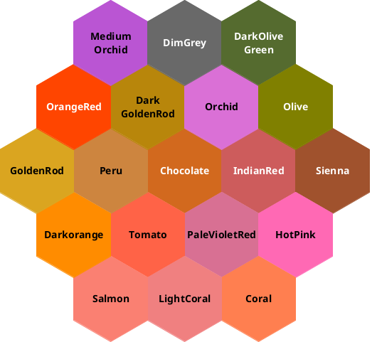

# Common commands[


## Comments

Everything that starts with&nbsp;`simple quote '`&nbsp;is a comment.


You can also put comments on several lines using&nbsp;`/'`&nbsp;to start and&nbsp;`'/`&nbsp;to end.


## Footer and header

You can use the commands&nbsp;`header`&nbsp;or&nbsp;`footer`&nbsp;to add a footer or a header on any generated diagram.

You can optionally specify if you want a&nbsp;`center`,&nbsp;`left`&nbsp;or&nbsp;`right`&nbsp;footer/header, by adding a keyword.

As for title, it is possible to define a header or a footer on several lines.

It is also possible to put some HTML into the header or footer.


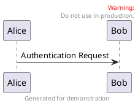

## Zoom


You can use the&nbsp;`scale`&nbsp;command to zoom the generated image.

You can use either a number or a fraction to define the scale factor. You can also specify either width or height (in pixel). And you can also give both width and height : the image is scaled to fit inside the specified dimension.

*  `scale 1.5` 
*  `scale 2/3` 
*  `scale 200 width` 
*  `scale 200 height` 
*  `scale 200*100` 
*  `scale max 300*200` 
*  `scale max 1024 width` 
*  `scale max 800 height` 


``` puml {hide=false}
@startuml
scale 180*90
Bob->Alice : hello
@enduml
```

## Title

The&nbsp;`title`&nbsp;keywords is used to put a title. You can add newline using&nbsp;`\n`&nbsp;in the title description.

Some skinparam settings are available to put borders on the title.

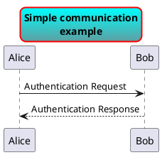

You can use&nbsp;[creole formatting](https://plantuml.com/en/creole)&nbsp;in the title.


You can also define title on several lines using&nbsp;`title`&nbsp;and&nbsp;`end title`&nbsp;keywords.


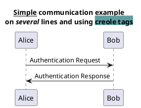

## Caption

There is also a&nbsp;`caption`&nbsp;keyword to put a caption under the diagram.


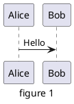


## Legend the diagram

The&nbsp;`legend`&nbsp;and&nbsp;`end legend`&nbsp;are keywords is used to put a legend.

You can optionally specify to have&nbsp;`left`,&nbsp;`right`,&nbsp;`top`,&nbsp;`bottom`&nbsp;or&nbsp;`center`&nbsp;alignment for the legend.


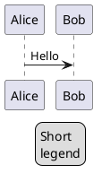


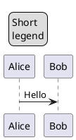


# Creole


A light&nbsp;[Creole engine](http://en.wikipedia.org/wiki/Creole_%28markup%29)&nbsp;has been integrated into PlantUML to have a standardized way of defining text style.

All diagrams are now supporting this syntax.

Note that ascending compatibility with HTML syntax is preserved.

## Emphasized text


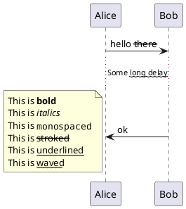

## List


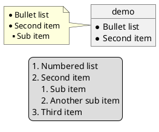


## Escape character

You can use the tilde&nbsp;`~`&nbsp;to escape special creole characters.


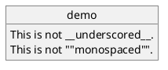

## Horizontal lines


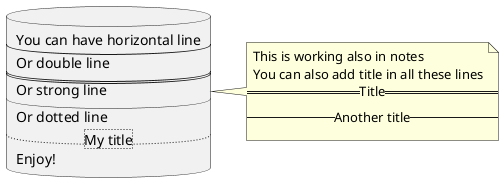


## Headings


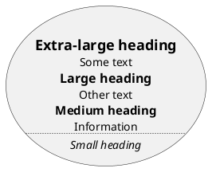

## Legacy HTML


Some HTML tags are also working:

*  `<b>`&nbsp;for bold text
*  `<u>`&nbsp;or&nbsp;`<u:#AAAAAA>`&nbsp;or&nbsp;`<u:[[color|colorName]]>`&nbsp;for underline
*  `<i>`&nbsp;for italic
*  `<s>`&nbsp;or&nbsp;`<s:#AAAAAA>`&nbsp;or&nbsp;`<s:[[color|colorName]]>`&nbsp;for strike text
*  `<w>`&nbsp;or&nbsp;`<w:#AAAAAA>`&nbsp;or&nbsp;`<w:[[color|colorName]]>`&nbsp;for wave underline text
*  `<color:#AAAAAA>`&nbsp;or&nbsp;`<color:[[color|colorName]]>```
*  `<back:#AAAAAA>`&nbsp;or&nbsp;`<back:[[color|colorName]]>`&nbsp;for background color
*  `<size:nn>`&nbsp;to change font size
*  ``&nbsp;: the file must be accessible by the filesystem
*  ``&nbsp;: the URL must be available from the Internet


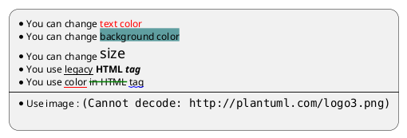

## Table


It is possible to build table.


``` puml {hide=false}
@startuml
skinparam titleFontSize 14
title
  
  |= |= table |= header |
  | a | table | row |
  | b | table | row |
end title
@enduml
```

You can specify background colors for cells and lines.


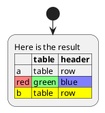

## Tree


You can use&nbsp;`|_`&nbsp;characters to build a tree.

``` puml {hide=false}
@startuml
skinparam titleFontSize 14
title
  
  |_ First line
  |_ **Bom(Model)**
    |_ prop1
    |_ prop2
    |_ prop3
  |_ Last line
end title
@enduml
```


## Special characters


It's possible to use&nbsp;[any unicode characters](http://www.fileformat.info/info/unicode/category/Sm/list.htm)&nbsp;with&nbsp;`&#`&nbsp;syntax or&nbsp;`<U+XXXX>```


``` puml {hide=false}
@startuml
usecase foo as "this is &#8734; long"
usecase bar as "this is also <U+221E> long"
@enduml
```


## OpenIconic


[OpenIconic](https://useiconic.com/open/)&nbsp;is an very nice open source icon set. Those icons have been integrated into the creole parser, so you can use them out-of-the-box.


You can use the following syntax:&nbsp;`<&ICON_NAME>`.


``` puml {hide=false}
@startuml
title: <size:20><&heart>Use of OpenIconic<&heart></size>
:Wifi;
note left
  Click on <&wifi>
end note
@enduml
```

The complete list is available on&nbsp;[OpenIconic Website](https://useiconic.com/open/), or you can use the following special diagram:


``` puml {hide=false}
@startuml
listopeniconic
@enduml
```


# Hyperlinks

Hyperlinks have been introduced in iterative mode so there have been some slight syntax changes with different versions. Starting with version&nbsp;**8058**, syntax about hyperlink is now clearly defined and stable.

Unfortunately, there are some tiny changes from previous legacy syntax, so you may have to update your existing source diagrams. This is something we do not like, because we try to guarantee ascending compatibility as far as possible. But in some cases, we have to move forward.

The good news is that older legacy diagrams will still be generated by newer versions of PlantUML.&nbsp;_The only impact is that some links may be displayed differently, so we think it is an acceptable change._

## Format definition

Simple links are define using two square brackets.

It is possible to give an optional label that will be printed instead of the link itself. A space is used as separator after the URL itself.


Finally you can also have an optional tooltip using round brackets, just after the URL and before the optional label.


## Links in sequence diagram


The following example lists some links features:


``` puml {hide=false}
@startuml
actor Bob [[http://plantuml.com/sequence]]
actor "This is [[http://plantuml.com/sequence Alice]] actor" as Alice
Bob -> Alice [[http://plantuml.com/start]] : hello
note left [[http://plantuml.com/start]]
  a note with a link
end note
Alice -> Bob : hello with [[http://plantuml.com/start{Tooltip for message} some link]]
note right [[http://plantuml.com/start]] : another note
note left of Bob
You can use [[http://plantuml.com/start links in notes]] also.
end note
@enduml
```

## Links in class diagram


``` puml {hide=false}
@startuml
class Car [[http://plantuml.com/link]]
class Wheel [[http://plantuml.com/sequence]]
note left [[http://plantuml.com]]
foo
end note
Car *-- Wheel [[http://plantuml.com/class]] : has some
@enduml
```


There is a special syntax with 3 square brackets in class definition when you want to define a link on field or method. For example:


``` puml {hide=false}
@startuml
class Car {
  - Some field [[[http://plantuml.com]]]
  Some method() [[[http://plantuml.com/link]]]
}
@enduml
```

## Links in activity diagram


``` puml {hide=false}
@startuml
start
[[http://plantuml.com]]:Some activity;
:Some [[http://plantuml.com link]];
end
@enduml
```

# Defining and using sprites[


A&nbsp;_Sprite_&nbsp;is a small graphic element that can be used in diagrams.


In PlantUML, sprites are monochrome and can have either 4, 8 or 16 gray level.


To define a sprite, you have to use a hexadecimal digit between 0 and F per pixel.


Then you can use the sprite using&nbsp;`<$XXX>`&nbsp;where XXX is the name of the sprite.


``` puml {hide=false}
@startuml
sprite $foo1 {
  FFFFFFFFFFFFFFF
  F0123456789ABCF
  F0123456789ABCF
  F0123456789ABCF
  F0123456789ABCF
  F0123456789ABCF
  F0123456789ABCF
  F0123456789ABCF
  F0123456789ABCF
  FFFFFFFFFFFFFFF
}
Alice -> Bob : Testing <$foo1>
@enduml
```

You can scale the sprite.


``` puml {hide=false}
@startuml
sprite $foo1 {
  FFFFFFFFFFFFFFF
  F0123456789ABCF
  F0123456789ABCF
  F0123456789ABCF
  F0123456789ABCF
  F0123456789ABCF
  F0123456789ABCF
  F0123456789ABCF
  F0123456789ABCF
  FFFFFFFFFFFFFFF
}
Alice -> Bob : Testing <$foo1{scale=3}>
@enduml
```


## Changing colors


Although sprites are monochrome, it's possible to change their color.


``` puml {hide=false}
@startuml
sprite $foo1 {
  FFFFFFFFFFFFFFF
  F0123456789ABCF
  F0123456789ABCF
  F0123456789ABCF
  F0123456789ABCF
  F0123456789ABCF
  F0123456789ABCF
  F0123456789ABCF
  F0123456789ABCF
  FFFFFFFFFFFFFFF
}
Alice -> Bob : Testing <$foo1,scale=3.4,color=orange>
@enduml
```


## Encoding Sprite


To encode sprite, you can use the command line like:


``` 
java -jar plantuml.jar -encodesprite 16z foo.png
```

where&nbsp;`foo.png`&nbsp;is the image file you want to use (it will be converted to gray automatically).

After&nbsp;`-encodesprite`, you have to specify a format:&nbsp;`4, 8, 16, 4z, 8z`&nbsp;or&nbsp;`16z`.

The number indicates the gray level and the optional&nbsp;`z`&nbsp;is used to enable compression in sprite definition.

## Importing Sprite

You can also launch the GUI to generate a sprite from an existing image.

Click in the menubar then on&nbsp;`File/Open Sprite Window`.


After copying an image into you clipboard, several possible definitions of the corresponding sprite will be displayed : you will just have to pickup the one you want.


``` puml {hide=false}
@startuml
sprite $printer [15x15/8z] NOtH3W0W208HxFz_kMAhj7lHWpa1XC716sz0Pq4MVPEWfBHIuxP3L6kbTcizR8tAhzaqFvXwvFfPEqm0
start
:click on <$printer> to print the page;
@enduml
```

``` puml {hide=false}
@startuml
 sprite $bug [15x15/16z] PKzR2i0m2BFMi15p__FEjQEqB1z27aeqCqixa8S4OT7C53cKpsHpaYPDJY_12MHM-BLRyywPhrrlw3qumqNThmXgd1TOterAZmOW8sgiJafogofWRwtV3nCF
 sprite $printer [15x15/8z] NOtH3W0W208HxFz_kMAhj7lHWpa1XC716sz0Pq4MVPEWfBHIuxP3L6kbTcizR8tAhzaqFvXwvFfPEqm0
 sprite $disk {
   444445566677881
   436000000009991
   43600000000ACA1
   53700000001A7A1
   53700000012B8A1
   53800000123B8A1
   63800001233C9A1
   634999AABBC99B1
   744566778899AB1
   7456AAAAA99AAB1
   8566AFC228AABB1
   8567AC8118BBBB1
   867BD4433BBBBB1
   39AAAAABBBBBBC1
}

 title Use of sprites (<$printer>, <$bug>...)

 :
 Can have some bug : <$bug>
 Click on <$disk> to save
 ;

 note left : The printer <$printer> is available

@enduml
```

## StdLib


The&nbsp;[PlantUML StdLib](https://github.com/plantuml/plantuml-stdlib)&nbsp;includes a number of ready icons in various IT areas such as architecture, cloud services, logos etc. It including AWS, Azure, Kubernetes, C4, product Logos and many others. To explore these libraries:


*  Browse the Github folders of&nbsp;[PlantUML StdLib](https://github.com/plantuml/plantuml-stdlib)
*  Browse the source repos of StdLib collections that interest you. Eg if you are interested in&nbsp;[logos](https://github.com/plantuml/plantuml-stdlib/tree/master/logos)&nbsp;you can find that it came from&nbsp;[gilbarbara-plantuml-sprites](https://github.com/rabelenda/gilbarbara-plantuml-sprites), and quickly find its

[sprites-list](https://github.com/rabelenda/gilbarbara-plantuml-sprites/blob/master/sprites-list.md). (The next section shows how to list selected sprites but unfortunately that's in grayscale whereas this custom listing is in color.)

*  Study the in-depth&nbsp;[Hitchhiker’s Guide to PlantUML](https://crashedmind.github.io/PlantUMLHitchhikersGuide/index.html), eg sections&nbsp;[Standard Library Sprites](https://crashedmind.github.io/PlantUMLHitchhikersGuide/PlantUMLSpriteLibraries/plantuml_sprites.html#standard-library-sprites)&nbsp;and&nbsp;[PlantUML Stdlib Overview](https://crashedmind.github.io/PlantUMLHitchhikersGuide/Stdlib/StdLibOverview.html)

## Listing Sprites


You can use the&nbsp;`listsprites`&nbsp;command to show available sprites:

*  Used on its own, it just shows&nbsp;[ArchiMate sprites](https://plantuml.com/archimate-diagram#9a3dbeaa372bf477)
*  If you include some sprite libraries in your diagram, the command shows all these sprites, as explained in&nbsp;[View all the icons with listsprites](https://crashedmind.github.io/PlantUMLHitchhikersGuide/NetworkUsersMachines/NetworkUsersMachines.html#view-all-the-icons-with-listsprites).


``` puml {hide=false}
@startuml

!define osaPuml https://raw.githubusercontent.com/Crashedmind/PlantUML-opensecurityarchitecture2-icons/master
!include osaPuml/Common.puml
!include osaPuml/User/all.puml

listsprites
@enduml
```


Most collections have files called&nbsp;`all`&nbsp;that allow you to see a whole sub-collection at once. Else you need to find the sprites that interest you and include them one by one. Unfortunately, the version of a collection included in StdLib often does not have such&nbsp;`all`&nbsp;files, so as you see above we include the collection from github, not from StdLib.


All sprites are in grayscale, but most collections define specific macros that include appropriate (vendor-specific) colors.

