# Component Diagram

Let's have few examples :

## Components!

Components must be bracketed.

You can also use the&nbsp;`component`&nbsp;keyword to define a component. And you can define an alias, using the&nbsp;`as`&nbsp;keyword. This alias will be used later, when defining relations.

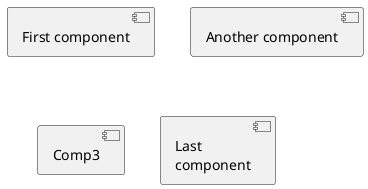

## Interfaces!

Interface can be defined using the&nbsp;`()`&nbsp;symbol (because this looks like a circle).

You can also use the&nbsp;`interface`&nbsp;keyword to define an interface. And you can define an alias, using the&nbsp;`as`&nbsp;keyword. This alias will be used latter, when defining relations.

We will see latter that interface definition is optional.

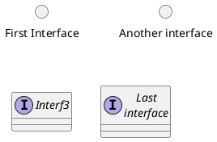

## Basic example!

Links between elements are made using combinations of dotted line (`..`), straight line (`--`), and arrows (`-->`) symbols.

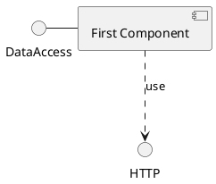

## Using notes!

You can use the&nbsp;`note left of`&nbsp;,&nbsp;`note right of`&nbsp;,&nbsp;`note top of`&nbsp;,&nbsp;`note bottom of`&nbsp;keywords to define notes related to a single object.

A note can be also define alone with the&nbsp;`note`&nbsp;keywords, then linked to other objects using the&nbsp;`..`&nbsp;symbol.

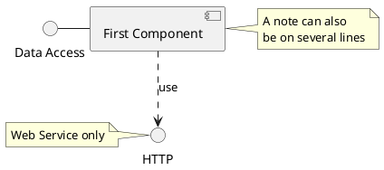

## Grouping Components!

You can use several keywords to group components and interfaces together:

*  `package`
*  `node`
*  `folder`
*  `frame`
*  `cloud`
*  `database`

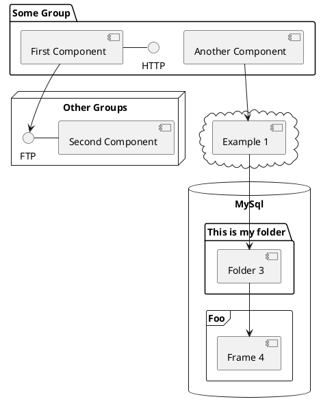

## Changing arrows direction!

By default, links between classes have two dashes&nbsp;`--`&nbsp;and are vertically oriented. It is possible to use horizontal link by putting a single dash (or dot) like this:

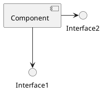

You can also change directions by reversing the link:

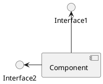

It is also possible to change arrow direction by adding&nbsp;`left`,&nbsp;`right`,&nbsp;`up`&nbsp;or&nbsp;`down`&nbsp;keywords inside the arrow:

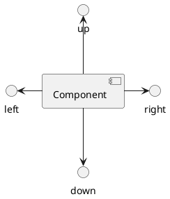

You can shorten the arrow by using only the first character of the direction (for example,&nbsp;`-d-`&nbsp;instead of&nbsp;`-down-`) or the two first characters (`-do-`).

Please note that you should not abuse this functionality :&nbsp;_Graphviz_&nbsp;gives usually good results without tweaking.

## Use UML2 notation!

By default&nbsp;_(from v1.2020.13-14)_, UML2 notation is used.

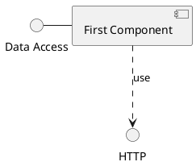

## Use UML1 notation!

The&nbsp;`skinparam componentStyle uml1`&nbsp;command is used to switch to UML1 notation.

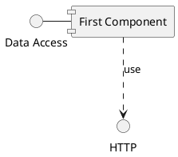

## Use rectangle notation (remove UML notation)!

The&nbsp;`skinparam componentStyle rectangle`&nbsp;command is used to switch to rectangle notation&nbsp;_(without any UML notation)_.

## Long description!

It is possible to put description on several lines using square brackets.

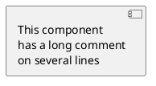

## Individual colors!

You can specify a color after component definition.

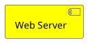

## Using Sprite in Stereotype!

You can use sprites within stereotype components.

``` puml {hide=false}
@startuml
sprite $businessProcess [16x16/16] {
FFFFFFFFFFFFFFFF
FFFFFFFFFFFFFFFF
FFFFFFFFFFFFFFFF
FFFFFFFFFFFFFFFF
FFFFFFFFFF0FFFFF
FFFFFFFFFF00FFFF
FF00000000000FFF
FF000000000000FF
FF00000000000FFF
FFFFFFFFFF00FFFF
FFFFFFFFFF0FFFFF
FFFFFFFFFFFFFFFF
FFFFFFFFFFFFFFFF
FFFFFFFFFFFFFFFF
FFFFFFFFFFFFFFFF
FFFFFFFFFFFFFFFF
}


rectangle " End to End\nbusiness process" <<$businessProcess>> {
 rectangle "inner process 1" <<$businessProcess>> as src
 rectangle "inner process 2" <<$businessProcess>> as tgt
 src -> tgt
}
@enduml
```

## Skinparam!

You can use the&nbsp;[skinparam](https://plantuml.com/en/skinparam)&nbsp;command to change colors and fonts for the drawing.

You can use this command :

*  In the diagram definition, like any other commands,
*  In an&nbsp;[included file](https://plantuml.com/en/preprocessing),
*  In a configuration file, provided in the&nbsp;[command line](https://plantuml.com/en/command-line)&nbsp;or the&nbsp;[ANT task](https://plantuml.com/en/ant-task).

You can define specific color and fonts for stereotyped components and interfaces.

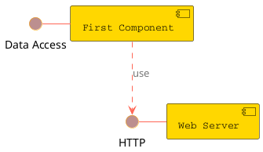

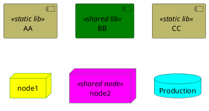

