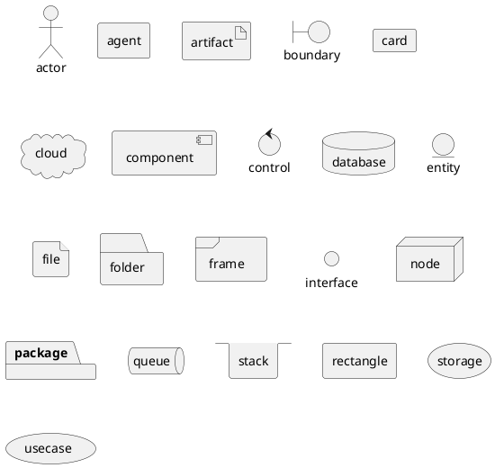
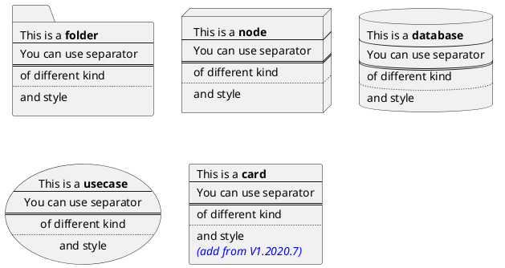
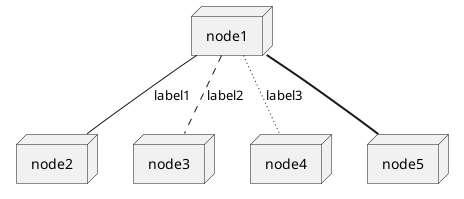
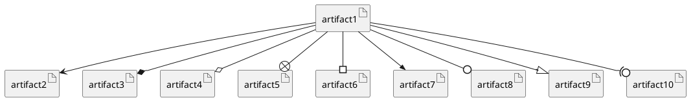
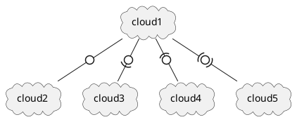
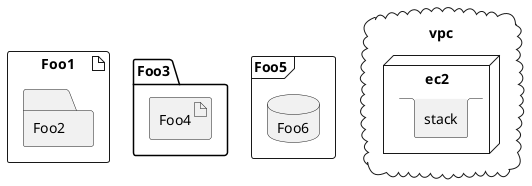
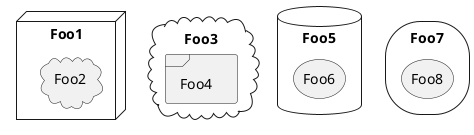
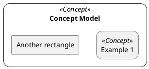

# Deployment Diagram

## Declaring element!

You can optionaly put text using bracket&nbsp;`[]`&nbsp;for a long description.

## Linking!

You can create simple links between elements with or without labels:

It is possible to use several types of links:

You can also have the following types:

## Packages!

_There is a limit of three levels._

## Round corner!

