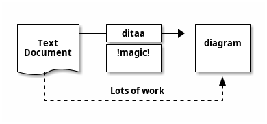
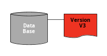
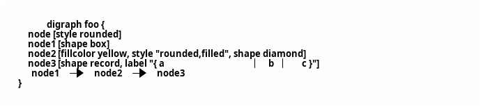

## Ditaa


[Ditaa](http://ditaa.sourceforge.net/)&nbsp;是一个支持通过文本描述生成通用图表的开源项目。这个理念和**PlantUML**非常相近，所以，支持除UML之外其他图表的文档化将会很有很有意义。


所以最新版本的**PlantUML**支持下面的语法：




你可以在&nbsp;[这里](http://ditaa.sourceforge.net/)&nbsp;找到它的完整的文档。


如果你的插件还不支持`@startditaa`，可以使用&nbsp;_临时_&nbsp;解决方案：在你的文档描述首行使用`@startuml`，通过`ditta`关键字来支持&nbsp;[Ditaa](http://ditaa.sourceforge.net/)&nbsp;。


你同样可以在`@startditaa`或者`@ditta`关键字后面使用一些设置：


*  `-E`&nbsp;或者&nbsp;`--no-separation`&nbsp;移除分隔符
*  `-S`&nbsp;或者&nbsp;`--no-shadows`&nbsp;移除阴影
*  `scale=XYZ`&nbsp;to 缩放图表





只支持PNG格式。

## DOT


自从&nbsp;**PlantUML**&nbsp;使用&nbsp;[Graphviz/DOT](http://www.graphviz.org/Gallery.php)语法，直接使用DOT语言成为可能。


这意味着你可以使用 Graphviz/DOT 所有支持**PlantUML**的工具。


注意，起始行必须是：


``` colo
digraph XYZ {
```


注意，你同样可以使用`@startuml`/`@enduml`代替`@startdot`/`@enddot`：


这里有一个实例：




