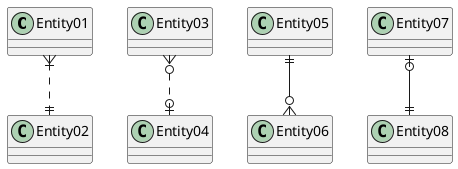
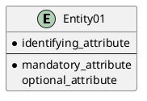
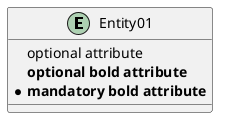
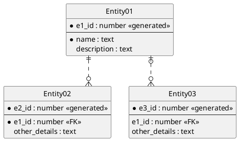

# Entity Relationship Diagram

*  [Information Engineering Relations](https://plantuml.com/zh/ie-diagram#a33822c778959028)
*  [Entities](https://plantuml.com/zh/ie-diagram#ea995898864fb0ea)
*  [Complete Example](https://plantuml.com/zh/ie-diagram#06a40b5d1c1792ac)

Based on the Information Engineering notation.

This is an extension to the existing&nbsp;[Class Diagram](https://plantuml.com/zh/class-diagram). This extension adds:

*  Additional relations for the Information Engineering notation.
*  An&nbsp;`entity`&nbsp;alias that maps to the class diagram&nbsp;`class`.
*  An additional visibility modifier&nbsp;`*`&nbsp;to identify mandatory attributes.

Otherwise, the syntax for drawing diagrams is the same as for class diagrams. All other features of class diagrams are also supported.

## Information Engineering Relations

|   |   |
|---|---|
| **Type** | **Symbol** |
| Zero or One | `|o--` |
| Exactly One | `||--` |
| Zero or Many | `}o--` |
| One or Many | `}|--` |

Examples:

## Entities

Again, this is the normal class diagram syntax (aside from use of&nbsp;`entity`&nbsp;instead of&nbsp;`class`). Anything that you can do in a class diagram can be done here.

The&nbsp;`*`&nbsp;visibility modifier can be used to identify mandatory attributes. A space can be used after the modifier character to avoid conflicts with the creole bold:

## Complete Example

