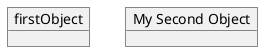
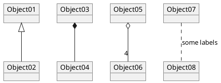
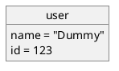

# Object Diagram

## Definition of objects!

You define instance of objects using the&nbsp;`object`&nbsp;keywords.

## Relations between objects!

Relations between objects are defined using the following symbols :

|   |   |   |
|---|---|---|
| **Type** | **Symbol** | **Image** |
| Extension | `<|--` |  |
| Composition | `*--` |  |
| Aggregation | `o--` |  |

It is possible to replace&nbsp;`--`&nbsp;by&nbsp;`..`&nbsp;to have a dotted line.

Knowing those rules, it is possible to draw the following drawings.

It is possible a add a label on the relation, using&nbsp;`:`&nbsp;followed by the text of the label.

For cardinality, you can use double-quotes&nbsp;`""`&nbsp;on each side of the relation.

## Adding fields!

To declare fields, you can use the symbol&nbsp;`:`&nbsp;followed by the field's name.

It is also possible to group all fields between brackets&nbsp;`{}`.

## Common features with class diagrams!

*  [Hide attributes, methods...](https://plantuml.com/en/class-diagram#Hide)
*  [Defines notes](https://plantuml.com/en/class-diagram#Notes)
*  [Use packages](https://plantuml.com/en/class-diagram#Using)
*  [Skin the output](https://plantuml.com/en/class-diagram#Skinparam)