# Salt (Wireframe)

**Salt**&nbsp;is a subproject included in PlantUML that may help you to design graphical interface or&nbsp;[_Website Wireframe or Page Schematic or Screen Blueprint_](https://en.wikipedia.org/wiki/Website_wireframe).

The goal of this tool is to discuss about simple and sample windows.

You can use either&nbsp;`@startsalt`&nbsp;keyword, or&nbsp;`@startuml`&nbsp;followed by a line with&nbsp;`salt`&nbsp;keyword.

## Basic widgets!

A window must start and end with brackets. You can then define:

*  Button using&nbsp;`[`&nbsp;and&nbsp;`]`.
*  Radio button using&nbsp;`(`&nbsp;and&nbsp;`)`.
*  Checkbox using&nbsp;`[`&nbsp;and&nbsp;`]`.
*  User text area using&nbsp;`"`.
*  Droplist using&nbsp;`^`.

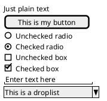

## Using grid!

A table is automatically created when you use an opening bracket&nbsp;`{`. And you have to use&nbsp;`|`&nbsp;to separate columns.

For example:

``` puml {hide=false}
@startsalt
{
  Login    | "MyName   "
  Password | "****     "
  [Cancel] | [  OK   ]
}
@endsalt
```

Just after the opening bracket, you can use a character to define if you want to draw lines or columns of the grid :

|   |   |
|---|---|
| **Symbol** | **Result** |
| `#` | To display all vertical and horizontal lines |
| `!` | To display all vertical lines |
| `-` | To display all horizontal lines |
| `+` | To display external lines |

``` puml {hide=false}
@startsalt
{+
  Login    | "MyName   "
  Password | "****     "
  [Cancel] | [  OK   ]
}
@endsalt
```

## Group box!

[more info](http://forum.plantuml.net/5840/please-allow-to-create-groupboxes-in-salt?show=5840#q5840)

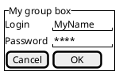

## Using separator!

You can use several horizontal lines as separator.

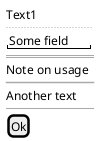

## Tree widget!

To have a Tree, you have to start with&nbsp;`{T`&nbsp;and to use&nbsp;`+`&nbsp;to denote hierarchy.

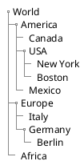

## Enclosing brackets!

You can define subelements by opening a new opening bracket.

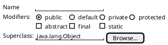

## Adding tabs!

You can add tabs using&nbsp;`{/`&nbsp;notation. Note that you can use HTML code to have bold text.

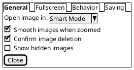

Tab could also be vertically oriented:

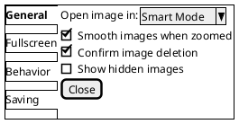

## Using menu!

You can add a menu by using&nbsp;`{*`&nbsp;notation.

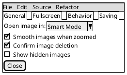

It is also possible to open a menu:

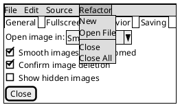

## Advanced table!

You can use two special notations for table :

*  `*`&nbsp;to indicate that a cell with span with left
*  `.`&nbsp;to denotate an empty cell

``` puml {hide=false}
@startsalt
{#
. | Column 2 | Column 3
Row header 1 | value 1 | value 2
Row header 2 | A long cell | *
}
@endsalt
```

## OpenIconic!

[OpenIconic](https://useiconic.com/open/)&nbsp;is an very nice open source icon set. Those icons have been integrated into the&nbsp;[creole parser](https://plantuml.com/en/creole), so you can use them out-of-the-box. You can use the following syntax:&nbsp;`<&ICON_NAME>`.

``` puml {hide=false}
@startsalt
{
  Login<&person> | "MyName   "
  Password<&key> | "****     "
  [Cancel <&circle-x>] | [OK <&account-login>]
}
@endsalt
```

The complete list is available on OpenIconic Website, or you can use the following special diagram:

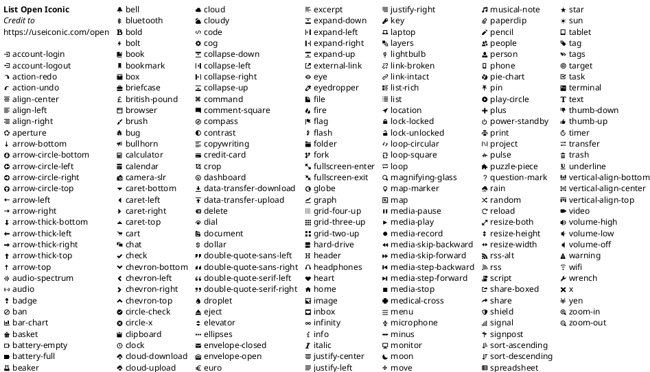

## Include Salt!

You can&nbsp;[read the following explanation](http://forum.plantuml.net/2427/salt-with-minimum-flowchat-capabilities?show=2427#q2427).

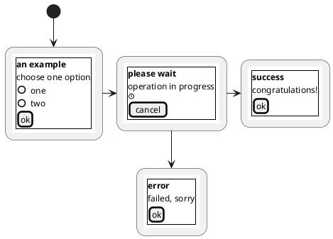

It can also be combined with&nbsp;[define macro](https://plantuml.com/en/preprocessing#macro_definition).

## Scroll Bars!

You can use "S" as scroll bar like in following examples:

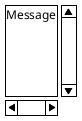

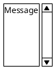

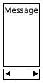

