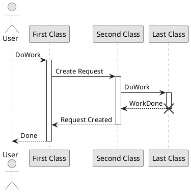
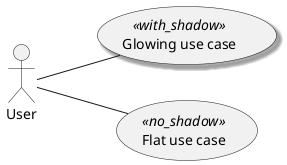
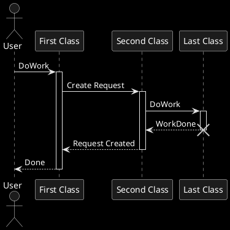
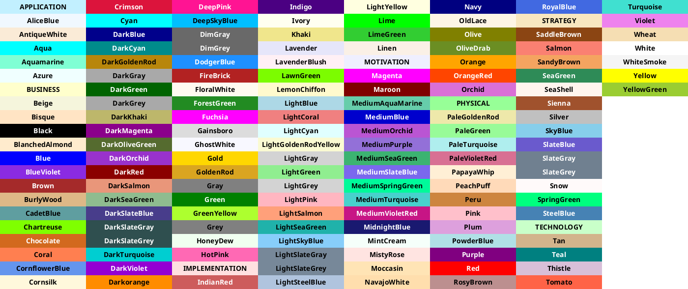
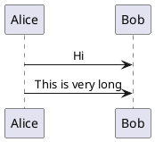
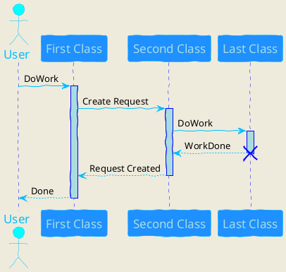
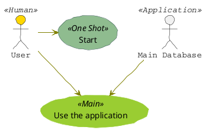
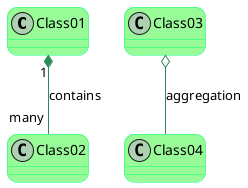
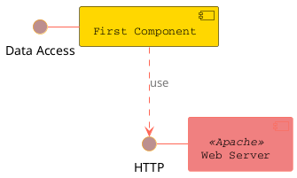
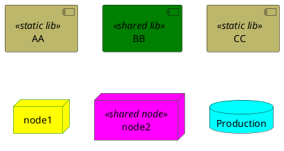

# Skinparam command

You can change colors and font of the drawing using the&nbsp;`skinparam`&nbsp;command.

``` 
skinparam backgroundColor transparent
```

You can use this command :

*  In the diagram definition, like any other commands,
*  In an&nbsp;[included file](https://plantuml.com/en/preprocessing),
*  In a configuration file, provided in the&nbsp;[command line](https://plantuml.com/en/command-line)&nbsp;or the&nbsp;[ANT task](https://plantuml.com/en/ant-task).


To avoid repetition, it is possible to nest definition. So the following definition :

``` 
skinparam xxxxParam1 value1
skinparam xxxxParam2 value2
skinparam xxxxParam3 value3
skinparam xxxxParam4 value4
```
is strictly equivalent to:

``` 
skinparam xxxx {
    Param1 value1
    Param2 value2
    Param3 value3
    Param4 value4
}
```

## Black and White

You can force the use of a black&white output using&nbsp;`skinparam monochrome true`&nbsp;command.


## Shadowing

You can disable the shadowing using the&nbsp;`skinparam shadowing false`&nbsp;command.




You can force the use of a black&white output using&nbsp;`skinparam monochrome reverse`&nbsp;command. This can be useful for black background environment.



## Colors

You can use either&nbsp;[standard color name](https://plantuml.com/en/color)&nbsp;or RGB code.




`transparent`&nbsp;can only be used for background of the image.


## Font color, name and size

You can change the font for the drawing using&nbsp;`xxxFontColor`,&nbsp;`xxxFontSize`&nbsp;and&nbsp;`xxxFontName`&nbsp;parameters.

``` 
skinparam classFontColor red
skinparam classFontSize 10
skinparam classFontName Aapex
```

You can also change the default font for all fonts using&nbsp;`skinparam defaultFontName`.

``` 
skinparam defaultFontName Aapex
```

Please note the fontname is highly system dependent, so do not over use it, if you look for portability.&nbsp;`Helvetica`&nbsp;and&nbsp;`Courier`&nbsp;should be available on all system.

A lot of parameters are available. You can list them using the following command:


``` colo
java -jar plantuml.jar -language
```

## Text Alignment

Text alignment can be set up to&nbsp;`left`,&nbsp;`right`&nbsp;or&nbsp;`center`. You can also use&nbsp;`direction`&nbsp;or&nbsp;`reverseDirection`&nbsp;values for&nbsp;`sequenceMessageAlign`&nbsp;which align text depending on arrow direction.

| **Param name** | **Default value** | **Comment** |
|---|---|---|
| sequenceMessageAlign | left | Used for messages in sequence diagrams |
| sequenceReferenceAlign | center | Used for&nbsp;`ref over`&nbsp;in sequence diagrams |



## Examples















Since the documentation is not always up to date, you can have the complete list of parameters using this command:


``` colo
java -jar plantuml.jar -language
```

Or you can generate a "diagram" with a list of all the skinparam parameters using:

That will give you the following result:

``` puml {hide=false}
@startuml
help skinparams
@enduml
```

You can also view each skinparam parameters with its results displayed at&nbsp;[https://plantuml-documentation.readthedocs.io/en/latest/formatting/all-skin-params.html](https://plantuml-documentation.readthedocs.io/en/latest/formatting/all-skin-params.html).


