# State Diagram

[State diagrams](https://en.wikipedia.org/wiki/State_diagram)&nbsp;are used to give an abstract description of the behavior of a system. This behavior is represented as a series of events that can occur in one or more possible states.

## Simple State!

You can use&nbsp;`[*]`&nbsp;for the starting point and ending point of the state diagram.

Use&nbsp;`-->`&nbsp;for arrows.

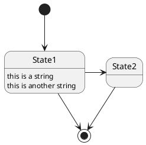

## Change state rendering!

You can use&nbsp;`hide empty description`&nbsp;to render state as simple box.

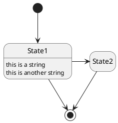

## Composite state!

A state can also be composite. You have to define it using the&nbsp;`state`&nbsp;keywords and brackets.

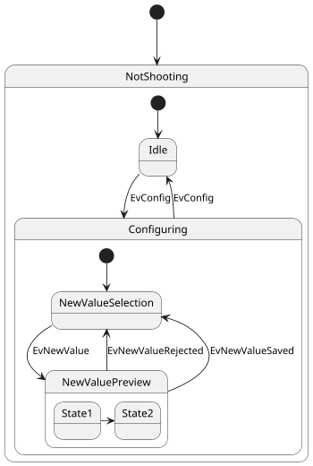

## Long name!

You can also use the&nbsp;`state`&nbsp;keyword to use long description for states.

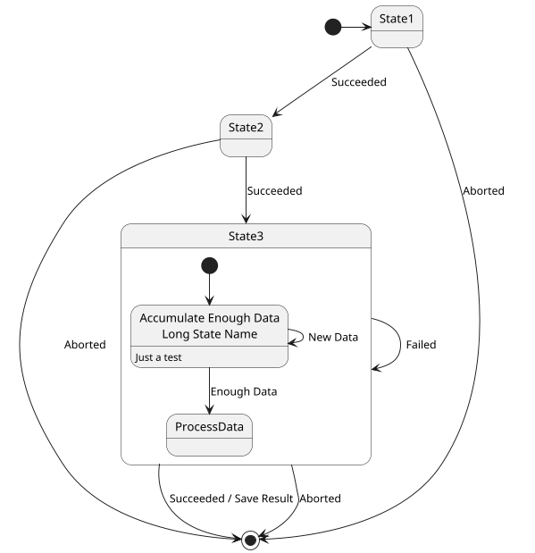

## History!

You can use [H] for the history and [H*] for the deep history of a substate

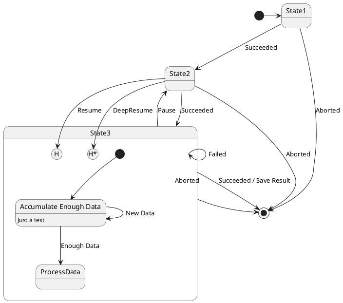

## Fork!

You can also fork and join using the&nbsp;`<<fork>>`&nbsp;and&nbsp;`<<join>>`&nbsp;stereotypes.

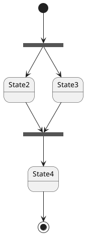

## Concurrent state!

You can define concurrent state into a composite state using either&nbsp;`--`&nbsp;or&nbsp;`||`&nbsp;symbol as separator.

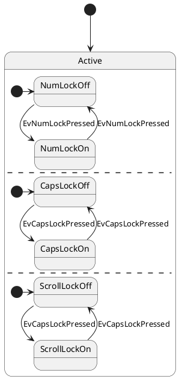

## Conditional!

The stereotype&nbsp;`<<choice>>`&nbsp;can be used to use conditional state.

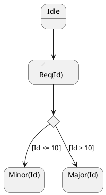

## Arrow direction!

You can use&nbsp;`->`&nbsp;for horizontal arrows. It is possible to force arrow's direction using the following syntax:

*  `-down->`&nbsp;(default arrow)
*  `-right->`&nbsp;or&nbsp;`->`
*  `-left->`
*  `-up->`

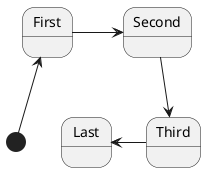

You can shorten the arrow by using only the first character of the direction (for example,&nbsp;`-d-`&nbsp;instead of&nbsp;`-down-`) or the two first characters (`-do-`).

Please note that you should not abuse this functionality :&nbsp;_Graphviz_&nbsp;gives usually good results without tweaking.

## Note!

You can also define notes using&nbsp;`note left of`,&nbsp;`note right of`,&nbsp;`note top of`,&nbsp;`note bottom of`&nbsp;keywords.

You can also define notes on several lines.

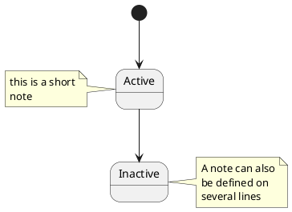

You can also have floating notes.

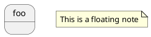

## Note on link!

You can put notes on state-transition or link, with&nbsp;`note on link`&nbsp;keyword.

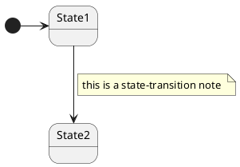

## More in notes!

You can put notes on composite states.

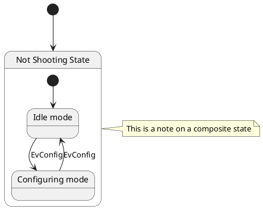

## Skinparam!

You can use the&nbsp;[skinparam](https://plantuml.com/en/skinparam)&nbsp;command to change colors and fonts for the drawing.

You can use this command :

*  In the diagram definition, like any other commands,
*  In an&nbsp;[included file](https://plantuml.com/en/preprocessing),
*  In a configuration file, provided in the&nbsp;[command line](https://plantuml.com/en/command-line)&nbsp;or the&nbsp;[ANT task](https://plantuml.com/en/ant-task).

You can define specific color and fonts for stereotyped states.

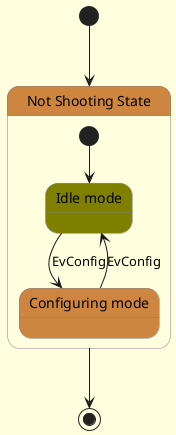

