## Usecases!

Use cases are enclosed using between parentheses (because two parentheses looks like an oval).

You can also use the&nbsp;`usecase`&nbsp;keyword to define a usecase. And you can define an alias, using the&nbsp;`as`&nbsp;keyword. This alias will be used later, when defining relations.

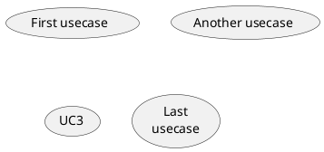

## Actors!

Actor are enclosed using between two points.

You can also use the&nbsp;`actor`&nbsp;keyword to define an actor. And you can define an alias, using the&nbsp;`as`&nbsp;keyword. This alias will be used latter, when defining relations.

We will see later that the actor definitions are optional.

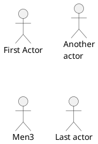

## Usecases description!

If you want to have description on several lines, you can use quotes.

You can also use the following separators:&nbsp;`--``..``==``__`. And you can put titles within the separators.

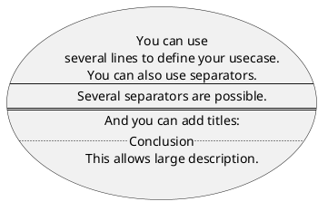

## Use package!

You can use packages to group actors or use cases.

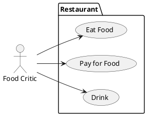

You can use&nbsp;`rectangle`&nbsp;to change the display of the package.

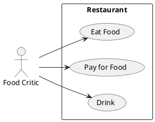

## Basic example!

To link actors and use cases, the arrow&nbsp;`-->`&nbsp;is used.

The more dashes&nbsp;`-`&nbsp;in the arrow, the longer the arrow. You can add a label on the arrow, by adding a&nbsp;`:`&nbsp;character in the arrow definition.

In this example, you see that&nbsp;_User_&nbsp;has not been defined before, and is used as an actor.

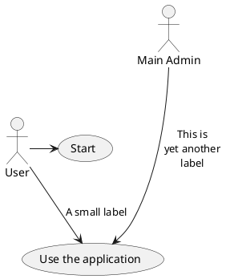

## Extension!

If one actor/use case extends another one, you can use the symbol&nbsp;`<|--`.

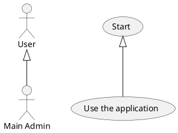

## Using notes!

You can use the&nbsp;`note left of`&nbsp;,&nbsp;`note right of`&nbsp;,&nbsp;`note top of`&nbsp;,&nbsp;`note bottom of`&nbsp;keywords to define notes related to a single object.

A note can be also define alone with the&nbsp;`note`&nbsp;keywords, then linked to other objects using the&nbsp;`..`&nbsp;symbol.

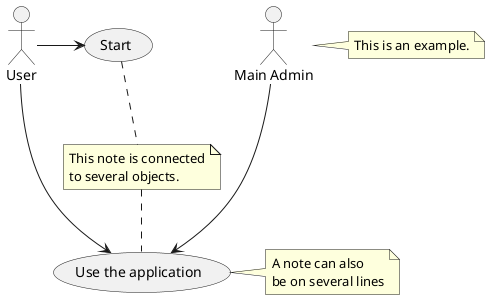

## Stereotypes!

You can add stereotypes while defining actors and use cases using&nbsp;`<<`&nbsp;and&nbsp;`>>`.

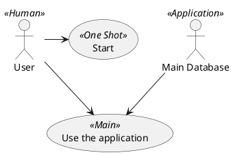

## Changing arrows direction!

By default, links between classes have two dashes&nbsp;`--`&nbsp;and are vertically oriented. It is possible to use horizontal link by putting a single dash (or dot) like this:

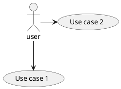

You can also change directions by reversing the link:

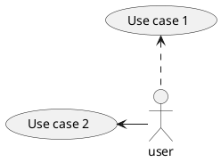

It is also possible to change arrow direction by adding&nbsp;`left`,&nbsp;`right`,&nbsp;`up`&nbsp;or&nbsp;`down`&nbsp;keywords inside the arrow:

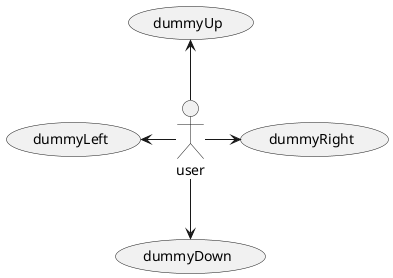

You can shorten the arrow by using only the first character of the direction (for example,&nbsp;`-d-`&nbsp;instead of&nbsp;`-down-`) or the two first characters (`-do-`).

Please note that you should not abuse this functionality :&nbsp;_Graphviz_&nbsp;gives usually good results without tweaking.

## Splitting diagrams!

The&nbsp;`newpage`&nbsp;keywords to split your diagram into several pages or images.

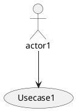

## Left to right direction!

The general default behavior when building diagram is&nbsp;**top to bottom**.

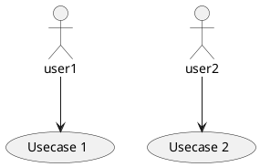

You may change to&nbsp;**left to right**&nbsp;using the&nbsp;`left to right direction`&nbsp;command. The result is often better with this direction.

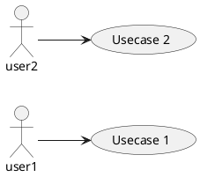

## Skinparam!

You can use the&nbsp;[skinparam](https://plantuml.com/en/skinparam)&nbsp;command to change colors and fonts for the drawing.

You can use this command :

*  In the diagram definition, like any other commands,
*  In an&nbsp;[included file](https://plantuml.com/en/preprocessing),
*  In a configuration file, provided in&nbsp;[the command line](https://plantuml.com/en/command-line)&nbsp;or&nbsp;[the ANT task](https://plantuml.com/en/ant-task).

You can define specific color and fonts for stereotyped actors and usecases.

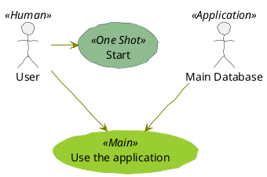

## Complete example!

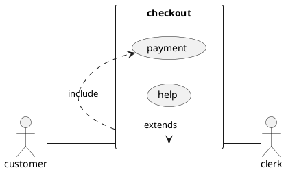